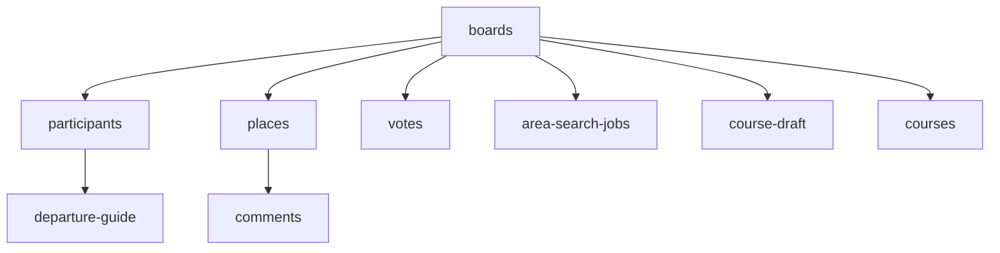

# 약속 올인원 API 명세서

| 항목 | 내용 |
|---|---|
| 문서 유형 | API Specification — REST MVP |
| 문서 버전 | 1.1 |
| 작성일 | 2026-07-22 |
| 기준 문서 | `기능명세서_v1.3.md`, `ERD_v1.0.md` |
| Base URL | `https://{host}/api/v1` |
| 데이터 형식 | JSON, UTF-8 |
| 시간 | DB에는 UTC로 저장하고 API는 ISO 8601 오프셋을 포함해 응답 |
| 보드 시간대 | `Asia/Seoul` |
| 좌표계 | WGS84, `lon`=경도, `lat`=위도 |

## 1. 목적과 MVP 범위

이 문서는 로그인 없는 약속 보드의 MVP 구현에 필요한 내부 REST API를 정의한다. URL은 가능한 한 자원을 나타내는 복수 명사를 사용하고, HTTP 메서드로 조회·생성·수정·삭제를 구분한다.

### 1.1 MVP 포함

- 약속 보드 생성·조회·수정·종료
- 초대 코드 확인과 비회원 참여
- 참여자 목록과 개인 출발지 입력
- Kakao Local 기반 장소·주소 검색과 지도 직접 지정
- 장소 보드, 장소 삭제, 장소별 댓글
- 선택적 장소 투표
- ODsay·Kakao Local·TMAP Transit을 조합한 만나기 좋은 지역 찾기
- 여러 장소 코스 초안·확정·버전 조회
- 첫 만남 장소 기준 개인 출발 안내
- 확정 약속 공개 공유
- 카카오맵·네이버지도 외부 링크 생성

### 1.2 MVP 제외

- 회원가입·로그인·소셜 인증
- NAVER 지역검색 API
- 장소 반응, 웹 푸시, 실시간 SSE·WebSocket
- 운영 대시보드 API
- 근처 장소 자동 탐색 전용 API
- 외부 지도 URL 입력·해석과 웹페이지 메타데이터 수집
- 중복 장소 자동 탐지·병합
- 전체 대중교통 경로선 미리보기
- 복잡한 분산 멱등성 저장소와 외부 API 결과 캐시

MVP에서는 중복 제출을 프론트엔드 버튼 잠금, 서버 트랜잭션, 상태 제약으로 방지한다. 운영 중 실제 중복 문제가 확인되면 `Idempotency-Key` 저장소를 추가한다.

## 2. 공통 규약

### 2.1 인증

인증이 필요한 요청은 표준 Bearer 헤더를 사용한다.

```http
Authorization: Bearer ptc_01HABC....{randomSecret}
```

참여 토큰은 `participantId.secret` 구조다.

1. 서버는 `participantId`로 참여자를 조회한다.
2. `secret`은 256비트 이상의 난수로 생성한다.
3. DB에는 `HMAC-SHA-256(serverPepper, secret)`만 저장한다.
4. 토큰은 보드 생성·참여 성공 응답에서만 전달한다.
5. 토큰을 분실하면 복구하지 않고 새 참여자로 입장한다.

초대 코드와 공개 토큰도 원문 대신 HMAC 값을 저장한다. URL 경로에 포함되는 초대 코드와 공개 토큰은 접근 로그에서 마스킹한다.

### 2.2 요청 헤더

| 헤더 | 적용 | 설명 |
|---|---|---|
| `Authorization` | 인증 필요 요청 | `Bearer {participantToken}` |
| `Content-Type` | 본문이 있는 요청 | `application/json` |
| `Accept` | 전체 | `application/json` |
| `X-Request-Id` | 선택 | UUID 형식의 추적 ID, 최대 36자 |
| `If-Match` | 코스 초안 수정 | GET에서 받은 `ETag` 값 |

### 2.3 성공 상태 코드

| HTTP | 사용 기준 |
|---:|---|
| `200 OK` | 조회·수정 성공, 결과 본문 반환 |
| `201 Created` | 보드·참여자·장소·댓글·투표·확정 코스 생성 |
| `202 Accepted` | 지역 찾기 또는 출발 안내 계산 작업 접수 |
| `204 No Content` | 삭제 성공 |

`201`은 생성된 자원의 URL을 `Location` 헤더로 반환한다. `202`는 작업 또는 결과 조회 URL을 `Location` 헤더로 반환한다.

### 2.4 오류 응답

```json
{
  "error": {
    "code": "PLACE_IN_USE",
    "message": "코스에 포함된 장소예요. 먼저 코스에서 제거해 주세요.",
    "details": {
      "courseId": "crs_01H...",
      "orderIndex": 2
    },
    "requestId": "f784bff8-2c16-4af2-a47e-a6aa35689d41"
  }
}
```

| HTTP | 코드 | 의미 |
|---:|---|---|
| 400 | `INVALID_ARGUMENT` | 형식, 길이, 필수 필드 오류 |
| 400 | `URL_QUERY_NOT_ALLOWED` | 장소 검색어가 URL 형식 |
| 401 | `AUTHENTICATION_REQUIRED` | 토큰 없음·형식 오류·검증 실패 |
| 403 | `FORBIDDEN` | 역할 또는 소유권 부족 |
| 404 | `RESOURCE_NOT_FOUND` | 보드·참여자·장소·댓글·투표·코스 없음 |
| 404 | `INVITE_NOT_FOUND` | 초대 코드가 없거나 만료됨 |
| 409 | `RESOURCE_CONFLICT` | 현재 상태와 요청이 충돌 |
| 409 | `JOB_ALREADY_RUNNING` | 동일 보드 지역 찾기가 이미 실행 중 |
| 409 | `PLACE_IN_USE` | 투표·코스가 참조하는 장소 삭제 시도 |
| 412 | `VERSION_MISMATCH` | `If-Match`의 코스 초안 버전 불일치 |
| 422 | `ORIGIN_REQUIRED` | 지역 계산 대상의 출발지 누락 |
| 422 | `ROUTE_UNAVAILABLE` | 대중교통 경로를 찾지 못함 |
| 429 | `RATE_LIMITED` | 본 서비스의 요청 제한 초과 |
| 502 | `EXTERNAL_BAD_RESPONSE` | 외부 API의 잘못된 응답 |
| 503 | `EXTERNAL_UNAVAILABLE` | 외부 API 장애·429 재시도 실패 |
| 503 | `QUOTA_EXCEEDED` | 일일 API 예산 상한 도달 |

`429`와 일시적인 `503`에는 가능한 경우 `Retry-After`를 포함한다. 오류 세부 정보에는 참여 토큰, 출발지 원문, 검색어 원문을 포함하지 않는다.

### 2.5 목록과 페이지네이션

장소·댓글·투표 목록은 페이지 번호 방식을 사용한다.

```http
GET /places?page=1&size=20
```

```json
{
  "items": [],
  "page": {
    "number": 1,
    "size": 20,
    "totalItems": 0,
    "totalPages": 0
  }
}
```

- `page` 기본값: 1
- `size` 기본값: 20, 최댓값: 50
- 참여자 목록과 검색 후보는 규모가 작으므로 페이지네이션하지 않는다.
- 성능 문제가 확인되면 목록 API를 커서 방식으로 교체한다.

### 2.6 HTTP 캐시와 Rate limit

- 인증 응답은 `Cache-Control: private, no-store`로 반환한다.
- 공개 일정은 `ETag`를 사용할 수 있으나 MVP에서는 `no-cache`로 재검증한다.
- 외부 API 결과 캐시는 사용하지 않는다. 검색 후보는 응답 후 폐기하고, 사용자가 선택한 값과 지역 찾기·출발 안내 결과만 도메인 데이터로 DB에 저장한다.

| 대상 | MVP 제한 |
|---|---:|
| 참여 토큰 전체 | 60회/분 |
| 장소·주소 검색 | 참여자당 20회/분 |
| 지역 찾기 생성 | 보드당 3회/시간 |
| 출발 안내 계산 | 참여자당 5회/시간 |
| 댓글 생성 | 참여자당 20회/분 |
| 초대 코드 확인 | IP당 30회/분 |

## 3. 자원 구조



### 3.1 보드 상태

MVP의 보드 상태는 세 개만 사용한다.

| 상태 | 의미 |
|---|---|
| `COLLECTING` | 장소 수집·댓글·투표·코스 초안 작성 가능 |
| `CONFIRMED` | 확정 코스가 존재함. 수정 시에도 이전 확정 코스는 보존 |
| `CLOSED` | 약속 종료. 읽기만 가능 |

투표와 코스 초안은 각 자원의 상태로 관리하며 보드 상태에 `DECIDING`, `COURSE_DRAFT`를 추가하지 않는다.

## 4. 엔드포인트 목록

| # | Method | Path | 권한 | 설명 |
|---:|---|---|---|---|
| 1 | POST | `/boards` | 없음 | 보드 생성 |
| 2 | GET | `/boards/{boardId}` | 참여자 | 보드 조회 |
| 3 | PATCH | `/boards/{boardId}` | 호스트 | 보드 정보 수정·종료 |
| 4 | GET | `/boards/{boardId}/invitation` | 호스트 | 초대 정보 조회 |
| 5 | GET | `/invitations/{inviteCode}` | 없음 | 초대 코드 확인 |
| 6 | POST | `/invitations/{inviteCode}/participants` | 없음 | 보드 참여 |
| 7 | GET | `/boards/{boardId}/participants` | 참여자 | 참여자 목록 |
| 8 | PATCH | `/boards/{boardId}/participants/me` | 참여자 | 닉네임·출발지 수정 |
| 9 | GET | `/boards/{boardId}/place-candidates` | 참여자 | Kakao 장소 후보 검색 |
| 10 | GET | `/boards/{boardId}/address-candidates` | 참여자 | 주소 후보 검색 |
| 11 | GET | `/boards/{boardId}/coordinate-address` | 참여자 | 좌표의 주소 조회 |
| 12 | POST | `/boards/{boardId}/places` | 참여자 | 장소 등록 |
| 13 | GET | `/boards/{boardId}/places` | 참여자 | 장소 목록 |
| 14 | GET | `/boards/{boardId}/places/{placeId}` | 참여자 | 장소 상세 |
| 15 | DELETE | `/boards/{boardId}/places/{placeId}` | 제안자·호스트 | 장소 삭제 |
| 16 | GET | `/boards/{boardId}/places/{placeId}/comments` | 참여자 | 댓글 목록 |
| 17 | POST | `/boards/{boardId}/places/{placeId}/comments` | 참여자 | 댓글 생성 |
| 18 | PATCH | `/boards/{boardId}/places/{placeId}/comments/{commentId}` | 작성자 | 댓글 수정 |
| 19 | DELETE | `/boards/{boardId}/places/{placeId}/comments/{commentId}` | 작성자·호스트 | 댓글 삭제 |
| 20 | POST | `/boards/{boardId}/votes` | 호스트 | 투표 생성 |
| 21 | GET | `/boards/{boardId}/votes` | 참여자 | 투표 목록 |
| 22 | GET | `/boards/{boardId}/votes/{voteId}` | 참여자 | 투표 상세 |
| 23 | PUT | `/boards/{boardId}/votes/{voteId}/ballots/me` | 참여자 | 내 투표 등록·교체 |
| 24 | PATCH | `/boards/{boardId}/votes/{voteId}` | 호스트 | 투표 종료 |
| 25 | POST | `/boards/{boardId}/area-search-jobs` | 호스트 | 지역 찾기 작업 생성 |
| 26 | GET | `/boards/{boardId}/area-search-jobs/{jobId}` | 참여자 | 작업 상태·결과 조회 |
| 27 | GET | `/boards/{boardId}/course-draft` | 참여자 | 코스 초안 조회 |
| 28 | PUT | `/boards/{boardId}/course-draft` | 호스트 | 코스 초안 전체 저장 |
| 29 | POST | `/boards/{boardId}/courses` | 호스트 | 초안을 확정 코스로 생성 |
| 30 | GET | `/boards/{boardId}/courses/current` | 참여자 | 현재 확정 코스 조회 |
| 31 | GET | `/boards/{boardId}/courses/{courseId}` | 참여자 | 특정 확정 버전 조회 |
| 32 | GET | `/boards/{boardId}/participants/me/departure-guide` | 참여자 | 내 출발 안내 조회 |
| 33 | POST | `/boards/{boardId}/participants/me/departure-calculations` | 참여자 | 내 출발 안내 계산 요청 |
| 34 | GET | `/public/schedules/{publicToken}` | 없음 | 공개 일정 조회 |

## 5. 보드·초대·참여자

### 5.1 POST /boards

보드와 호스트 참여자를 생성한다.

```json
{
  "name": "주말 모임",
  "dateRange": {
    "start": "2026-07-25",
    "end": "2026-07-25"
  },
  "purpose": "저녁 식사",
  "hostNickname": "종민"
}
```

| 필드 | 필수 | 규칙 |
|---|:---:|---|
| `name` | O | 2~40자 |
| `dateRange.start` | O | 오늘 이후 |
| `dateRange.end` | O | `start` 이상, 최대 30일 범위 |
| `purpose` | - | 100자 이하 |
| `hostNickname` | O | 1~20자 |

응답 `201 Created`:

```json
{
  "board": {
    "boardId": "brd_01H...",
    "name": "주말 모임",
    "status": "COLLECTING",
    "timezone": "Asia/Seoul",
    "dateRange": {
      "start": "2026-07-25",
      "end": "2026-07-25"
    }
  },
  "participant": {
    "participantId": "ptc_01H...",
    "nickname": "종민",
    "role": "HOST",
    "participantToken": "ptc_01H....secret"
  },
  "invitation": {
    "inviteCode": "AB12CD34",
    "inviteUrl": "https://example.app/j/AB12CD34",
    "expiresAt": "2026-08-20T23:59:59+09:00"
  }
}
```

### 5.2 GET /boards/{boardId}

보드 기본 정보와 집계만 반환한다.

```json
{
  "boardId": "brd_01H...",
  "name": "주말 모임",
  "dateRange": { "start": "2026-07-25", "end": "2026-07-25" },
  "purpose": "저녁 식사",
  "status": "COLLECTING",
  "timezone": "Asia/Seoul",
  "counts": { "participants": 3, "places": 5, "comments": 8 },
  "updatedAt": "2026-07-21T14:00:00+09:00"
}
```

진행 중인 보드 목록은 서버에 토큰 묶음을 전송하지 않는다. 브라우저가 로컬에 저장한 `{boardId, participantToken}`별로 이 API를 호출한다.

### 5.3 PATCH /boards/{boardId}

호스트만 호출한다. 제공된 필드만 수정한다.

```json
{
  "name": "토요일 저녁 모임",
  "dateRange": { "start": "2026-07-26", "end": "2026-07-26" },
  "status": "CLOSED"
}
```

- 수정 가능: `name`, `dateRange`, `purpose`
- `status`는 `CLOSED`로만 변경할 수 있다.
- 확정 후 날짜가 변경되면 기존 출발 안내는 `STALE`이 된다.

### 5.4 초대 확인과 참여

```http
GET /invitations/{inviteCode}
```

```json
{
  "boardId": "brd_01H...",
  "boardName": "주말 모임",
  "participantCount": 3,
  "joinable": true,
  "expiresAt": "2026-08-20T23:59:59+09:00"
}
```

```http
POST /invitations/{inviteCode}/participants
```

```json
{ "nickname": "하늘" }
```

응답 `201 Created`:

```json
{
  "boardId": "brd_01H...",
  "participantId": "ptc_02H...",
  "nickname": "하늘",
  "role": "MEMBER",
  "avatarColor": "#50B87A",
  "participantToken": "ptc_02H....secret"
}
```

### 5.5 GET /boards/{boardId}/invitation

호스트에게 현재 초대 코드·URL·만료시각을 반환한다. MVP에서는 초대 코드 재발급 API를 제공하지 않는다.

### 5.6 GET /boards/{boardId}/participants

타인의 출발지는 등록 여부만 반환한다. 본인은 라벨과 좌표까지 볼 수 있다.

```json
{
  "items": [
    {
      "participantId": "ptc_01H...",
      "nickname": "종민",
      "role": "HOST",
      "avatarColor": "#4A90E2",
      "origin": {
        "registered": true,
        "label": "정왕역",
        "lon": 126.7426,
        "lat": 37.3459
      }
    },
    {
      "participantId": "ptc_02H...",
      "nickname": "하늘",
      "role": "MEMBER",
      "avatarColor": "#50B87A",
      "origin": { "registered": true }
    }
  ]
}
```

### 5.7 PATCH /boards/{boardId}/participants/me

닉네임 또는 출발지를 수정한다.

```json
{
  "nickname": "종민",
  "origin": {
    "label": "정왕역",
    "lon": 126.7426,
    "lat": 37.3459,
    "source": "KAKAO_KEYWORD",
    "providerPlaceId": "26338954"
  }
}
```

`origin.source`는 `KAKAO_KEYWORD`, `KAKAO_ADDRESS`, `MANUAL_PIN` 중 하나다. 출발지 변경 시 해당 참여자의 출발 안내를 `STALE`로 만든다.

## 6. 장소·주소 후보 검색

검색 API는 저장 자원을 만들지 않는 안전한 GET 요청이다. 외부 호출 비용이 발생할 수 있으므로 UI는 검색 버튼 또는 Enter 입력 때만 호출한다.

### 6.1 GET /boards/{boardId}/place-candidates

| 쿼리 | 필수 | 규칙 |
|---|:---:|---|
| `query` | O | 2~80자, URL 입력 금지 |
| `lon`, `lat` | - | 중심 좌표, 둘 다 함께 전달 |
| `radius` | - | 중심 좌표가 있을 때만 사용, 최대 20,000m |

Kakao Local 키워드 검색 결과에서 최대 5개를 정규화해 반환한다.

```json
{
  "provider": "KAKAO",
  "items": [
    {
      "providerPlaceId": "1234567",
      "name": "긴자료코 부평점",
      "category": "음식점 > 일식 > 돈까스,우동",
      "internalCategory": "RESTAURANT",
      "addressName": "인천 부평구 부평동 000-0",
      "roadAddressName": "인천 부평구 경원대로 0",
      "lon": 126.72065,
      "lat": 37.49079,
      "providerPlaceUrl": "https://place.map.kakao.com/1234567",
      "distanceMeters": 320
    }
  ]
}
```

결과가 없으면 `200 OK`와 빈 배열을 반환한다.

```json
{
  "provider": "KAKAO",
  "items": [],
  "hint": "장소명에 지역이나 지점명을 더해 보세요."
}
```

### 6.2 GET /boards/{boardId}/address-candidates

`query`에 도로명 또는 지번 주소를 전달한다. Kakao Local 주소 검색을 사용한다.

```json
{
  "items": [
    {
      "addressName": "서울 강남구 역삼동 858",
      "roadAddressName": "서울 강남구 강남대로 396",
      "addressType": "ROAD_ADDR",
      "lon": 127.0276,
      "lat": 37.4979
    }
  ]
}
```

실재하지 않는 주소도 오류가 아니라 빈 배열을 반환한다.

### 6.3 GET /boards/{boardId}/coordinate-address

`lon`, `lat`을 필수로 받아 Kakao Local 좌표→주소 API를 호출한다.

```json
{
  "roadAddressName": null,
  "addressName": "서울 강남구 역삼동 858"
}
```

둘 다 없더라도 오류로 처리하지 않는다. 수동 핀 장소는 좌표와 사용자가 입력한 장소명만으로 등록할 수 있다.

## 7. 장소와 댓글

### 7.1 POST /boards/{boardId}/places

검색 후보를 사용자가 선택했거나 지도에서 핀을 지정한 후 호출한다.

```json
{
  "name": "긴자료코 부평점",
  "lon": 126.72065,
  "lat": 37.49079,
  "addressName": "인천 부평구 부평동 000-0",
  "roadAddressName": "인천 부평구 경원대로 0",
  "internalCategory": "RESTAURANT",
  "provider": "KAKAO",
  "providerPlaceId": "1234567",
  "providerPlaceUrl": "https://place.map.kakao.com/1234567",
  "source": "SEARCH_SELECT"
}
```

| 필드 | 필수 | 설명 |
|---|:---:|---|
| `name` | O | 1~100자 |
| `lon`, `lat` | O | WGS84 |
| `internalCategory` | O | `RESTAURANT`, `CAFE`, `PLAY`, `BAR`, `CULTURE`, `ATTRACTION`, `TRANSIT`, `ETC` |
| `provider` | - | 검색 결과는 `KAKAO`, 수동 핀은 생략 |
| `providerPlaceId`, `providerPlaceUrl` | - | 검색 결과에 있을 때 저장 |
| `source` | O | `SEARCH_SELECT`, `MANUAL_PIN` |

응답은 `201 Created`이며 `status: ACTIVE`인 장소를 반환한다. 동일 장소의 중복 등록은 허용한다.

### 7.2 GET /boards/{boardId}/places

| 쿼리 | 값 |
|---|---|
| `category` | 내부 카테고리 |
| `sort` | `RECENT`, `COMMENTS` |
| `bbox` | `minLon,minLat,maxLon,maxLat` |
| `page`, `size` | 공통 페이지네이션 |

각 장소에 `commentCount`, 제안자, 지도 마커 라벨을 포함한다.

### 7.3 DELETE /boards/{boardId}/places/{placeId}

- 제안자 또는 호스트만 호출한다.
- 투표·코스가 참조하면 `409 PLACE_IN_USE`를 반환한다.
- 성공 시 soft delete 후 `204 No Content`를 반환한다.
- 이미 삭제된 장소를 같은 권한으로 다시 삭제해도 `204`를 반환한다.

### 7.4 댓글

```http
GET  /boards/{boardId}/places/{placeId}/comments?page=1&size=20
POST /boards/{boardId}/places/{placeId}/comments
```

```json
{ "body": "여기 웨이팅이 길 수 있어요." }
```

- `body`: 공백 제거 후 1~500자
- 생성 성공: `201 Created`
- 수정: `PATCH .../comments/{commentId}`와 `{ "body": "수정 내용" }`
- 삭제: `DELETE .../comments/{commentId}`, 성공 시 `204`
- 작성자는 수정·삭제, 호스트는 삭제만 가능하다.

## 8. 투표

### 8.1 POST /boards/{boardId}/votes

호스트가 장소 투표를 생성한다.

```json
{
  "placeIds": ["plc_01H...", "plc_02H..."],
  "maxSelections": 1,
  "anonymous": false,
  "closesAt": "2026-07-25T22:00:00+09:00"
}
```

- 후보 2~10개
- `maxSelections`는 1 이상 후보 수 이하
- 보드당 열린 장소 투표는 하나만 허용
- 성공 시 `201 Created`, 초기 `status: OPEN`

### 8.2 GET /boards/{boardId}/votes

`status=OPEN|CLOSED`와 페이지네이션을 지원한다. 현재 투표는 `GET /votes?status=OPEN`으로 조회한다.

### 8.3 PUT /boards/{boardId}/votes/{voteId}/ballots/me

내 투표를 생성하거나 전체 교체한다.

```json
{ "placeIds": ["plc_01H..."] }
```

빈 배열은 투표 취소를 의미한다. 투표 마감 전까지 반복 호출할 수 있으며 같은 본문은 같은 결과를 만든다.

### 8.4 PATCH /boards/{boardId}/votes/{voteId}

호스트가 투표를 조기 종료한다.

```json
{ "status": "CLOSED" }
```

이미 종료된 투표에 같은 요청을 보내면 현재 투표를 `200 OK`로 반환한다.

## 9. 만나기 좋은 지역 찾기

지역 찾기는 참여자 수만큼 ODsay 도달권을 요청하고, 교집합에서 지역 거점을 수집한 뒤 참여자×후보 수만큼 TMAP Transit을 호출할 수 있다. 따라서 MVP에서도 비동기 작업 자원으로 처리한다.

### 9.1 POST /boards/{boardId}/area-search-jobs

호스트 전용이다.

```json
{
  "durationMin": 45,
  "participantIds": ["ptc_01H...", "ptc_02H...", "ptc_03H..."]
}
```

- `durationMin`: 30, 45, 60 중 하나
- 대상: 최소 2명
- 출발지 미등록자가 포함되면 `422 ORIGIN_REQUIRED`
- 같은 보드의 `QUEUED`, `RUNNING`, `RETRY_WAIT` 작업은 하나만 허용
- 일일 예산 초과 시 `503 QUOTA_EXCEEDED`

응답 `202 Accepted`:

```http
Location: /api/v1/boards/brd_01H.../area-search-jobs/job_01H...
Retry-After: 2
```

```json
{
  "jobId": "job_01H...",
  "status": "QUEUED",
  "estimatedExternalCalls": {
    "odsay": 3,
    "kakaoLocal": 12,
    "tmapTransit": 18
  }
}
```

### 9.2 GET /boards/{boardId}/area-search-jobs/{jobId}

진행 중에는 진행률을 반환한다.

```json
{
  "jobId": "job_01H...",
  "status": "RUNNING",
  "progress": {
    "phase": "TRANSIT_EVALUATION",
    "done": 12,
    "total": 18
  },
  "result": null,
  "error": null
}
```

`status`는 `QUEUED`, `RUNNING`, `RETRY_WAIT`, `SUCCEEDED`, `FAILED` 중 하나다. 단계는 `ISOCHRONE`, `INTERSECTION`, `HUB_COLLECTION`, `TRANSIT_EVALUATION` 순서다.

성공하면 같은 자원의 `result`에 결과를 포함한다.

```json
{
  "jobId": "job_01H...",
  "status": "SUCCEEDED",
  "progress": { "phase": "TRANSIT_EVALUATION", "done": 18, "total": 18 },
  "result": {
    "durationMin": 45,
    "intersection": {
      "type": "MultiPolygon",
      "coordinates": [],
      "areaKm2": 93.4,
      "usedPieces": 3
    },
    "candidates": [
      {
        "areaCandidateId": "arc_01H...",
        "name": "신도림역",
        "lon": 126.8912,
        "lat": 37.5088,
        "providerPlaceId": "8154321",
        "metrics": {
          "avgSeconds": 1920,
          "maxSeconds": 2460,
          "transferAvg": 0.7,
          "unreachableCount": 0
        },
        "reasons": ["평균 이동시간이 가장 짧음"]
      }
    ]
  },
  "error": null
}
```

- 교집합은 면적 상위 3개 조각만 반환한다.
- 최대 6개 후보를 평가하고 상위 3개를 반환한다.
- 특정 참여자의 경로가 없어도 전체 작업은 계속한다.
- 실패 시 `error.code`는 `NO_INTERSECTION`, `NO_HUB_FOUND`, `EXTERNAL_UNAVAILABLE` 중 하나다.

## 10. 코스 초안과 확정 코스

### 10.1 GET /boards/{boardId}/course-draft

초안이 없으면 `200 OK`로 빈 초안을 반환한다.

```http
ETag: "draft-3"
```

```json
{
  "version": 3,
  "stops": []
}
```

### 10.2 PUT /boards/{boardId}/course-draft

호스트가 전체 초안을 교체한다. GET에서 받은 `ETag`를 `If-Match`로 전달한다.

```http
If-Match: "draft-3"
```

```json
{
  "stops": [
    {
      "placeId": "plc_01H...",
      "orderIndex": 1,
      "role": "FIRST_MEETING",
      "scheduledAt": "2026-07-26T18:00:00+09:00"
    },
    {
      "placeId": "plc_02H...",
      "orderIndex": 2,
      "role": "CAFE",
      "scheduledAt": "2026-07-26T19:30:00+09:00"
    }
  ]
}
```

검증 규칙:

- 장소 1~10개
- `orderIndex`는 1부터 연속되고 중복되지 않음
- 1번 장소만 `FIRST_MEETING`
- `scheduledAt`은 이전 장소보다 늦음
- 보드에 활성 상태로 등록된 장소만 사용
- 버전 불일치 시 `412 VERSION_MISMATCH`와 최신 `ETag` 반환

응답에는 다음 버전과 직선거리 기반 구간 추정을 포함한다.

```json
{
  "version": 4,
  "stops": [],
  "legs": [
    {
      "fromOrder": 1,
      "toOrder": 2,
      "straightDistanceMeters": 280,
      "estimatedWalkMinutes": 4,
      "estimated": true
    }
  ]
}
```

`estimatedWalkMinutes = round(straightDistanceMeters / 70)`이며 실제 도보 경로가 아니다.

### 10.3 POST /boards/{boardId}/courses

현재 초안의 순서·역할·예정시각을 새 확정 코스 버전으로 생성한다. 확정된 코스 구조는 애플리케이션에서 수정하지 않지만 장소 이름·주소·좌표는 스냅샷 없이 현재 Place 값을 참조한다.

```json
{ "draftVersion": 4 }
```

- `draftVersion`이 현재 초안과 다르면 `409 RESOURCE_CONFLICT`
- 새 확정 코스를 생성하고 기존 확정 버전은 보존
- 보드 상태를 `CONFIRMED`로 변경
- 최초 확정이면 공개 토큰 생성
- 모든 참여자의 출발 안내를 `STALE`로 변경
- 출발 안내 API는 자동 호출하지 않음

응답 `201 Created`:

```http
Location: /api/v1/boards/brd_01H.../courses/crs_01H...
```

```json
{
  "courseId": "crs_01H...",
  "version": 2,
  "confirmedAt": "2026-07-21T14:02:00+09:00",
  "publicUrl": "https://example.app/s/pub_7c1d..."
}
```

### 10.4 확정 코스 조회

```http
GET /boards/{boardId}/courses/current
GET /boards/{boardId}/courses/{courseId}
```

응답에는 코스 버전, 장소 번호·역할·예정시각, 직선거리 기반 구간 추정을 포함한다.

## 11. 개인 출발 안내

출발 안내는 참여자가 화면에서 `계산하기`를 눌렀을 때만 TMAP Transit을 호출한다. 코스 확정이나 변경만으로 자동 호출하지 않는다.

### 11.1 POST /boards/{boardId}/participants/me/departure-calculations

사전 조건:

- 출발지가 등록되어 있음
- 현재 확정 코스가 있음
- 첫 만남 장소와 시각이 있음

작업을 큐에 등록하고 `202 Accepted`를 반환한다.

`CALCULATING`은 대기와 실행을 함께 나타내며 별도 출발 계산 job ID를 노출하지 않는다. 단일 Job Executor가 일시 오류를 짧게 재시도하고 한도를 넘으면 `FAILED`로 저장한다.

```http
Location: /api/v1/boards/brd_01H.../participants/me/departure-guide
Retry-After: 2
```

```json
{
  "status": "CALCULATING",
  "courseVersion": 2
}
```

같은 참여자·코스 버전의 계산이 이미 진행 중이면 새 작업을 만들지 않고 같은 응답을 반환한다. 같은 조합의 저장된 `READY` 결과가 있으면 외부 API를 다시 호출하지 않고 즉시 `200 OK`와 출발 안내를 반환한다. 이는 캐시가 아니라 현재 도메인 결과 조회다.

### 11.2 GET /boards/{boardId}/participants/me/departure-guide

```json
{
  "status": "READY",
  "courseVersion": 2,
  "firstMeeting": {
    "placeId": "plc_01H...",
    "name": "긴자료코 부평점",
    "scheduledAt": "2026-07-26T18:00:00+09:00"
  },
  "transit": {
    "totalSeconds": 1920,
    "transferCount": 1,
    "fare": {
      "amount": 1550,
      "currency": "KRW"
    },
    "totalWalkSeconds": 420
  },
  "recommendedDepartureAt": "2026-07-26T17:18:00+09:00",
  "calculatedAt": "2026-07-21T14:03:00+09:00",
  "basis": "CURRENT_TIMETABLE"
}
```

| 상태 | 의미 |
|---|---|
| `NOT_REQUESTED` | 아직 계산하지 않음 |
| `CALCULATING` | 계산 중 |
| `READY` | 사용 가능 |
| `STALE` | 출발지·일정 변경으로 재계산 필요 |
| `UNAVAILABLE` | 대중교통 경로 없음 |
| `FAILED` | 외부 API 오류 또는 처리 실패 |

권장 출발시각은 `첫 만남 시각 - totalSeconds - 10분`이다. `totalWalkSeconds`는 보조 표시만 하며 계산식에 다시 더하지 않는다. 화면에는 `현재 시간표 기준 추정`을 표시한다.

## 12. 공개 일정

### GET /public/schedules/{publicToken}

인증 없이 현재 확정 코스만 반환한다.

```json
{
  "boardName": "주말 모임",
  "date": "2026-07-26",
  "courseVersion": 2,
  "updatedAt": "2026-07-21T14:02:00+09:00",
  "stops": [
    {
      "orderIndex": 1,
      "role": "FIRST_MEETING",
      "name": "긴자료코 부평점",
      "roadAddressName": "인천 부평구 경원대로 0",
      "lon": 126.72065,
      "lat": 37.49079,
      "scheduledAt": "2026-07-26T18:00:00+09:00"
    }
  ],
  "legs": [
    {
      "fromOrder": 1,
      "toOrder": 2,
      "straightDistanceMeters": 280,
      "estimatedWalkMinutes": 4,
      "estimated": true
    }
  ]
}
```

응답에서 참여자, 출발지, 참여 토큰, 댓글, 투표 상세, 내부 `boardId`를 제외한다. 보드가 `CLOSED`이면 `404 RESOURCE_NOT_FOUND`를 반환해 토큰 존재 여부를 노출하지 않는다. MVP에는 별도 공개 중지 상태나 API를 두지 않는다.

코스의 순서·역할·예정시각은 확정 버전에서 읽고, 장소 이름·주소·좌표는 현재 Place에서 읽는다. 따라서 확정 후 장소 정보가 변경되면 공개 응답도 변경된다. `updatedAt`은 코스와 참조 장소의 `updatedAt` 중 가장 최근 값이며, 공개 일정 ETag를 도입할 경우에도 같은 변경 범위를 반영해야 한다.

## 13. 외부 API 사용

| 내부 요청 | 외부 기술 | 호출 시점 | 사용하는 응답 | 저장 정책 |
|---|---|---|---|---|
| `GET /place-candidates` | Kakao Local 키워드 검색 | 사용자가 검색 실행 | 장소 ID·이름·주소·카테고리·좌표·장소 URL·거리 | 캐시하지 않으며 사용자가 선택한 결과만 Place에 저장 |
| `GET /address-candidates` | Kakao Local 주소 검색 | 사용자가 주소 검색 | 주소 유형·도로명·지번·좌표 | 캐시하지 않으며 확정한 출발지 또는 장소만 저장 |
| `GET /coordinate-address` | Kakao Local 좌표→주소 | 사용자가 수동 핀 확정 | 도로명·지번 주소 | 캐시하지 않으며 확정한 장소 정보만 저장 |
| `POST /area-search-jobs` | ODsay 도달권 | 호스트가 지역 찾기 실행 | WGS84 GeoJSON 폴리곤 | AreaSearchJob의 snapshot·result에 저장 |
| 지역 찾기 작업 내부 | JTS Topology Suite | 도달권 응답 후 | 교집합·면적·포함 여부 | 애플리케이션 내부 연산 결과를 AreaSearchJob.result에 저장 |
| 지역 찾기 작업 내부 | Kakao Local | 교집합 계산 후 | 역·기차역·터미널·시청·시장 후보 | 선택된 후보를 AreaCandidate에 저장 |
| 지역 찾기 작업 내부 | TMAP Transit 요약 | 후보 최대 6개 평가 | 이동시간·환승·거리·요금 | 평가 지표를 AreaCandidate.metrics에 저장 |
| `POST /departure-calculations` | TMAP Transit 요약 | 참여자가 계산 실행 | 이동시간·환승·요금·총 도보시간 | 참여자×코스 버전 결과를 DepartureCalculation에 저장 |

외부 API 키는 서버 비밀 저장소에 두고 클라이언트에 노출하지 않는다. 모든 외부 호출은 공급자별 Rate limit을 적용한다. 429에는 `Retry-After`를 우선 사용하고, 없으면 1초·2초·4초 간격으로 최대 3회 재시도한다.

## 14. 외부 지도 링크

외부 지도 열기는 서버 API를 호출하지 않는다. 저장된 장소명과 좌표로 클라이언트가 링크를 생성한다.

| 동작 | 링크 형식 |
|---|---|
| 카카오맵 장소 보기 | `https://map.kakao.com/link/map/{encodedName},{lat},{lon}` |
| 카카오맵 길찾기 | `https://map.kakao.com/link/to/{encodedName},{lat},{lon}` |
| 네이버지도 장소 앱 | `nmap://place?lat={lat}&lng={lon}&name={encodedName}&appname={APP_NAME}` |
| 네이버지도 대중교통 앱 | `nmap://route/public?dlat={lat}&dlng={lon}&dname={encodedName}&appname={APP_NAME}` |
| 네이버지도 웹 대체 | `https://map.naver.com/p/search/{encodedName}` |

- 카카오맵 웹 길찾기는 자동차 모드로 열릴 수 있으므로 대중교통은 네이버지도 앱 버튼을 기본으로 제공한다.
- 앱 스킴이 실패하면 HTTPS 웹 링크를 제공한다.
- 사용자 입력 URL을 그대로 열지 않는다.

## 15. 데이터·보안 규칙

1. 개인 출발지 좌표는 저장 시 암호화하고 본인 이외의 API 응답에 포함하지 않는다.
2. 검색어 원문, 참여 토큰, 초대 코드, 공개 토큰을 애플리케이션 로그와 분석 이벤트에 기록하지 않는다.
3. 장소명·댓글은 일반 텍스트로 저장하고 HTML로 렌더링하지 않는다.
4. 클라이언트가 전송한 공급자 URL은 허용 도메인과 형식을 검증한다.
5. 지역 찾기 작업 생성은 DB 트랜잭션과 `active job per board` 유일 제약으로 중복을 방지한다.
6. 장소·댓글 삭제는 soft delete로 처리한다.
7. 보드 종료 후에는 읽기와 공개 일정 조회만 허용하고 쓰기 요청은 `409 RESOURCE_CONFLICT`를 반환한다.
8. 보드 삭제 기능은 MVP 외부 API에서 제공하지 않는다. 보존 기간·삭제 배치는 운영 정책으로 처리한다.

## 16. 구현 순서

| 단계 | 구현 범위 | 확인할 E2E |
|---:|---|---|
| 1 | 보드·초대·참여자 | 생성 → 초대 확인 → 참여 → 보드 조회 |
| 2 | Kakao 장소·주소 후보와 장소 | 검색 → 후보 선택 → 장소 등록 → 지도·목록 조회 |
| 3 | 댓글·투표 | 장소 댓글 → 투표 생성 → 참여 → 종료 |
| 4 | 코스 초안·확정·공개 일정 | 순서 저장 → 버전 충돌 → 확정 → 공개 조회 |
| 5 | 출발지와 개인 출발 안내 | 출발지 등록 → 계산 요청 → READY/STALE 처리 |
| 6 | 지역 찾기 작업 | 작업 생성 → 폴링 → 성공·교집합 없음·외부 장애 처리 |

## 17. MVP 완료 기준

1. 모든 인증 API가 Bearer 참여 토큰의 보드 범위와 역할을 검증한다.
2. 사용자가 장소 후보를 직접 선택하기 전에는 `Place`가 생성되지 않는다.
3. 장소 검색만으로 TMAP Transit이나 ODsay를 호출하지 않는다.
4. 지역 찾기는 호스트의 명시적인 POST 요청으로만 실행된다.
5. 출발 안내는 참여자의 명시적인 계산 요청으로만 실행된다.
6. 지역 찾기와 출발 안내 계산은 중복 작업을 생성하지 않는다.
7. 첫 코스 장소만 `FIRST_MEETING`이고 출발 안내 목적지가 된다.
8. 공개 API에 참여자·출발지·토큰·댓글·투표 상세가 노출되지 않는다.
9. 외부 API 429·장애·예산 초과가 정의된 오류 응답으로 수렴한다.
10. NAVER 지역검색, 외부 URL 가져오기, SSE, 푸시, 운영 API가 MVP 코드 경로에 포함되지 않는다.
