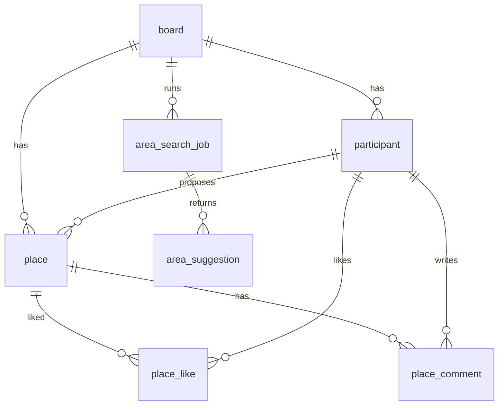

# ERD 명세서

| 항목 | 내용 |
|---|---|
| 문서 버전 | 1.0 |
| 작성일 | 2026-07-23 |
| 기준 문서 | `2026-07-23-candidate-place-board-product-design.md` |
| DB | PostgreSQL |
| 스키마 관리 | Flyway migration만 사용 |
| 시간 | 전부 `timestamptz`, UTC 저장 |
| 좌표 | WGS84, `lon`=경도, `lat`=위도 |

## 0. 설계 원칙

1. 핵심 모델은 후보 장소 보드 하나에 집중한다.
2. 보드의 현재 선택 장소는 `board.selected_place_id` nullable FK 하나로 표현한다.
3. 출발지는 `participant.origin_ciphertext`에만 암호화 저장하고 타인 응답에는 평문을 노출하지 않는다.
4. 장소 저장 모델은 공급자 중립적이어야 하며 특정 지도 API에 종속된 테이블을 두지 않는다.
5. 장소 삭제는 물리 삭제 대신 `ACTIVE` / `ARCHIVED` 상태 전환으로 처리한다.
6. 좋아요는 `(place_id, participant_id)` 유일성으로 멱등 보장한다.
7. 개설자는 이력 메타데이터일 뿐 기능 권한에 사용하지 않는다.
8. 정식 투표, 코스, 출발 계산, 공개 토큰용 canonical 테이블은 유지하지 않는다.

## 1. 전체 관계도



## 2. 테이블 정의

공통 컬럼:
- `id bigint generated always as identity primary key`
- `created_at timestamptz not null default now()`
- `updated_at timestamptz not null default now()`

### 2.1 board

| 컬럼 | 타입 | 제약 | 설명 |
|---|---|---|---|
| public_id | text | unique, not null | `brd_` + ULID |
| name | text | not null | 2~40자 |
| status | text | not null, default 'OPEN' | `OPEN` / `CLOSED` |
| creator_participant_id | bigint | FK participant, null | 생성 직후 개설자 연결 전까지 null 허용 |
| selected_place_id | bigint | nullable FK place | 현재 선택 장소 |
| selected_by_participant_id | bigint | nullable FK participant | 마지막 선택 변경자 |
| selected_at | timestamptz | null | 마지막 선택 변경 시각 |
| invite_code | text | unique, not null | 참여자가 상시 확인하는 참여 코드 |
| closed_at | timestamptz | null | 보관 시각 |

제약:
- `check (status in ('OPEN','CLOSED'))`
- `selected_place_id`는 같은 보드의 장소만 가리켜야 하므로 `foreign key (selected_place_id, id) references place (id, board_id)`로 강제한다.
- `creator_participant_id`, `selected_by_participant_id`는 같은 보드의 참여자만 가리키도록 애플리케이션 트랜잭션에서 확인한다.
- 선택 대상은 `ACTIVE` 장소만 허용하며, 이는 애플리케이션 트랜잭션에서 확인한다.

### 2.2 participant

| 컬럼 | 타입 | 제약 | 설명 |
|---|---|---|---|
| public_id | text | unique, not null | `ptc_` + ULID |
| board_id | bigint | FK board, not null | |
| nickname | text | not null | 1~20자 |
| token_hash | text | not null | 참여 토큰 해시 |
| active | boolean | not null, default true | 비활성 참여자 구분 |
| origin_label | text | null | 표시용 요약 |
| origin_ciphertext | bytea | null | 암호화된 출발지 좌표/원문 |
| origin_source | text | null | `KAKAO`, `NAVER`, `EXTERNAL`, `MANUAL` 등 |

개설자 여부는 `board.creator_participant_id`와 비교해 파생하며 별도 권한 역할 컬럼을 두지 않는다.

### 2.3 place

| 컬럼 | 타입 | 제약 | 설명 |
|---|---|---|---|
| public_id | text | unique, not null | `plc_` + ULID |
| board_id | bigint | FK board, not null | |
| proposer_id | bigint | FK participant, not null | |
| name | text | not null | 1~100자 |
| lon | double precision | not null | |
| lat | double precision | not null | |
| address_name | text | null | 지번 주소 |
| road_address_name | text | null | 도로명 주소 |
| category | text | null | 공급자 원본 또는 내부 매핑 |
| source_provider | text | not null | `KAKAO` / `NAVER` / `EXTERNAL` / `MANUAL` |
| provider_place_id | text | null | 공급자 원본 ID |
| source_url | text | null | 원본 지도 링크 |
| status | text | not null, default 'ACTIVE' | `ACTIVE` / `ARCHIVED` |
| archived_at | timestamptz | null | 보관 시각 |

제약:
- `check (status in ('ACTIVE','ARCHIVED'))`
- `check (source_provider in ('KAKAO','NAVER','EXTERNAL','MANUAL'))`
- `check (lon between 124 and 132 and lat between 33 and 39)` for Korea MVP 범위
- `unique (id, board_id)`를 둬 `board.selected_place_id`의 same-board FK를 지원한다.

### 2.4 place_like

| 컬럼 | 타입 | 제약 | 설명 |
|---|---|---|---|
| place_id | bigint | FK place, not null | |
| participant_id | bigint | FK participant, not null | |

제약:
- `primary key (place_id, participant_id)` 또는 동등한 unique index
- 같은 참여자는 같은 장소를 한 번만 좋아요할 수 있다.

### 2.5 place_comment

| 컬럼 | 타입 | 제약 | 설명 |
|---|---|---|---|
| public_id | text | unique, not null | `cmt_` + ULID |
| place_id | bigint | FK place, not null | |
| author_id | bigint | FK participant, not null | |
| body | text | not null | 1~500자 |
| deleted_at | timestamptz | null | 소프트 삭제 |

제약:
- 삭제는 작성자만 가능하며 권한은 애플리케이션 계층에서 검사한다.

### 2.6 area_search_job

| 컬럼 | 타입 | 제약 | 설명 |
|---|---|---|---|
| public_id | text | unique, not null | `job_` + ULID |
| board_id | bigint | FK board, not null | |
| requester_id | bigint | FK participant, not null | 작업을 시작한 참여자 |
| status | text | not null, default 'QUEUED' | `QUEUED` / `RUNNING` / `SUCCEEDED` / `FAILED` |
| duration_min | int | not null | 30 / 45 / 60 |
| participant_snapshot | jsonb | not null | 참여자 ID 목록과 입력 스냅샷 |
| result_summary | jsonb | null | 공통 영역/오류 요약 |
| error_code | text | null | `NO_INTERSECTION` 등 |
| started_at | timestamptz | null | |
| finished_at | timestamptz | null | |

제약:
- `check (duration_min in (30,45,60))`
- `check (status in ('QUEUED','RUNNING','SUCCEEDED','FAILED'))`

### 2.7 area_suggestion

| 컬럼 | 타입 | 제약 | 설명 |
|---|---|---|---|
| public_id | text | unique, not null | `asg_` + ULID |
| job_id | bigint | FK area_search_job, not null | |
| rank | int | not null | 1~3 |
| name | text | not null | 예: 신도림역 |
| lon | double precision | not null | |
| lat | double precision | not null | |
| provider | text | not null | 기준점 수집 공급자 |
| provider_place_id | text | null | 공급자 원본 ID |
| reason_summary | jsonb | not null | 선택 이유 목록 |

제약:
- `check (rank between 1 and 3)`
- `unique (job_id, rank)`

## 3. 인덱스 요약

FK 컬럼은 전부 인덱스를 생성한다. 추가 인덱스는 아래를 기준으로 한다.

```sql
create unique index ux_place_like_unique
    on place_like (place_id, participant_id);

create index ix_place_board_active
    on place (board_id, created_at desc)
    where status = 'ACTIVE';

create index ix_place_proposer
    on place (proposer_id, created_at desc);

create index ix_place_comment_place_active
    on place_comment (place_id, created_at asc)
    where deleted_at is null;

create unique index ux_area_search_job_active
    on area_search_job (board_id)
    where status in ('QUEUED','RUNNING');

create index ix_area_search_job_board_created
    on area_search_job (board_id, created_at desc);

create unique index ux_area_suggestion_rank
    on area_suggestion (job_id, rank);
```

## 4. 핵심 무결성 규칙

1. `board.status = 'CLOSED'`면 장소 추가, 좋아요, 댓글, 선택 변경, 지역 제안 시작을 막는다.
2. `board.selected_place_id`는 null 또는 같은 보드의 `ACTIVE` 장소 하나여야 한다.
3. `ARCHIVED` 장소에는 새 좋아요, 댓글, 선택 지정을 허용하지 않는다.
4. `place_like.participant_id`와 `place.proposer_id`는 같은 `board_id` 소속 참여자여야 한다.
5. `place_comment.author_id`도 같은 보드 참여자여야 한다.
6. `area_search_job.requester_id`는 같은 보드의 활성 참여자여야 한다.
7. 출발지 평문 좌표는 어떤 테이블에도 별도 컬럼으로 저장하지 않는다.

## 5. 선택/삭제 트랜잭션

### 5.1 현재 선택 장소 지정 또는 변경

1. `board` 행을 `FOR UPDATE`로 잠근다.
2. 대상 `place`가 같은 보드에 속하고 `status = 'ACTIVE'`인지 확인한다.
3. 요청자가 같은 보드의 활성 참여자인지 확인한다.
4. `update board set selected_place_id = :placeId, selected_by_participant_id = :participantId, selected_at = now(), updated_at = now() where id = :boardId`
5. 동시에 여러 요청이 오면 잠금 획득 후 마지막으로 커밋된 변경을 현재 상태로 삼는다.
6. 응답에서 `selectedPlaceId`, `selectedByParticipantId`, `selectedAt`을 반환한다.

### 5.2 선택된 장소 삭제(보관)

1. 트랜잭션 시작
2. `board` 행을 `FOR UPDATE`로 잠근다.
3. 요청자가 같은 보드의 활성 참여자인지 확인한다.
4. `place` 행을 조회해 같은 보드인지 확인한다.
5. `board.selected_place_id = :placeId`면 먼저 `selected_place_id = null`, 변경자·시각을 갱신한다.
6. `update place set status = 'ARCHIVED', archived_at = now(), updated_at = now() where id = :placeId`
7. 커밋

이 순서를 고정해 선택 포인터가 보관된 장소를 가리키는 상태를 막는다.

## 6. 범위에서 제외하는 canonical 테이블

다음 테이블은 새 MVP 기준 canonical schema에서 제거한다.

- `vote`
- `vote_option`
- `vote_ballot`
- `course_draft`
- `course`
- `course_stop`
- `departure_calculation`
- 공개 일정/공개 토큰 전용 canonical 테이블

초대 코드, 참여 토큰 해시 등 접근 제어에 필요한 값은 `board`와 `participant` 내부 컬럼으로만 유지한다.
