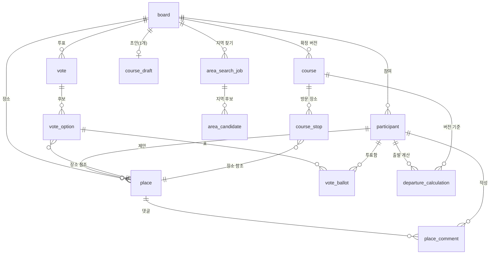

# ERD 명세서

| 항목 | 내용 |
|---|---|
| 문서 버전 | 1.0 |
| 작성일 | 2026-07-22 |
| 기준 문서 | `기능명세서_v1.3.md`, `API명세서_v1.1.md`, `시스템아키텍처_v1.0.md` |
| DB | PostgreSQL (로컬: Docker, 운영: Cloud SQL) |
| 스키마 관리 | Flyway migration만 사용 |
| 시간 | 전부 `timestamptz`, UTC 저장 |
| 좌표 | WGS84. `lon`=경도, `lat`=위도, `double precision` |

## 0. 설계 원칙 (팀 합의 사항)

1. **PK는 내부 `bigint` identity**, 외부 노출용 `public_id`(ULID + 접두사, 예: `brd_01H...`)를 별도 unique 컬럼으로 둔다. FK는 전부 bigint.
2. **코스 초안 stops는 JSONB 한 컬럼**. 초안은 PUT 전체 교체라 정규화하지 않는다.
3. **확정 코스도 스냅샷 복사하지 않는다.** `course_stop`은 `place_id` FK만 참조한다. 장소는 soft delete라 행이 사라지지 않으므로 조회는 가능하다. MVP에서 DB 수준 불변성을 강제하지 않는다.
4. **외부 API 결과 캐시와 캐시 전용 테이블은 사용하지 않는다.** 검색 후보는 저장하지 않고, 사용자가 확정한 장소·출발지와 지역 찾기·출발 안내 결과만 도메인 테이블에 저장한다. TTL이나 캐시 적중 정책을 두지 않는다.
5. MVP 제외: `PlaceReaction`(P1), `ActivityEvent`(조회 API 없음), 알림, 운영 대시보드 테이블. PostGIS 미사용 — 폴리곤 연산은 JTS가 애플리케이션에서 수행하고 GeoJSON은 JSONB로 저장.

## 1. 전체 관계도



## 2. 테이블 정의

공통 컬럼(모든 테이블): `id bigint generated always as identity primary key`, `created_at timestamptz not null default now()`, `updated_at timestamptz not null default now()`. 아래 표에서는 생략한다.

### 2.1 board

| 컬럼 | 타입 | 제약 | 설명 |
|---|---|---|---|
| public_id | text | unique, not null | `brd_` + ULID |
| name | text | not null | 2~40자 (앱 검증) |
| date_start | date | not null | |
| date_end | date | not null | start 이상 |
| purpose | text | | 선택 |
| budget_per_person | int | | 선택, 0 이상 |
| status | text | not null, default 'COLLECTING' | COLLECTING / CONFIRMED / CLOSED |
| invite_code_hash | text | unique, not null | HMAC 값만 저장 |
| invite_expires_at | timestamptz | not null | |
| public_token_hash | text | unique | 최초 확정 시 생성, 그 전 null |

### 2.2 participant

| 컬럼 | 타입 | 제약 | 설명 |
|---|---|---|---|
| public_id | text | unique, not null | `ptc_` + ULID |
| board_id | bigint | FK board, not null | |
| nickname | text | not null | 1~20자, 중복 허용 |
| role | text | not null | HOST / MEMBER |
| token_hash | text | not null | HMAC-SHA-256(secret) |
| avatar_color | text | not null | |
| active | boolean | not null, default true | 호스트가 비활성화 가능 |
| origin_label | text | | 출발지 표시명 (예: 정왕역) |
| origin_ciphertext | bytea | | 암호화된 lon/lat. null이면 미등록 |
| origin_source | text | | KAKAO_KEYWORD / KAKAO_ADDRESS / MANUAL_PIN |
| origin_provider_place_id | text | | 선택 |

- 타인 조회 시 `origin_ciphertext is not null` 여부만 `registered`로 노출한다.
- 좌표는 애플리케이션 수준 암호화(아키텍처 문서 7절). 평문 lat/lon 컬럼을 두지 않는다.

### 2.3 place

| 컬럼 | 타입 | 제약 | 설명 |
|---|---|---|---|
| public_id | text | unique, not null | `plc_` + ULID |
| board_id | bigint | FK board, not null | |
| proposer_id | bigint | FK participant, not null | |
| name | text | not null | 1~100자 |
| lon / lat | double precision | not null | |
| address_name | text | | |
| road_address_name | text | | |
| internal_category | text | not null | RESTAURANT / CAFE / PLAY / BAR / CULTURE / ATTRACTION / TRANSIT / ETC |
| provider | text | | 검색 결과는 'KAKAO', 수동 핀은 null |
| provider_place_id | text | | |
| provider_place_url | text | | 허용 도메인 검증 후 저장 |
| source | text | not null | SEARCH_SELECT / MANUAL_PIN |
| status | text | not null, default 'ACTIVE' | ACTIVE / ARCHIVED |
| deleted_at | timestamptz | | soft delete |

- 중복 장소 허용, 자동 병합 없음 (BR-004).
- SEARCHING/NEEDS_CONFIRMATION 상태는 저장하지 않는다 — 사용자 선택 전에는 행을 만들지 않기 때문 (BR-003).

### 2.4 place_comment

| 컬럼 | 타입 | 제약 | 설명 |
|---|---|---|---|
| public_id | text | unique, not null | `cmt_` + ULID |
| place_id | bigint | FK place, not null | |
| author_id | bigint | FK participant, not null | |
| body | text | not null | 1~500자, 일반 텍스트 |
| deleted_at | timestamptz | | soft delete |

### 2.5 vote / vote_option / vote_ballot

**vote**

| 컬럼 | 타입 | 제약 | 설명 |
|---|---|---|---|
| public_id | text | unique, not null | `vot_` + ULID |
| board_id | bigint | FK board, not null | |
| status | text | not null, default 'OPEN' | OPEN / CLOSED |
| max_selections | int | not null | 1 이상 |
| anonymous | boolean | not null | 생성 시 고정 |
| closes_at | timestamptz | not null | |

**vote_option**

| 컬럼 | 타입 | 제약 |
|---|---|---|
| vote_id | bigint | FK vote, not null |
| place_id | bigint | FK place, not null |
| unique (vote_id, place_id) | | 같은 투표에 같은 장소 중복 금지 |

**vote_ballot**

| 컬럼 | 타입 | 제약 |
|---|---|---|
| vote_id | bigint | FK vote, not null |
| participant_id | bigint | FK participant, not null |
| option_id | bigint | FK vote_option, not null |
| unique (vote_id, participant_id, option_id) | | |

- 내 투표 PUT 교체 = 트랜잭션 안에서 해당 (vote_id, participant_id) 전체 delete 후 insert.
- 보드당 열린 투표 1개: `create unique index on vote (board_id) where status = 'OPEN';`

### 2.6 area_search_job

| 컬럼 | 타입 | 제약 | 설명 |
|---|---|---|---|
| public_id | text | unique, not null | `job_` + ULID |
| board_id | bigint | FK board, not null | |
| status | text | not null, default 'QUEUED' | QUEUED / RUNNING / RETRY_WAIT / SUCCEEDED / FAILED |
| duration_min | int | not null | 30 / 45 / 60 |
| snapshot | jsonb | not null | 대상 참여자 ID·출발 좌표 스냅샷 |
| progress | jsonb | | phase / done / total |
| result | jsonb | | 교집합 GeoJSON + 요약 (성공 시) |
| error_code | text | | NO_INTERSECTION / NO_HUB_FOUND / EXTERNAL_UNAVAILABLE |
| retry_count | int | not null, default 0 | |
| next_retry_at | timestamptz | | RETRY_WAIT용 |
| started_at / finished_at | timestamptz | | |

- 보드당 활성 작업 1개: `create unique index on area_search_job (board_id) where status in ('QUEUED','RUNNING','RETRY_WAIT');`
- Job Executor가 `SELECT ... FOR UPDATE SKIP LOCKED`로 선점하는 대상 테이블이다.

### 2.7 area_candidate

| 컬럼 | 타입 | 제약 | 설명 |
|---|---|---|---|
| public_id | text | unique, not null | `arc_` + ULID |
| job_id | bigint | FK area_search_job, not null | |
| name | text | not null | 예: 신도림역 |
| lon / lat | double precision | not null | |
| provider_place_id | text | | Kakao 장소 ID |
| metrics | jsonb | not null | avgSeconds / maxSeconds / transferAvg / unreachableCount |
| reasons | jsonb | not null | 설명 문자열 배열 |
| rank | int | not null | 1~3 |

### 2.8 course_draft

| 컬럼 | 타입 | 제약 | 설명 |
|---|---|---|---|
| board_id | bigint | FK board, unique, not null | 보드당 1행 |
| version | int | not null, default 0 | ETag / If-Match 비교용 |
| stops | jsonb | not null, default '[]' | `[{placeId, orderIndex, role, scheduledAt}]` |

- PUT마다 version+1, 전체 교체. stops 내 placeId 유효성은 애플리케이션에서 검증.

### 2.9 course / course_stop

**course**

| 컬럼 | 타입 | 제약 | 설명 |
|---|---|---|---|
| public_id | text | unique, not null | `crs_` + ULID |
| board_id | bigint | FK board, not null | |
| version | int | not null | 보드 내 확정 순번, unique (board_id, version) |
| confirmed_at | timestamptz | not null | |

- "현재 확정 코스" = 보드의 version 최대 행. 별도 current 플래그 없음.

**course_stop**

| 컬럼 | 타입 | 제약 | 설명 |
|---|---|---|---|
| course_id | bigint | FK course, not null | |
| place_id | bigint | FK place, not null | 스냅샷 없이 FK 참조 |
| order_index | int | not null | unique (course_id, order_index) |
| role | text | not null | FIRST_MEETING / MEAL / CAFE / PLAY / ETC |
| scheduled_at | timestamptz | not null | |

- 코스당 FIRST_MEETING 1개(= order_index 1)는 애플리케이션 검증.
- 코스에 포함된 장소 삭제 시도는 이 테이블 참조 검사로 `409 PLACE_IN_USE` 처리.

### 2.10 departure_calculation

| 컬럼 | 타입 | 제약 | 설명 |
|---|---|---|---|
| participant_id | bigint | FK participant, not null | |
| course_id | bigint | FK course, not null | 계산 기준 확정 버전 |
| status | text | not null | CALCULATING / READY / STALE / UNAVAILABLE / FAILED |
| total_seconds | int | | |
| transfer_count | int | | |
| fare_amount | int | | KRW |
| total_walk_seconds | int | | 보조 표시용 |
| recommended_departure_at | timestamptz | | 만남시각 - totalSeconds - 10분 |
| calculated_at | timestamptz | | |
| unique (participant_id, course_id) | | | 참여자×버전당 1건 |

- `NOT_REQUESTED`는 행 없음으로 표현한다.
- 출발지·일정 변경 시 해당 행들을 STALE로 갱신 (BR-012).
- `CALCULATING`은 대기와 실행을 함께 나타낸다. 단일 Job Executor가 처리하며 짧은 인메모리 재시도 후에도 실패하면 `FAILED`로 저장한다.
- 같은 참여자·코스의 `READY` 행 반환은 캐시 적중이 아니라 현재 도메인 결과 조회다. 별도 TMAP 좌표쌍 캐시나 TTL은 두지 않는다.

## 3. 인덱스 요약

FK 컬럼은 전부 인덱스를 만든다 (PostgreSQL은 FK에 자동 인덱스를 만들지 않음).

```sql
-- 조회 패턴 기반
create index on place (board_id, status) where deleted_at is null;
create index on place_comment (place_id) where deleted_at is null;
create index on participant (board_id);
create index on vote_ballot (vote_id, participant_id);
create index on course (board_id, version desc);
create index on area_search_job (status, next_retry_at);  -- Job Executor 폴링용

-- 유일성 (부분 인덱스)
create unique index on vote (board_id) where status = 'OPEN';
create unique index on area_search_job (board_id)
    where status in ('QUEUED','RUNNING','RETRY_WAIT');
```

토큰 조회는 `participant.public_id`로 참여자를 찾고 `token_hash`를 비교하므로 별도 인덱스가 필요 없다 (public_id unique 인덱스 사용).

## 4. 의도적으로 하지 않은 것

| 항목 | 이유 |
|---|---|
| 확정 코스 스냅샷 컬럼 | place가 soft delete라 FK로 충분. MVP 단순성 우선 (팀 결정) |
| 외부 API 결과 캐시·캐시 테이블 | 검색 후보는 저장하지 않고 지역 찾기·출발 안내 결과만 도메인 기록으로 보존 (팀 결정) |
| PostGIS | 폴리곤 연산은 JTS(앱), GeoJSON은 JSONB 저장으로 충분 |
| enum 타입 (PostgreSQL ENUM) | 값 추가 시 migration 부담. text + 앱 검증 |
| ActivityEvent / PlaceReaction / 알림 | MVP API에 없음 |
| 트리거·저장 프로시저 | 로직은 전부 애플리케이션 계층 |
| 파티셔닝, 커서 페이지네이션용 구조 | 규모상 불필요, 문제 확인 후 도입 |
