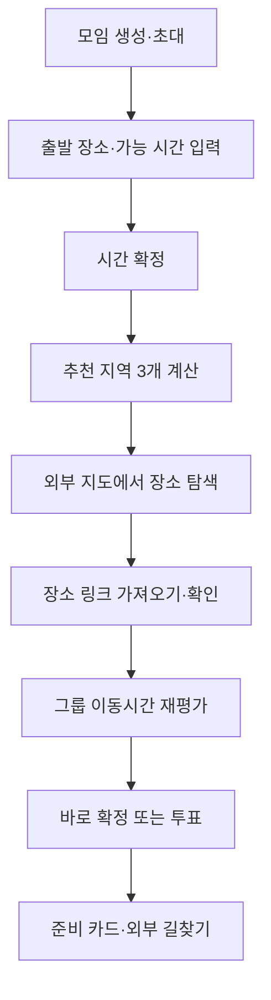

# 모임 조율 서비스 최종 기능 명세서

- 문서 버전: 2.0
- 기준일: 2026-07-20
- 문서 상태: 구현 기준선
- 제품 형태: B2C 반응형 웹
- 대상: 고등학생 개발팀과 구현 에이전트

## 0. 문서 목적

여러 참여자가 약속 시간과 장소를 정하는 서비스를 구현할 수 있도록 제품 범위, 화면, 상태, 추천 알고리즘, 외부 API, 데이터, 예외 처리, 우선순위와 완료 조건을 하나의 기준으로 정의한다.

이 문서는 다음 기존 논의와 PoC 결과를 통합한다.

- 시간·장소 조율 기능 명세
- ODsay 도달권과 GeoJSON 교집합 PoC
- TMAP POI·지오코딩·대중교통 요약·전체정보 PoC
- 카카오맵·네이버 지도 링크 가져오기·내보내기 PoC
- 무료·후불 요금제의 호출 제한과 비용 통제 논의

이 문서와 이전 문서가 충돌하면 이 문서를 우선한다.

## 1. 제품 정의

### 1.1 한 문장

참여자들의 실제 출발 장소와 가능한 시간을 모아, 대중교통으로 만나기 괜찮고 주변에서 활동하기 편한 지역을 제안하고, 여러 지도에서 찾은 정확한 장소를 가져와 함께 비교·결정하는 서비스다.

### 1.2 해결할 생활 불편

- 메신저에서 가능한 날짜를 반복해서 묻는 불편
- 단순 지도 중앙이 실제 대중교통 중앙과 다른 문제
- 중간 지점이더라도 만나서 할 것이 없는 장소일 수 있는 문제
- 각자 지도 앱으로 후보를 검색한 뒤 다시 이동시간을 비교해야 하는 문제
- 약속 확정 후 각자가 출발시각과 경로를 다시 검색하는 불편

### 1.3 핵심 차별점

우리 서비스는 네이버 지도나 카카오맵을 대체하지 않는다.

- 외부 지도: 장소 탐색, 리뷰, 실시간 상세 길찾기
- 우리 서비스: 여러 사람의 조건 수집, 추천 지역 생성, 후보별 그룹 이동 비교, 투표·확정, 개인 준비 정보

핵심 메시지는 `여러 지도에서 찾은 장소가 우리 모임에 실제로 괜찮은지 계산해준다`이다.

### 1.4 제품 원칙

1. 공정성을 전면 메시지로 내세우지 않고 약속 결정의 번거로움을 줄인다.
2. 기본 화면에는 후보 3개만 노출한다.
3. 투표는 입력 과정에 끼워 넣지 않고 별도 `결정` 탭에서 선택적으로 연다.
4. 회원가입과 GPS를 강제하지 않는다.
5. 시스템이 모르는 장소 매력도를 과장하지 않는다.
6. 자동 계산이 실패해도 수동 후보와 투표로 약속을 확정할 수 있어야 한다.
7. 우리 서비스에는 비교에 필요한 경로 요약을 남기고 실제 이동은 외부 지도와 연결한다.

## 2. 범위

### 2.1 목표 MVP: P0+P1

- 모임 생성, 초대 코드·링크, 비회원 참여
- 진행 중인 모임 카드
- 닉네임·출발 장소 통합 입력
- 가능한 시간 빠른 입력과 상세 입력
- 추천 시간 바로 확정 또는 선택적 투표
- 참여자 출발 장소와 추천 영역 지도 표시
- ODsay 도달권 교집합 기반 추천 영역 생성
- TMAP POI 기반 교통·활동 거점 수집
- TMAP 대중교통 요약정보 기반 지역·장소 평가
- 기본 추천 지역 3개
- 카카오맵·네이버 지도 주변 탐색 링크
- 카카오맵·네이버 지도 장소 링크 가져오기
- 가져온 장소 확인과 그룹 이동시간 재평가
- 장소 바로 확정 또는 선택적 투표
- 확정 모임 공유 페이지와 외부 지도 길찾기
- API 호출량·비용·오류 로그

### 2.2 P2

- 선택한 후보의 TMAP 실제 경로선 지연 표시
- 참여자 경로 레이스 애니메이션
- 장거리 추천 고도화
- 실시간 WebSocket 갱신
- 운영 대시보드

### 2.3 MVP 비범위

- GPS 현재 위치 입력과 실시간 위치 공유
- 별도 보행자 경로 API와 도보 전용 이동수단
- 자동차 경로와 내비게이션
- 음식점·상품의 개인화 추천
- 외부 지도 리뷰·사진·평점 수집 또는 스크래핑
- 결제와 수익화
- AI만으로 생성하는 추천
- 외부 캘린더 연동
- 카카오맵·네이버 지도 페이지 iframe 삽입
- 우리 서비스의 턴바이턴 이동 안내

## 3. 사용자와 권한

| 역할 | 권한 |
|---|---|
| 방장 | 모임 생성·수정, 추천 계산, 투표 시작·종료, 시간·장소 최종 확정, 모임 취소 |
| 참여자 | 초대 참여, 개인 입력 수정, 후보 추가, 열린 투표 참여, 확정 정보 확인 |

MVP에서는 회원가입을 강제하지 않는다. 참가 시 모임별 접근 토큰을 발급하고 브라우저에 저장한다. 다른 기기 복원은 초대 링크와 닉네임 재확인 방식으로 제한한다.

## 4. 정보 구조와 진입 장벽

### 4.1 홈

- `새 모임 만들기`
- `초대 코드 입력`
- 현재 브라우저에서 참여한 `진행 중인 모임`

### 4.2 모임 상세 탭

| 탭 | 내용 |
|---|---|
| 모임 | 현재 상태, 참여자, 내 입력, 확정 정보 |
| 후보 | 추천 시간·지역 3개, 외부 지도 탐색, 사용자가 추가한 장소 |
| 결정 | 방장이 연 시간·장소 투표와 결과 |

### 4.3 참여자 초기 입력

강제 입력은 두 단계로 제한한다.

1. 닉네임 + 실제 출발 예정 장소
2. 가능한 날짜·시간

이동수단은 MVP에서 대중교통으로 고정해 입력받지 않는다. 브라우저에 최근 출발 장소와 닉네임이 있으면 빠른 선택으로 제안한다.

## 5. 핵심 사용자 흐름



정확한 장소를 외부에서 가져오지 않아도 추천 지역의 대표 교통 거점을 임시 만남 장소로 확정할 수 있다.

## 6. 상태 모델

| 상태 | 설명 | 허용되는 주요 동작 |
|---|---|---|
| `COLLECTING` | 참여자·출발지·가능 시간 수집 | 참가, 개인 입력 |
| `TIME_VOTING` | 선택적 시간 투표 | 투표, 방장 종료 |
| `TIME_CONFIRMED` | 시간 확정 | 추천 지역 계산 |
| `PLACE_CALCULATING` | 도달권·후보 평가 | 진행률 확인, 중복 요청 차단 |
| `PLACE_SELECTING` | 추천 지역·장소 탐색 | 외부 지도 열기, 장소 가져오기, 바로 확정·투표 시작 |
| `PLACE_VOTING` | 선택적 장소 투표 | 단일 선택, 방장 종료 |
| `CONFIRMED` | 시간·장소 확정 | 공유, 개인 경로 확인 |
| `COMPLETED` | 모임 종료 | 읽기 전용 |
| `CANCELLED` | 모임 취소 | 읽기 전용 |

모든 상태 변경은 서버에서 권한과 현재 상태를 검사한다.

## 7. 기능 명세

### F01. 새 모임 만들기

| 항목 | 필수 | 규칙 |
|---|---:|---|
| 모임 이름 | 필수 | 2~30자 |
| 후보 날짜 범위 | 필수 | 시작일 ≤ 종료일, 최대 범위는 설정값 |
| 모임 목적 | 선택 | 100자 이하 |
| 1인 예산 | 선택 | 0 이상의 정수, 추천 순위에는 사용하지 않음 |
| 예상 소요시간 | 선택 | 기본 2시간, 30분 단위 |
| 최대 참여자 | 선택 | 기본 10명, 최대 10명 |

생성 결과는 모임 ID, 6자리 초대 코드, 초대 링크와 방장 접근 토큰이다.

완료 조건:

- 필수값만으로 한 화면에서 생성할 수 있다.
- 목적·예산은 생성 이후 수정할 수 있다.

### F02. 초대 링크·코드로 참여하기

- 기본 수단은 코드가 포함된 링크다.
- 홈에서 6자리 코드를 직접 입력할 수 있다.
- 닉네임은 모임 안에서 중복될 수 없다.
- 취소·종료·정원 초과 모임에는 참가할 수 없다.
- 참여 성공 후 초기 입력 1단계로 이동한다.

### F03. 진행 중인 모임 확인하기

모임 카드에는 다음을 표시한다.

- 모임 이름과 상태
- 참여 인원
- 사용자에게 남은 입력·투표
- 확정된 시간과 장소

비회원 MVP에서는 현재 브라우저에 저장된 모임만 표시한다.

### F04. 참여자 목록

- 닉네임, 방장 여부, 식별 색상
- 시간 입력 완료 여부
- 출발 장소 입력 완료 여부
- 열린 투표 참여 여부

다른 참여자에게는 상세 주소 대신 사용자가 선택한 공개 장소명만 보여준다.

### F05. 출발 장소 수동 입력

GPS 대신 실제 출발 예정 장소를 직접 입력한다.

입력 순서:

1. 학교·역·건물·랜드마크 검색
2. TMAP POI 결과에서 선택
3. 결과가 없으면 도로명 주소 입력
4. 주소도 찾지 못하면 지도에서 수동으로 핀 선택
5. 지도 마커와 공개 표시명을 확인

저장값:

- TMAP 장소 ID 또는 null
- 장소명과 공개 표시명
- 주소
- WGS84 경도·위도
- 입력 버전
- 이동수단 `PUBLIC_TRANSIT`

POI 검색 결과에 좌표가 있으면 지오코딩하지 않는다. 주소 직접 입력에만 TMAP 지오코딩을 호출한다. `A2C500` 오류에는 입력값을 유지한 채 수정·재검색을 안내한다.

수동 핀은 GPS가 아니라 사용자가 지도를 눌러 지정한 좌표다. 역지오코딩은 호출하지 않고 사용자가 다른 참여자에게 보일 공개 장소명을 직접 입력한다.

### F06. 가능한 시간 입력

- 날짜 선택 후 오전·오후·저녁 빠른 버튼
- 필요할 때만 30분 단위 상세 그리드 펼치기
- 드래그로 연속 선택, 재선택으로 해제
- 예상 모임 시간을 만족하지 못하는 짧은 구간 제외
- 변경 즉시 내부 집계 갱신

서버는 슬롯별 가능 인원과 참여자 목록을 계산한다.

### F07. 시간 후보·확정·투표

시간 후보 정렬:

1. 전원이 가능한 연속 시간대
2. 가능한 인원이 많은 시간대
3. 동률이면 더 이른 시간대

기본 후보는 최대 3개, 투표를 열 때는 최대 5개다. 전원이 가능한 후보가 명확하면 방장이 바로 확정한다. 투표는 선택 사항이며 참여자는 복수 선택할 수 있다.

### F08. 지도 기본 표시

- 참여자 출발 장소: 참여자별 색상 마커
- 도달권: 참여자별 반투명 폴리곤
- 공통 도달 영역: 강조 폴리곤
- 추천 지역: 영역 또는 대표 마커
- 정확한 장소 후보: 카테고리 마커
- 확정 장소: 강조 마커

원본 도달권은 서버 계산에만 사용하고 브라우저에는 topology를 보존해 단순화한 GeoJSON을 전송한다.

### F09. 추천 계산 시작

방장만 다음 조건에서 실행할 수 있다.

- 시간 확정
- 참여자 2명 이상
- 모든 참여자의 출발 장소 입력 완료
- 같은 입력 버전의 계산이 진행 중이지 않음

입력 변경 이벤트로 자동 실행하지 않는다. 동일 입력 버전의 요청은 기존 작업을 반환한다.

### F10. ODsay 도달권 생성

참여자마다 `searchPubTransIsochrone`을 호출한다.

| 요청값 | 사용 |
|---|---|
| `x`, `y` | WGS84 출발 좌표 |
| `searchTime` | 30·45·60분 |
| `searchMethod=4` | 버스+지하철 |

첫 검색시간은 가장 먼 참여자 사이의 직선거리로 API 호출 단계를 선택하는 데만 사용한다.

| 최대 직선거리 | 첫 검색시간 |
|---:|---:|
| 15km 이하 | 30분 |
| 15~35km | 45분 |
| 35km 초과 | 60분 |

첫 교집합이 없으면 한 단계만 확대한다. 모임당 최대 2라운드다. ODsay 도달권에는 실제 출발 날짜·시간이 없으므로 후보 탐색 영역으로만 사용한다.

### F11. 공통 영역 계산

1. 참여자별 WGS84 GeoJSON을 교차한다.
2. MultiPolygon을 개별 Polygon으로 분리한다.
3. 설정값보다 작은 조각을 제거한다.
4. 면적 상위 3개를 우선 탐색한다.
5. 유효한 거점이 없으면 다음 조각을 순차 탐색한다.

PoC에서는 60분 교집합이 17개 조각이었으므로 모든 조각에 POI 검색을 수행하지 않는다.

### F12. 추천 지역 거점 수집

추천의 1차 결과는 음식점이 아니라 `만나기 좋은 지역`이다.

공통 영역에서 다음 POI를 수집한다.

1. 지하철역
2. 기차역
3. 고속·시외버스터미널
4. 주요 버스 환승시설
5. 복합상업·문화시설
6. 지역 중심 시설과 전통시장

좌표가 공통 영역 안에 있는지 자체 서버에서 검사한다. 같은 역·터미널·시설의 중복을 제거하고 실제 평가 후보는 최대 6개로 제한한다.

### F13. 지역 활동성 보조 지표

교통 중심점이더라도 주변에 활동할 장소가 없을 수 있으므로 추천 지역 주변의 `활동 선택지`를 보조 지표로 계산한다. 이는 특정 음식점 추천이나 실제 인기 순위가 아니다.

- 도시권 기본 반경: 500m
- 지방·저밀도 fallback 반경: 1km
- 확인 카테고리: 음식·카페, 쇼핑, 문화·여가, 교통 편의
- 사용 데이터: TMAP 주변 POI의 카테고리와 개수

```text
P1 활동성 보조값 = 결과가 존재하는 카테고리 그룹 수(0~4)
동률 처리 = 카테고리 검색 결과 수의 상한 합이 큰 순
```

이 값은 `유명함`이나 `맛있음`으로 표시하지 않는다. 화면에는 `주변 선택지가 많아요` 정도로 표현한다. 데이터가 부족한 지방에서는 활동성 조건을 완화하고 교통 거점 여부를 우선한다.

P1은 후보 6개마다 카테고리 그룹별 최대 1회, 총 24건까지만 주변 POI를 조회한다. P2에서 실제 면적당 밀도, 영업 상태 등 추가 데이터가 확보될 때 지표를 교체할 수 있으나 `meeting_areas.activityMetric` 인터페이스는 유지한다.

### F14. TMAP 실제 대중교통 평가

모든 참여자×최대 6개 후보에 대중교통 요약정보를 `count=1`로 호출한다.

| 응답 필드 | 내부 사용 |
|---|---|
| `totalTime` | 예상 이동시간 |
| `totalWalkTime` | 경로에 포함된 총 도보시간 |
| `totalDistance` | 전체 이동거리 |
| `totalWalkDistance` | 총 도보거리 |
| `transferCount` | 환승 횟수 |
| `fare.regular.totalFare` | 참고 교통비 |
| `pathType` | 경로 유형 |

별도 보행자 API는 호출하지 않는다. 경로가 없는 참여자가 있으면 기본적으로 후보를 제외한다. 모든 후보가 일부 참여자에게 도달 불가능하면 도달 인원이 많은 순으로 표시하고 경고한다.

### F15. 기본 추천 지역 3개

후보별로 다음을 집계한다.

```text
그룹 총 이동시간 = Σ totalTime
평균 이동시간 = 그룹 총 이동시간 / 참여자 수
그룹 총 환승 = Σ transferCount
그룹 예상 교통비 = Σ totalFare
최장 이동시간 = max(totalTime)
```

기본 카드 3개는 중복되지 않게 선정한다.

| 카드 | 선정 규칙 |
|---|---|
| 빠르게 만나요 | 그룹 총 이동시간 최소 |
| 환승이 적어요 | 그룹 총 환승 최소, 동률이면 총 이동시간 |
| 주변 선택지가 많아요 | 최적 평균보다 15분 이상 늘어나지 않는 후보 중 활동성 보조값 최대 |

세 번째 후보가 조건을 만족하지 않거나 활동성 데이터가 없으면 `교통비가 적어요` 후보로 대체한다. 15분은 환경설정으로 관리하되 MVP 기본값으로 고정한다.

카드에는 다음을 표시한다.

- 대표 지역명·거점명
- 평균 이동시간과 최장 이동시간
- 환승 합계와 예상 교통비
- 추천 이유
- 주변 탐색 버튼
- `이 지역으로 정하기` 또는 `정확한 장소 추가`

기본 화면에는 3개만 표시하고 최대 6개 전체 후보는 `다른 후보 보기`에서 펼친다.

### F16. 외부 지도에서 주변 탐색

추천 지역 카드에 다음 버튼을 제공한다.

- `카카오맵에서 주변 보기`
- `네이버 지도에서 주변 보기`

링크는 대표 좌표, 지역명과 모임 목적의 일반 검색어로 만든다. 외부 지도에서 리뷰와 구체적인 장소를 탐색한 뒤 공유 링크를 우리 서비스로 가져올 수 있다.

외부 지도 URL 생성은 공급자 장소 ID가 아니라 WGS84 좌표와 장소명을 기본으로 한다. 따라서 카카오에서 가져온 장소도 네이버 지도에서 열 수 있다. 교차 열기는 동일 공급자의 장소 상세 ID를 보장하는 것이 아니라 같은 좌표를 지도·길찾기 목적지로 여는 기능이다.

### F17. 외부 지도 장소 링크 가져오기

지원 공급자:

- 카카오맵 `kko.to`와 공식 지도·장소 URL
- 네이버 지도 `naver.me`와 공식 지도·장소 URL

표준 처리:

1. URL과 공급자를 분류한다.
2. 허용 도메인과 `https`를 검사한다.
3. 단축 URL을 최대 3회 안전하게 확장한다.
4. 최종 URL에서 공급자 장소 ID를 추출한다.
5. 장소 페이지의 OG 메타를 best-effort로 조회한다.
6. 장소명으로 TMAP POI를 검색한다.
7. 후보 마커·주소를 사용자에게 보여준다.
8. 사용자가 확인한 뒤 정확한 장소 후보로 등록한다.

OG 메타는 핵심 계약이 아니라 편의 기능이다. 실패·429·페이지 변경 시 즉시 장소명·주소 입력 또는 지도 선택으로 전환한다.

네이버 OG 설명에 `방문자리뷰·블로그리뷰` 문구가 들어온 PoC 결과가 있으므로 이를 주소로 저장하지 않는다. 내부 필드는 다음처럼 분리한다.

```text
ogTitle: nullable string
ogDescription: nullable string
address: nullable string
```

외부 페이지 원본 HTML과 리뷰 수는 저장하지 않는다.

### F18. 가져온 장소 확인과 신뢰도

모든 외부 링크 가져오기는 자동 등록이 아니라 확인 화면으로 끝난다.

| 단계 | 조건 | 처리 |
|---|---|---|
| 높음 | 장소명·주소·좌표가 일치 | 마커 확인 후 한 번에 등록 |
| 보통 | 장소명과 좌표만 있거나 POI가 1개 | 주소·마커 확인 필수 |
| 낮음 | POI 복수 또는 이름·주소 불일치 | 최대 3개 중 선택 |
| 실패 | OG와 POI 모두 실패 | 장소명·주소 입력 또는 지도 선택 |

POI 후보 선택 시 첫 번째 결과를 자동 채택하지 않는다. 다음 부속시설 단어가 원본명에 없는데 후보명에 추가되면 감점한다.

```text
주차장, 정문, 후문, 출입구, 장례식장, 외상센터,
별관, 본관, 지하주차장
```

장소명이 조금 다르더라도 지점명·주소를 확인할 수 없으면 자동 확정하지 않는다.

### F19. 가져온 장소 재평가

사용자가 장소를 확인하면 신규 후보 1개만 평가한다.

- TMAP 요약정보 호출 수: 참여자 수
- 기존 지역·장소 후보 결과는 재사용
- 평가 중 후보 카드에 진행률 표시
- 경로가 없는 참여자가 있으면 등록은 유지하되 경고하고 기본 추천에서는 제외

카드에는 `이 장소면 우리는 얼마나 걸려?`를 중심으로 다음을 표시한다.

- 참여자별 이동시간·환승
- 그룹 평균과 최장 이동시간
- 현재 1위 지역·장소 대비 차이
- 후보 출처: 카카오·네이버·직접 입력

### F20. 장소 확정과 선택적 투표

- 방장은 추천 지역 대표 거점 또는 정확한 장소를 바로 확정할 수 있다.
- 의견 수렴이 필요할 때만 장소 투표를 연다.
- 기본 추천 3개와 사용자가 추가한 장소 중 최대 5개를 선택지로 사용한다.
- 참여자별 단일 선택이다.
- 동점이면 방장이 최종 선택한다.
- 투표는 `결정` 탭에서만 진행한다.

### F21. 최종 일정과 개인 준비 카드

확정 시 저장·표시:

- 날짜·시간
- 정확한 장소 또는 대표 거점
- 장소명·주소·지도 마커
- 참여자별 예상 이동시간·환승·요금
- 권장 출발시각: 모임 시각 - 예상 이동시간 - 10분
- 카카오맵·네이버 지도 길찾기 버튼

경로 정보는 확정 시각 기준으로 다시 확인할 수 있어야 한다. 공급자가 미래시각 검색을 지원하지 않거나 결과가 없으면 `현재 기준 예상`이라고 표시한다.

### F22. 경로 미리보기와 외부 상세 길찾기

우리 서비스의 후보 카드에는 요약정보를 항상 유지한다. 사용자가 선택 후보 또는 자신의 확정 경로를 펼칠 때만 TMAP 전체정보를 지연 호출한다.

내부 미리보기:

- `legs[].mode`, `sectionTime`
- 시작·종료 지점
- `passShape.linestring` Polyline
- 버스·지하철·기차 구간별 색상
- WALK 구간은 선을 그리지 않고 `도보 N분` 텍스트만 표시

외부 지도 담당:

- 실시간 배차
- 정류장별 상세 안내
- 실제 이동 중 재탐색
- 턴바이턴 내비게이션

앱 Scheme과 앱 미설치 fallback은 Android·iOS 실기기 검증 후 운영 활성화한다. 카카오 웹에서 대중교통이 아닌 자동차가 기본으로 열리는 경우 앱·웹 버튼을 분리한다.

### F23. 경로 레이스 애니메이션

P2 wow 기능이다. 이미 받은 Polyline과 구간 시간을 프론트엔드에서 재생하므로 애니메이션 자체는 API를 추가 호출하지 않는다.

- 참여자별 색상 점을 동일한 시간축에서 이동
- 예상 도착 순서와 주요 환승 시점 표시
- 모션 감소 설정 지원
- 경로 데이터가 없는 참여자는 요약 카드만 표시

전체정보를 애니메이션만을 위해 모든 후보에 미리 호출하지 않는다.

### F24. 모임 예정 카드 공유

- 모임 이름·목적
- 날짜·시간
- 장소명·주소
- 지도 썸네일
- 참여 인원
- 개인 접근 시 자신의 예상시간·권장 출발시각
- 외부 지도 열기
- 모임 링크와 Open Graph 메타

공개 공유 카드에는 참여자의 상세 출발지와 개인 경로를 포함하지 않는다.

## 8. 추천 엔진 상세

### 8.1 지역·인접 생활권

1. 모든 출발지를 WGS84 좌표로 정규화한다.
2. 가장 먼 참여자 간 직선거리로 첫 ODsay 시간만 선택한다.
3. 참여자별 도달권을 계산한다.
4. 서버에서 교집합을 계산하고 상위 Polygon을 고른다.
5. 교통·활동 거점 POI를 수집한다.
6. 좌표 포함 여부와 중복을 검사해 최대 6개로 축소한다.
7. TMAP 실제 대중교통 요약정보로 전원×후보를 평가한다.
8. 이동시간·환승·활동 선택지 기준 후보 3개를 만든다.

### 8.2 장거리 fallback

60분에도 교집합이 없으면 `LONG_DISTANCE`로 전환한다.

1. 기차역·고속·시외버스터미널 후보 수집
2. 지리적으로 멀고 방향이 다른 대표 참여자 쌍 최대 3개 선정
3. TMAP 전체정보에서 주요 환승 거점 추출
4. 중복 제거 후 후보 최대 6개
5. 전원×후보 TMAP 요약 평가

화면에는 `60분 내 공통 도달 지역이 없어 장거리 교통 거점을 기준으로 계산했습니다`라고 표시한다. 이는 전국 모든 후보를 탐색한 전역 최적해가 아니다.

### 8.3 후보 변경 최적화

- 참여자 한 명의 출발지 변경: 해당 참여자의 후보 경로만 재평가
- 신규 외부 장소 1개 추가: 전원×신규 후보만 평가
- 시간 변경: 경로 검색 시각을 지원하는 경우 전체 후보 경로 만료
- 같은 입력 버전: 중복 계산 금지

## 9. 외부 API 계약

| 공급자·API | 엔드포인트 | 요청 핵심값 | 사용하는 응답 |
|---|---|---|---|
| TMAP POI | `GET /tmap/pois` | `searchKeyword`, 결과 수 | 장소 ID·명칭·주소·좌표·카테고리 |
| TMAP 지오코딩 | `GET /tmap/geo/fullAddrGeo` | `fullAddr` | WGS84 경도·위도, 주소 결과 |
| ODsay 도달권 | `GET/POST https://api.odsay.com/v1/api/searchPubTransIsochrone` | `x`, `y`, `searchTime`, `searchMethod=4` | GeoJSON 도달권 |
| TMAP 요약정보 | `POST https://apis.openapi.sk.com/transit/routes/sub` | 시작·종료 좌표, `count=1`, 검색시각 | 시간·도보·환승·거리·요금·경로유형 |
| TMAP 전체정보 | `POST https://apis.openapi.sk.com/transit/routes` | 시작·종료 좌표, `count=1`, 검색시각 | `legs`, `mode`, `passShape.linestring` |

모든 공급자 DTO는 어댑터에서 내부 명칭으로 정규화한다. 외부 API는 서버에서만 호출하고 키를 브라우저에 노출하지 않는다.

### 9.1 외부 지도 URL

- 카카오 지도 보기·주변 검색·길찾기: 공식 Web URL 또는 앱·모바일웹 Scheme
- 네이버 지도 보기·검색·길찾기: 공식 URL Scheme과 웹 fallback
- URL 생성에는 새 지도 API 호출을 사용하지 않는다.
- 네이버 Scheme에는 서비스 식별용 `appname`을 포함한다.

## 10. API 호출·비용·속도 통제

### 10.1 호출 상한

| API | 모임 기준 상한 |
|---|---:|
| ODsay 도달권 | 참여자 10명 × 최대 2라운드 |
| TMAP 후보 요약 | 참여자 10명 × 후보 6개 |
| TMAP 주변 POI 활동성 | 후보 6개 × 카테고리 그룹 4개 |
| 외부 장소 신규 평가 | 참여자 수 × 신규 후보 수 |
| TMAP 전체정보 | 사용자 요청 시 1건, 장거리 대표 쌍 최대 3건 |

### 10.2 작업 큐

- 공급자·AppKey별 전역 큐
- 모임별 공정 스케줄링
- 동시성·RPS·최소 간격 환경설정
- free 개발 기본: 동시성 1, 최소 3초 간격
- 429 `Retry-After` 우선, 없으면 지수 백오프+jitter 최대 3회
- validation 4xx는 재시도하지 않음
- 입력 버전과 요청 해시로 중복 제거
- 작업 진행률과 부분 결과 제공

후불 종량제도 초당 호출 제한 해제를 의미하지 않는다. 유료 전환 전 공급자에게 RPS/TPS, burst, 동시 요청 수, 요약·전체 API의 제한 공유 여부를 확인하고, 운영에서도 공급자 한도보다 낮은 자체 rate limit을 유지한다.

### 10.3 비용 보호

- 모임당 호출 예산
- 일·월 비용 상한과 80% 경고
- 긴급 외부 API 차단 스위치
- 공급자 대시보드 사용량과 내부 로그 대조
- 재시도·429·5xx의 과금 반영 여부 검증

사용자 제공 단가 기준 5명×6후보 예시:

```text
요약정보 30건 × 0.55원 = 16.5원
확정 후 전체정보 5건 × 0.88원 = 4.4원
합계 = 20.9원
```

### 10.4 캐시

- TMAP·ODsay 파생 데이터는 공급자 약관에 맞춰 24시간 미만
- 동일 입력 버전과 같은 좌표 쌍은 캐시 사용
- 외부 지도 원본 HTML은 저장하지 않음
- 외부 place ID 조회 결과 캐시는 정책 검토 전 짧은 기술 캐시로만 사용

## 11. 외부 링크 보안

### 11.1 허용 원칙

- `https`만 inbound 입력으로 허용
- 카카오·네이버 공식 공유·지도 도메인 allowlist
- URL 최대 길이 제한
- 리다이렉트 최대 3회
- 각 hop마다 Scheme·호스트·DNS 결과 재검사
- loopback, 사설·link-local IP 차단
- 응답 크기·연결·전체 timeout 제한
- 원본 HTML 전체 저장 금지

### 11.2 실패 정책

- OG 조회 429: 반복하지 않고 장소 확인 입력으로 전환
- 공급자 페이지 구조 변경: 파서 실패 로그 후 수동 입력
- 비허용 URL: 네트워크 요청 전에 거절
- 같은 place ID 중복: 기존 후보 안내

외부 OG 메타 조회 방식은 운영 전 공급자 정책 검토를 통과해야 한다. 통과하지 못하면 `링크 인식 → 장소명·주소 확인`만 유지한다.

## 12. 데이터 모델

| 테이블 | 주요 필드 |
|---|---|
| `meetings` | 이름, 목적, 예산, 상태, 코드, 확정 시간·장소 |
| `participants` | 닉네임, 역할, 색상, 토큰 해시 |
| `departure_points` | TMAP ID, 공개명, 주소, 좌표, 입력 버전 |
| `availability_slots` | 참여자, 시작·종료 시각 |
| `polls` | 유형, 상태, 시작·마감 시각 |
| `poll_options` | 시간 또는 지역·장소 후보 ID |
| `votes` | 참여자, 선택지 |
| `isochrone_runs` | 입력 버전, 검색시간, 상태, 호출 수 |
| `isochrones` | 참여자, GeoJSON, 만료 시각 |
| `meeting_areas` | 대표 거점, Polygon, 활동성 지표, 추천 유형 |
| `place_candidates` | 내부 ID, 출처, 장소명, 주소, 좌표, 확인 상태 |
| `external_place_links` | 공급자, place ID, 원본·최종 URL, OG 필드, 해석 방식 |
| `travel_estimates` | 참여자, 후보, 시간, 도보, 환승, 요금, 만료 |
| `route_details` | 참여자, 후보, legs·Polyline, 만료 |
| `calculation_jobs` | 입력 버전, 진행률, 재시도, 오류 |
| `api_usage_logs` | 공급자, API, 모임, 상태, latency, 비용 추정 |

`place_candidates.origin` 값:

- `SYSTEM_AREA_ANCHOR`
- `EXTERNAL_MAP_IMPORT`
- `MANUAL_INPUT`

`external_place_links.address`에는 검증된 주소만 저장한다. `ogDescription`을 주소로 복사하지 않는다.

## 13. 실시간·비동기 처리

외부 API 계산은 요청 스레드에서 직렬 대기하지 않고 작업 큐로 실행한다.

클라이언트 이벤트:

- 참여자 입장·입력 완료
- 시간 집계 변경
- 투표 변경
- 계산 시작·진행·부분 완료·완료·실패
- 후보 장소 평가 완료
- 시간·장소 확정

P0에서는 polling으로 시작할 수 있고 P2에서 WebSocket으로 전환한다. 이벤트 payload와 상태 코드는 동일하게 유지한다.

## 14. 오류·fallback

| 상황 | 처리 |
|---|---|
| 잘못된 초대 코드 | 참가 불가 안내 |
| TMAP POI 결과 없음 | 주소 입력·지도 선택 |
| 지오코딩 `A2C500` | 입력 유지 후 수정 안내 |
| ODsay 일부 실패 | 1회 재시도 후 계산 중단, 해당 참여자 표시 |
| 교집합 없음 | 한 단계 확대 후 장거리 fallback |
| 추천 영역 POI 없음 | 다음 Polygon, 수동 후보 추가 |
| 일부 TMAP 경로 없음 | 기본 추천 제외, 후보에는 경고 표시 |
| 모든 경로 없음 | 자동 추천 종료, 수동 장소·투표 제공 |
| TMAP 429 | 큐 감속·백오프·이어받기 안내 |
| 쿼터·비용 상한 | 새 자동 계산 중지, 기존·수동 후보 유지 |
| 외부 지도 URL 해석 실패 | 장소명·주소 입력으로 전환 |
| OG 429·페이지 변경 | 재시도 폭주 없이 확인 흐름 전환 |
| 복수·부속시설 POI | 최대 3개 중 사용자 선택 |
| 외부 지도 앱 미설치 | 검증된 웹 fallback 또는 설치 안내 |

수동 경로는 항상 다음 순서로 완결된다.

```text
장소명·주소 입력 → 마커 확인 → 후보 추가 → 투표 또는 방장 확정
```

## 15. 개인정보와 접근 제어

- GPS와 실시간 위치를 수집하지 않는다.
- 사용자가 선택한 출발 예정 장소만 저장한다.
- 다른 참여자에게 상세 주소 대신 공개명을 표시한다.
- 공개 공유 카드에는 개인 출발지·경로를 포함하지 않는다.
- API 키는 서버 환경변수·비밀 저장소에 둔다.
- 접근 토큰은 해시 저장하고 모임 권한을 서버에서 검사한다.
- 로그에는 전체 주소·토큰·API 키·원본 HTML을 남기지 않는다.
- 위치 데이터 삭제·보존기간은 운영 정책으로 설정한다.

## 16. 구현 우선순위

### P0. 외부 API 없이도 완결되는 수직 흐름

1. 모임 생성·초대·비회원 참여
2. 출발 장소·가능 시간 입력
3. 시간 후보와 바로 확정·선택 투표
4. 참여자·지도 마커
5. 수동 추천 지역·장소 후보 등록
6. 장소 바로 확정·선택 투표
7. 공유 카드

### P1. 목표 MVP

1. TMAP POI·지오코딩
2. ODsay 도달권과 교집합
3. 추천 지역 거점 수집·최대 6개 축소
4. TMAP 요약 평가와 기본 카드 3개
5. 활동성 보조 지표 또는 카테고리 다양성
6. 카카오·네이버 주변 탐색 outbound
7. 외부 장소 링크 분류·안전한 redirect·best-effort OG
8. 장소 확인과 신규 후보 재평가
9. 호출 큐·비용·오류 로그

### P2. wow와 운영 고도화

1. 선택 후보 TMAP 전체정보·Polyline
2. 경로 레이스 애니메이션
3. 장거리 fallback 고도화
4. 권장 출발시각 재검증
5. WebSocket
6. 운영 대시보드와 비용 차단

### P3. 후속 확장

- 로그인·다기기 동기화
- 푸시·캘린더
- GPS·당일 ETA
- 자동차 이동수단

## 17. 테스트 명세

### 17.1 단위

- 시간 슬롯 교집합·정렬
- GeoJSON 교집합·MultiPolygon 상위 조각
- POI 중복과 부속시설 감점
- 추천 카드 중복 제거와 15분 활동성 guard
- URL 공급자 분류·encoding·redirect 정책
- OG 설명과 주소 필드 분리
- 입력 버전·요청 해시 중복 방지
- 상태 전환·권한
- 호출 예산 계산

### 17.2 통합

- TMAP POI·지오코딩 DTO 정규화
- ODsay WGS84 GeoJSON
- TMAP 요약·전체정보 DTO
- 외부 공유 URL → place ID → OG → POI → 확인
- 429·timeout·5xx·쿼터 초과
- 캐시 적중·만료
- 카카오·네이버 outbound URL 생성
- 원본·단순화 GeoJSON topology·면적 오차

### 17.3 E2E

- 5명 모임 생성부터 확정·공유까지
- 30분 교집합 없음 → 60분 교집합 성공
- 60분 교집합 없음 → 장거리 fallback
- 추천 지역에서 외부 지도 탐색 → 링크 가져오기 → 재평가 → 투표
- 네이버 TMAP 미검색 장소 → 수동 확인
- 병원·주차장 등 복수 POI → 사용자 선택
- 일부 참여자 경로 없음
- 중복 계산과 계산 이어받기

### 17.4 실기기

- Android Chrome·iOS Safari
- 카카오맵·네이버 지도 앱 설치·미설치
- 장소 보기·주변 검색·대중교통 길찾기
- 웹 fallback과 뒤로 돌아오기
- 공유 링크를 복사해 후보로 다시 가져오기

## 18. MVP 완료 조건

- 5명이 초대 링크로 같은 모임에 참가한다.
- 초기 필수 입력이 닉네임·출발 장소와 가능한 시간 두 단계 안에 끝난다.
- 방장이 시간 후보를 바로 확정하거나 별도 탭에서 투표를 연다.
- 도달권 계산은 최대 2라운드 안에 종료된다.
- 추천 지역 3개에 이동시간·환승·활동 선택지 이유가 표시된다.
- 사용자가 카카오·네이버에서 장소를 탐색하고 링크를 붙여넣는다.
- 링크 결과는 자동 확정되지 않고 마커·주소 확인을 거친다.
- 신규 장소 1개의 전원 이동정보만 추가 계산한다.
- 장소를 바로 확정하거나 별도 탭에서 투표한다.
- 확정 카드에서 카카오·네이버 길찾기를 열 수 있다.
- API 실패 시에도 수동 장소 후보로 모임을 완료한다.
- 공급자별 호출량·latency·429·예상 비용을 확인할 수 있다.

## 19. 검증된 사실

### 19.1 교통·공간 API PoC

- ODsay 강남·정왕·충주 30·60분 도달권 GeoJSON 반환
- WGS84와 60분 응답 약 56KB
- 강남60∩정왕60 교집합 93.4km², 약 65ms
- 강남30∩정왕30 교집합 없음
- 강남60∩충주60 교집합 없음
- 교집합 17개 조각 발생
- TMAP POI 좌표·카테고리와 지오코딩 WGS84
- TMAP 요약 시간·도보·환승·요금 필드
- TMAP 전체 `legs[].mode`, `passShape.linestring`
- 수도권·경기 외곽·충주→청주·서울→천안 경로
- free 병렬 호출 429와 3초 간격 재시도 성공

### 19.2 외부 지도 링크 PoC

실제 `naver.me` 4건과 `kko.to` 4건 결과:

- 링크 식별·redirect·장소명 추출 8/8
- 좌표 후보 생성 7/8
- 추가 선택 없이 등록 가능한 수준 4/8
- 확인 또는 수동 입력으로 완료 가능한 흐름 8/8
- 카카오 단축 링크 4/4 좌표 후보 생성
- 네이버 4건 중 3건 좌표 후보, 1건 TMAP 미검색
- 위험 입력 5/5 차단
- 좌표·장소명으로 양방향 outbound 링크 생성
- 웹 링크 HTTP 확인, 앱 Scheme 실기기 검증 필요

PoC에서 네이버 OG 설명은 주소가 아니라 리뷰 수였고, `국군수도병원`이 장례식장·외상센터 후보로만 검색되는 등 자동 첫 결과 선택이 위험함을 확인했다.

## 20. 운영 전 필수 검증 게이트

다음 항목은 미검증 기능이 아니라 운영 활성화 전 통과해야 할 게이트다.

1. Android·iOS 앱 Scheme과 앱 미설치 fallback
2. 외부 OG 메타 조회의 공급자 정책 적합성
3. TMAP 검색 시각의 평일 낮·심야·주말·막차 결과
4. 불규칙 Polygon의 POI 수집 방식과 호출 수
5. GeoJSON 단순화 품질·면적 오차
6. 선택 후보 Polyline의 브라우저 렌더링·애니메이션
7. TMAP 유료 계약 RPS/TPS·burst·동시 요청과 실제 30건 latency
8. 성공·429·재시도의 청구 반영
9. 여러 모임 동시 계산과 비용 차단

게이트가 실패해도 P0 수동 흐름은 배포 가능해야 한다.

## 21. 명시적 한계

- 추천 지역은 전국 모든 장소를 완전 탐색한 전역 최적해가 아니다.
- 활동성 보조값은 인기도·품질·영업 여부를 보장하지 않는다.
- 정확한 장소의 리뷰·영업정보는 외부 지도에서 확인한다.
- ODsay 도달권은 실제 날짜·시간의 운행을 보장하지 않는다.
- ODsay와 TMAP의 공급자 차이로 도달권과 최종 경로가 다를 수 있다.
- 외부 지도 공유 URL·OG 구조는 예고 없이 바뀔 수 있다.
- 좌표 교차 열기는 반대 공급자의 동일 장소 상세 페이지를 보장하지 않는다.
- 지방 저밀도 지역과 장거리 이동은 거점 중심 근사로 처리한다.

## 22. 공식 참고 문서

- ODsay 대중교통 접근성 영역: https://lab.odsay.com/guide/releaseReference
- ODsay 이용 정책: https://lab.odsay.com/contact/contact
- TMAP 대중교통 전체정보: https://transit.tmapmobility.com/docs/routes
- TMAP 대중교통 요약정보: https://transit.tmapmobility.com/docs/routes/sub
- TMAP 대중교통 이용약관: https://transit.tmapmobility.com/terms
- TMAP 일반 API 정책: https://tmapapi.tmapmobility.com/terms.html
- SK Open API 오류 코드: https://openapi.sk.com/products/detail?linkMenuSeq=345
- TMAP 대중교통 제휴 문의: https://transit.tmapmobility.com/partnership
- 카카오 지도 Web URL: https://apis.map.kakao.com/web/guide/
- 카카오맵 앱·모바일웹 URL Scheme: https://apis.map.kakao.com/ios_v2/docs/getting-started/urlscheme/
- 네이버 지도 URL Scheme: https://guide.ncloud-docs.com/docs/maps-url-scheme