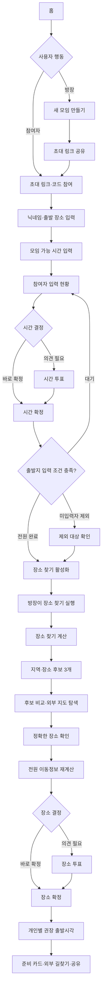
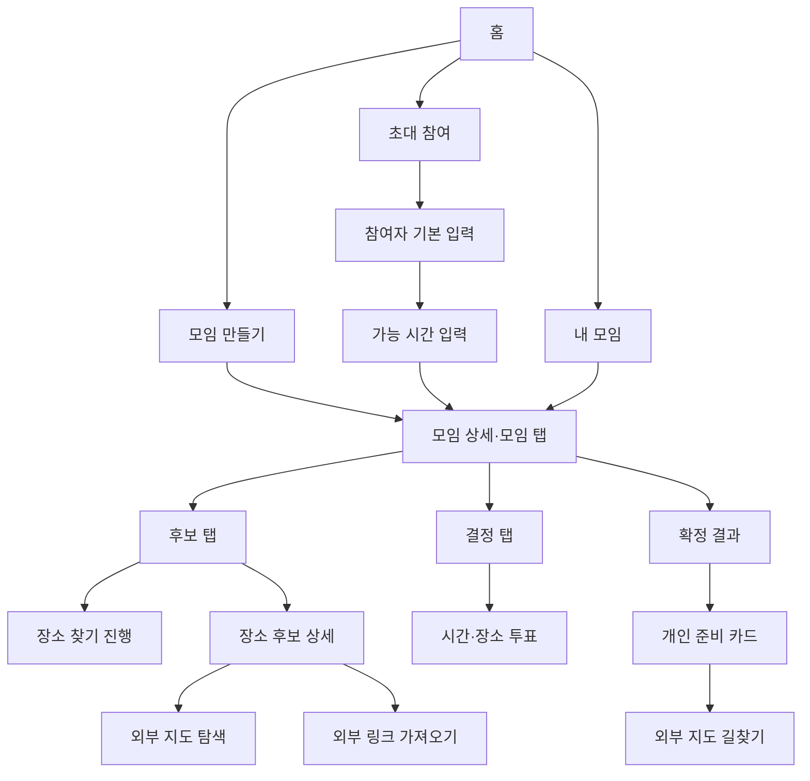
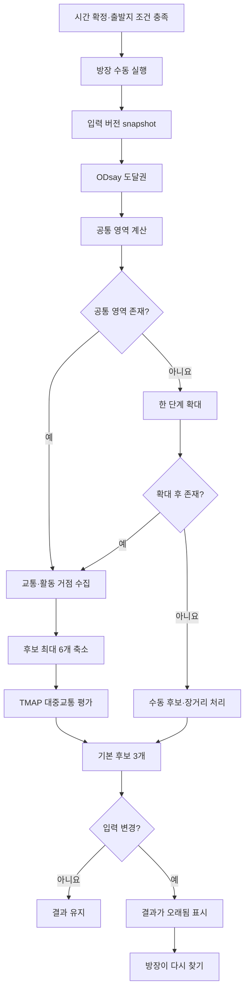
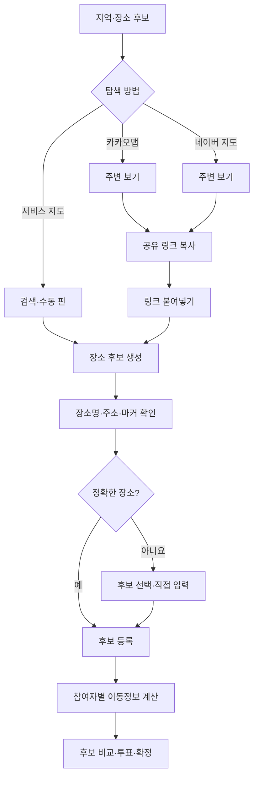
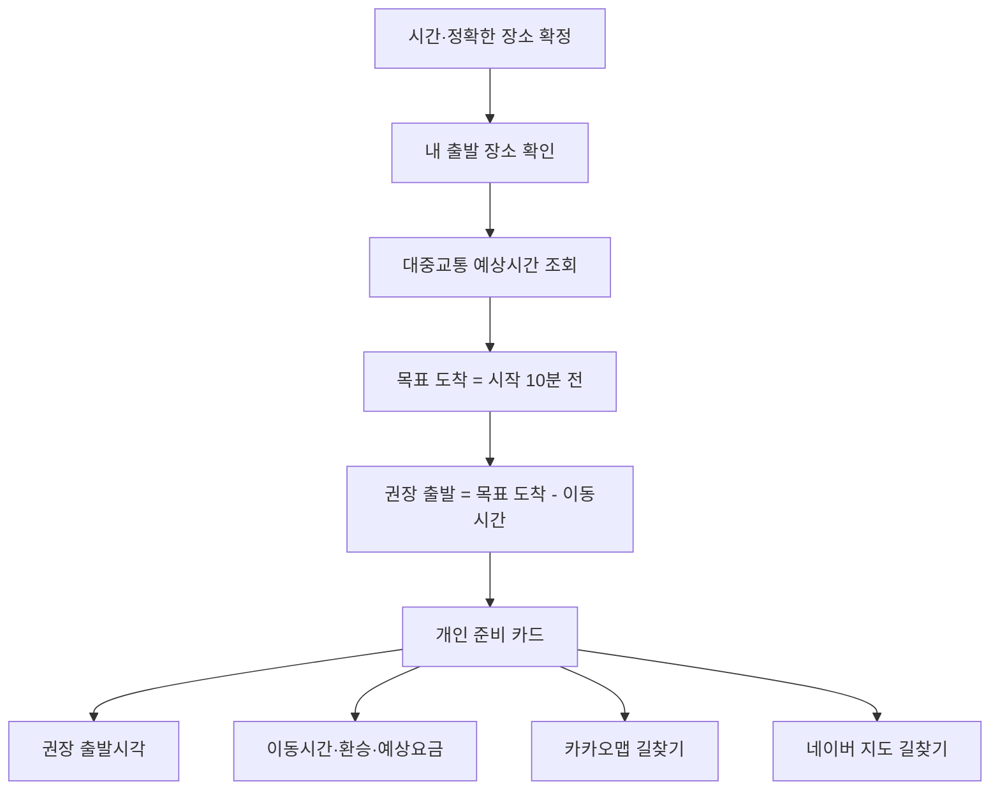
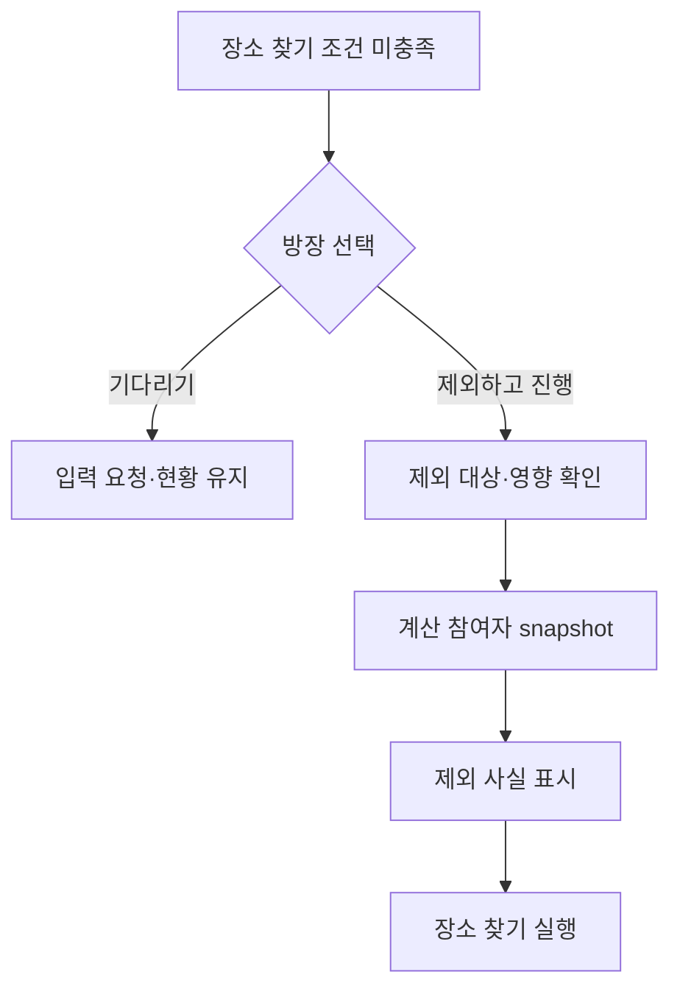
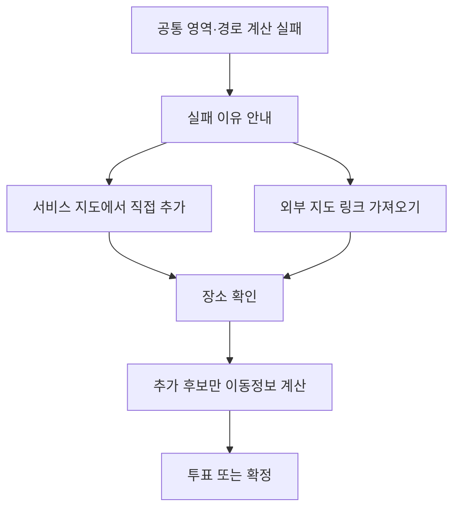

# 모임 조율 서비스 사용자 시나리오·플로우

- 문서 버전: 1.0
- 기준일: 2026-07-20
- 문서 상태: 사용자 흐름 확정안
- 입력 자료: 학생 와이어프레임, 교통·지도 API PoC, 외부 지도 링크 PoC
- 목적: 다음 기능명세서 작성의 화면·행동 기준

## 1. 서비스 흐름 한 문장

방장이 모임을 만들고 참여자들이 실제 출발 장소와 모임 가능 시간을 입력하면, 방장이 필요할 때 `장소 찾기`를 실행하고, 참여자들이 후보를 비교해 장소를 확정한 뒤 각자 권장 출발시각과 외부 지도 길찾기를 확인한다.

## 2. 와이어프레임 반영 결과

### 2.1 유지

- 새 모임 만들기
- 초대 코드·링크
- 로그인 없는 참여
- 진행 중인 모임
- 모임 정보와 참여자 입력 현황
- 출발 장소 수동 입력
- 지도 출발지 표시
- 후보 비교
- 지도 검색·후보 추가
- 선택적 장소 투표
- 시간·장소 확정
- 개인 길찾기
- 개인별 권장 출발시각
- 모임 카드 공유

### 2.2 변경

| 기존 와이어프레임 | 확정 표현·동작 |
|---|---|
| 장소 추천 | `장소 찾기` |
| 장소 추천 준비 중 | `장소를 찾을 준비가 됐어요` |
| 모두 입력하면 추천 시작 | 모든 조건 충족 후 방장이 `장소 찾기`를 직접 누름 |
| 후보 추천 | `찾은 지역·장소` 또는 `장소 후보` |
| 공정성 점수 | 평균·최장 이동시간, 환승, 주변 선택지 |
| 출발 가능 시간 입력 | 모임 가능 시간 입력 |
| 출발시각 입력 | 확정 후 시스템 계산 결과로 제공 |
| 모임 채팅 | 시스템 활동 기록 |
| 프로필 | 모임 안의 닉네임·입력 상태 |

### 2.3 제외

- 로그인과 계정 프로필
- 이메일·전화번호
- 친구 목록
- 나이·소속·온·오프라인 상태·현지 시간
- 출석체크·데일리 스트릭·포인트·트로피
- 광고 보상·미니게임·N빵
- 자유 채팅
- 택시·자동차·도보 전용 이동수단

## 3. 확정한 제품 규칙

1. 참여자는 `모임에 참여 가능한 시간`을 입력한다.
2. 시스템은 시간·정확한 장소 확정 후 `몇 시에 출발해야 하는지` 계산한다.
3. MVP 이동수단은 대중교통으로 고정한다.
4. `장소 찾기`는 API를 사용하므로 방장만 수동 실행한다.
5. 전원 입력이 기본 조건이며, 방장은 미입력 참여자를 명시적으로 제외할 수 있다.
6. 제외된 참여자는 해당 계산 결과에 포함되지 않았다는 사실을 모든 사용자에게 표시한다.
7. 시간·장소 투표는 필수가 아니다. 방장이 바로 확정하거나 필요할 때만 연다.
8. 지역·역을 임시 후보로 선택할 수 있지만, 개인 출발시각 안내 전에는 정확한 좌표를 확인한다.
9. 권장 도착 여유시간은 MVP 공통 10분이다.
10. 생성 필수값은 모임 이름과 후보 날짜 범위다. 목적·예산은 선택값이다.
11. MVP 하단 내비게이션은 `홈`, `내 모임`만 사용한다.
12. 서비스 안에는 비교용 경로 요약을 남기고 실제 이동 안내는 카카오맵·네이버 지도와 연결한다.

## 4. 주요 사용자

| 사용자 | 목표 |
|---|---|
| 방장 | 최소 입력으로 모임을 열고 시간·장소 결정을 끝낸다. |
| 참여자 | 출발 장소와 가능한 시간을 입력하고 후보 결정에 참여한다. |
| 장소 제안자 | 외부 지도에서 찾은 정확한 장소를 모임 후보로 가져온다. |
| 확정 후 참여자 | 자신의 권장 출발시각과 실제 길찾기를 확인한다. |

한 사용자가 참여자와 장소 제안자 역할을 동시에 가질 수 있다.

## 5. 전체 사용자 흐름



## 6. 방장 시나리오

### S-H01. 모임 생성과 초대

1. 방장이 홈에서 `새 모임 만들기`를 누른다.
2. 모임 이름과 후보 날짜 범위를 입력한다.
3. 필요하면 목적·1인 예산을 추가한다.
4. 모임을 생성한다.
5. 생성된 초대 링크·코드를 메신저에 공유한다.
6. 모임 상세에서 참가자와 입력 진행률을 확인한다.

결과:

- 모임은 `정보 수집 중` 상태다.
- 방장도 참여자와 동일하게 자신의 출발 장소와 가능한 시간을 입력해야 한다.

### S-H02. 시간 확정

1. 참여자들의 가능 시간 입력이 모인다.
2. 시스템이 가능한 인원과 시간 후보를 보여준다.
3. 후보가 명확하면 방장이 바로 확정한다.
4. 의견이 필요하면 `시간 투표 시작`을 누른다.
5. 투표 결과를 확인하고 방장이 시간을 확정한다.

### S-H03. 장소 찾기 실행

1. 시간이 확정되고 모든 참여자가 출발 장소를 입력하면 버튼이 활성화된다.
2. 미입력자가 있으면 방장은 기다리거나 해당 참여자를 이번 계산에서 제외한다.
3. 제외 시 대상·영향을 확인하는 모달을 거친다.
4. 방장이 `장소 찾기`를 누른다.
5. 계산 진행률과 부분 완료 상태를 확인한다.
6. 지역·장소 후보 3개를 확인한다.

`장소 찾기`를 누르기 전까지 도달권·후보별 대중교통 API를 호출하지 않는다.

### S-H04. 장소 확정

1. 후보 카드의 이동시간·최장시간·환승·주변 선택지를 비교한다.
2. 정확한 장소가 필요하면 외부 지도에서 탐색하거나 참여자가 추가한 후보를 사용한다.
3. 후보가 명확하면 바로 확정한다.
4. 의견이 필요하면 `장소 투표 시작`을 누른다.
5. 방장이 결과를 확인하고 최종 장소를 확정한다.

### S-H05. 확정 결과 공유

1. 확정된 날짜·시간·장소를 확인한다.
2. 모임 카드 또는 링크를 공유한다.
3. 공개 카드에 개인 출발 장소·경로가 포함되지 않았는지 확인한다.

## 7. 참여자 시나리오

### S-P01. 초대 참여와 기본 입력

1. 참여자가 초대 링크를 연다.
2. 로그인 없이 닉네임을 입력한다.
3. 학교·역·건물·주소로 실제 출발 예정 장소를 찾는다.
4. 결과가 없으면 지도에서 핀을 선택하고 공개 장소명을 입력한다.
5. 장소 마커를 확인한다.
6. 모임에 참여 가능한 날짜·시간을 입력한다.

### S-P02. 입력·결정 상태 확인

참여자는 모임 화면에서 다음을 확인한다.

- 누가 출발 장소·시간을 입력했는지
- 자신에게 남은 작업
- 시간·장소 투표가 열렸는지
- 장소 찾기가 진행 중인지
- 최종 시간·장소가 확정됐는지

다른 사람의 상세 주소는 보지 못한다.

### S-P03. 시간·장소 투표

1. 열린 투표가 있으면 `결정` 탭으로 이동한다.
2. 시간 투표에서는 가능한 후보를 복수 선택한다.
3. 장소 투표에서는 한 후보를 선택한다.
4. 투표가 끝나기 전에는 자신의 선택을 변경할 수 있다.
5. 방장이 최종 확정한 결과를 확인한다.

### S-P04. 장소 후보 추가

1. 추천 지역 카드에서 카카오맵 또는 네이버 지도를 연다.
2. 구체적인 장소를 탐색한다.
3. 공유 링크를 복사해 우리 서비스에 붙여넣는다.
4. 자동으로 채워진 장소명·주소·마커를 확인한다.
5. 후보가 모호하면 최대 3개 중 정확한 장소를 선택한다.
6. 정확한 후보를 등록한다.
7. 시스템이 이 후보에 대해서만 모든 참여자의 이동시간을 계산한다.

### S-P05. 개인 준비 카드

1. 시간·장소 확정 알림을 확인한다.
2. `몇 시에 출발해야 해요?` 카드를 연다.
3. 권장 출발시각, 예상 이동시간, 환승을 확인한다.
4. 카카오맵 또는 네이버 지도에서 실제 길찾기를 연다.

## 8. 화면 흐름



## 9. 장소 찾기 시스템 흐름



표시 워딩:

- `장소를 찾을 준비가 됐어요`
- `장소 찾기`
- `장소를 찾는 중이에요`
- `만나기 괜찮은 곳 3곳을 찾았어요`
- `출발 정보가 바뀌었어요. 다시 찾아주세요`
- `자동으로 찾지 못했어요. 직접 후보를 추가해 주세요`

## 10. 외부 지도 왕복 흐름



외부 지도 링크는 자동 확정하지 않는다. 카카오·네이버에서 가져온 장소도 내부 WGS84 좌표로 정규화해 양쪽 지도에서 다시 열 수 있다.

## 11. 권장 출발시각 흐름



예시:

```text
모임 시작: 오후 6:00
목표 도착: 오후 5:50
예상 이동: 52분
권장 출발: 오후 4:58
```

이 값은 실시간 도착을 보장하지 않는 예상치다. 화면에 `현재 교통 데이터 기준 예상`을 표시한다.

## 12. 활동 기록

자유 채팅 대신 모임 상태를 이해하는 데 필요한 시스템 이벤트를 보여준다.

```text
민지가 출발 장소를 입력했어요.
현수가 가능한 시간을 입력했어요.
방장이 장소 찾기를 시작했어요.
서연이가 새로운 장소 후보를 추가했어요.
지훈이가 성수역 후보에 투표했어요.
방장이 모임 장소를 확정했어요.
```

MVP에서는 읽기 전용이다. 시스템 이벤트만 저장하고 자유 텍스트 메시지는 받지 않는다.

## 13. 예외 시나리오

### 13.1 미입력 참여자



제외는 모임 강퇴가 아니다. 이번 장소 계산에서만 빠지며, 재계산할 때 다시 포함할 수 있다.

### 13.2 자동 장소 찾기 실패



### 13.3 링크 장소 불일치

- 장소명·주소·마커가 일치하면 확인 후 등록한다.
- 주소가 없거나 이름이 다르면 확인을 필수로 한다.
- 주차장·정문·장례식장 등 부속시설 후보는 자동 선택하지 않는다.
- 찾지 못하면 장소명·주소 입력 또는 수동 핀으로 전환한다.

## 14. 상태와 사용자 메시지

| 제품 상태 | 사용자 표현 | 대표 행동 |
|---|---|---|
| 정보 수집 | `참여자 정보를 기다리고 있어요` | 내 정보 입력 |
| 시간 결정 | `언제 만날지 정해 주세요` | 바로 확정·투표 |
| 장소 찾기 가능 | `장소를 찾을 준비가 됐어요` | 방장 `장소 찾기` |
| 계산 중 | `만나기 괜찮은 곳을 찾고 있어요` | 진행률 확인 |
| 후보 확인 | `3곳을 찾았어요` | 비교·외부 탐색 |
| 장소 결정 | `어디서 만날지 정해 주세요` | 바로 확정·투표 |
| 확정 | `약속이 정해졌어요` | 출발시각·길찾기 |
| 결과 오래됨 | `출발 정보가 바뀌었어요` | 방장 다시 찾기 |
| 자동 계산 실패 | `직접 장소를 추가해 주세요` | 검색·링크·핀 |

## 15. 기능명세 작성 시 반영할 화면

1. 홈
2. 모임 만들기
3. 초대 참여
4. 닉네임·출발 장소 입력
5. 모임 가능 시간 입력
6. 모임 상세 `모임` 탭
7. 모임 상세 `후보` 탭
8. 모임 상세 `결정` 탭
9. 장소 찾기 진행 상태
10. 장소 후보 상세·비교
11. 외부 지도 링크 가져오기·장소 확인
12. 시간·장소 투표
13. 확정 결과
14. 개인 준비 카드
15. 공개 공유 카드

## 16. 기술 검증 게이트

제품 흐름은 확정했지만 다음은 구현·운영 전 기술 검증이 필요하다.

1. TMAP의 미래시각 검색 지원과 출발시각 계산 정확도
2. 도착 10분 전을 목표로 한 경로시간 재계산 방식
3. Android·iOS에서 카카오·네이버 앱 Scheme과 미설치 fallback
4. 외부 지도 OG 메타 조회의 공급자 정책 적합성
5. 미입력 참여자 제외 후 재포함·재계산의 캐시 무효화
6. 장소 찾기 중 입력 변경 시 snapshot 일관성

기술 게이트가 실패하더라도 사용자 흐름은 다음 fallback으로 완결한다.

```text
수동 장소 입력 → 시간·장소 확정 → 예상 이동시간 → 외부 지도 길찾기
```

## 17. 다음 문서로 넘길 결정

다음 기능명세서에서는 이 문서를 기준으로 다음을 구체화한다.

- 화면별 필드·버튼·권한
- 상태 전환 조건
- 장소 찾기 API 호출 조건과 결과 DTO
- 미입력자 제외 데이터 모델
- 시간·장소 투표 규칙
- 권장 출발시각 계산 규칙
- 활동 기록 이벤트
- 외부 지도 링크 실패·확인 흐름

새 기능을 추가할 때 이 흐름의 필수 입력 단계가 늘어나는지 먼저 검토한다.