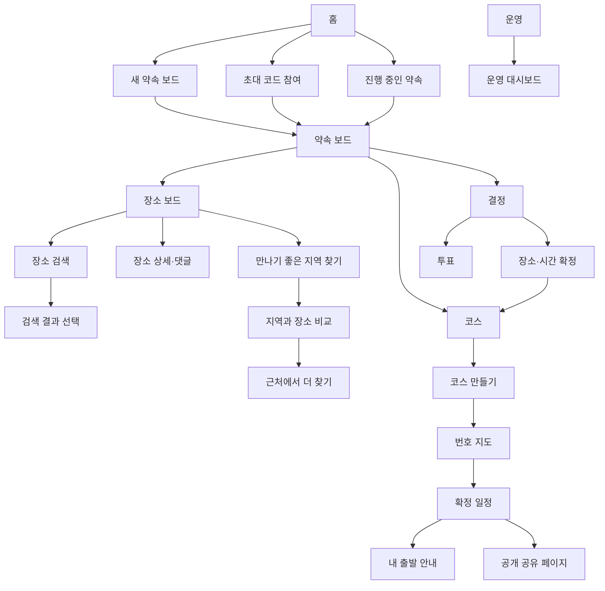
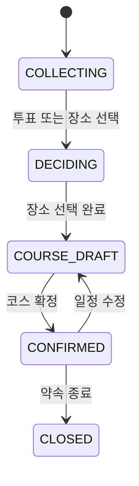

# 약속 올인원 기능 명세서

| 항목 | 내용 |
|---|---|
| 문서 유형 | Software Requirements Specification / Functional Specification |
| 문서 버전 | 1.3 |
| 작성일 | 2026-07-21 |
| 대상 | 모바일 우선 반응형 웹 서비스 |
| 독자 | 기획자, 디자이너, 프론트엔드·백엔드 개발자, QA |
| 기준 디자인 | Figma `Link Board Flow V3` |
| 인증 방식 | MVP 비회원·초대 링크/코드 기반 |

## 1. 제품 정의

### 1.1 한 문장 정의

여러 사람이 장소를 검색해 하나의 약속 보드에 모으고, 장소별 의견·투표·방문 순서·출발 안내까지 함께 결정하는 약속 올인원 서비스다.

### 1.2 핵심 사용자 가치

1. 장소명을 검색하고 정확한 후보를 선택해 약속 보드에 추가한다.
2. 여러 사람이 제안한 장소를 카드와 지도 마커로 한눈에 비교한다.
3. 장소별 댓글·반응·투표를 한곳에 모은다.
4. 필요하면 참여자들이 만나기 좋은 지역을 계산한다.
5. 선택한 여러 장소를 번호가 있는 약속 코스로 만든다.
6. 첫 만남 장소를 기준으로 개인별 권장 출발시각을 제공한다.

### 1.3 범위 제외

- 회원가입, 소셜 로그인, 친구·팔로우
- 자유 채팅 및 메신저 대체
- 장소 리뷰·별점의 자체 생산 또는 외부 지도 리뷰 복제
- 음식점의 품질·인기도를 보장하는 자동 추천
- 예약, 결제, N빵, 택시 호출
- 자동차·도보 전용 정밀 길찾기
- 실시간 위치 공유 및 출석 체크
- 외부 지도 공유 URL 입력·해석·메타데이터 수집
- 중복 장소 자동 탐지·병합

## 2. 우선순위 정의

| 우선순위 | 정의 | 출시 기준 |
|---|---|---|
| P0 | 핵심 기능 | MVP 출시 전 반드시 구현하고 전체 E2E 테스트를 통과해야 한다. |
| P1 | 확장 기능 | MVP 이후 적용할 수 있으나 데이터 모델과 화면 확장 지점은 P0에서 고려한다. |
| P2 | 고도화 기능 | 사용자 검증 후 구현 여부를 결정한다. |

### 2.1 기능군별 우선순위

| 기능군 | 우선순위 | 핵심/부가 | 설명 |
|---|---:|---|---|
| 약속 보드 생성·초대 | P0 | 핵심 | 로그인 없이 협업 공간을 만든다. |
| 장소 검색 | P0 | 핵심 | 장소명을 검색해 공식 POI 후보를 표시한다. |
| 검색 결과 확인 | P0 | 핵심 | 사용자가 정확한 장소를 선택해 카드와 좌표로 등록한다. |
| 장소 보드·지도 마커 | P0 | 핵심 | 모든 장소를 목록과 지도에서 함께 본다. |
| 장소별 댓글 | P0 | 핵심 | 장소에 대한 의견을 해당 장소에 묶는다. |
| 장소별 반응 | P1 | 부가 | 빠른 선호 표현을 제공한다. |
| 장소 투표 | P0 | 핵심 | 의견이 갈릴 때 선택적으로 사용한다. |
| 만나기 좋은 지역 찾기 | P0 | 차별화 | 호스트가 수동 실행하며 참여자별 대중교통 시간을 비교한다. |
| 지역 주변 장소 탐색 | P1 | 확장 | 카테고리·거리 기준으로 추가 장소를 찾는다. |
| 다중 장소 코스 | P0 | 핵심/Wow | 첫 만남과 이후 방문 장소를 순서로 구성한다. |
| 개인 출발 안내 | P0 | 차별화 | 첫 만남 장소와 확정시각을 기준으로 계산한다. |
| 공개 공유 페이지 | P0 | 핵심 | 로그인 없이 확정된 약속을 확인한다. |
| 출발 알림 | P1 | 부가 | 권장 출발시각 전에 알림을 발송한다. |
| 운영 대시보드 | P1 | 운영 | API 사용량·비용·오류·작업 큐를 관찰한다. |

## 3. 사용자와 권한

### 3.1 사용자 역할

| 역할 | 설명 |
|---|---|
| 호스트 | 보드를 생성하고 유료 API 작업, 투표, 코스 확정을 실행한다. |
| 참여자 | 초대 링크로 입장해 장소·댓글·투표·출발 정보를 등록한다. |
| 방문자 | 공개 공유 링크에서 확정된 일정만 읽는다. |
| 운영자 | API 사용량과 시스템 오류를 확인한다. |

### 3.2 권한 매트릭스

| 기능 | 호스트 | 참여자 | 방문자 | 운영자 |
|---|:---:|:---:|:---:|:---:|
| 보드 생성·수정 | O | - | - | - |
| 초대 링크 확인 | O | O | - | - |
| 장소 검색·추가 | O | O | - | - |
| 장소 확인·수정 | O | 제안 장소만 | - | - |
| 댓글 등록·수정·삭제 | O | 본인 댓글만 | - | - |
| 투표 참여 | O | O | - | - |
| 투표 개설·종료 | O | - | - | - |
| 만나기 좋은 지역 찾기 실행 | O | - | - | - |
| 코스 편집·확정 | O | - | - | - |
| 확정 일정 조회 | O | O | O | - |
| 개인 출발 안내 | O | O | - | - |
| 운영 지표 조회 | - | - | - | O |

### 3.3 비회원 식별

- 보드별 닉네임과 참여 토큰으로 사용자를 식별한다.
- 참여 토큰은 초대 링크와 별개의 개인 토큰이며 브라우저의 안전한 저장소에 보관한다.
- 동일 닉네임을 허용하되 화면에는 구분용 내부 아바타 색상을 함께 표시한다.
- 토큰 분실 시 기존 작성 내용의 편집권을 복구하지 않는다. 호스트가 해당 참여자를 비활성화하고 새 참여로 입장시킬 수 있다.

## 4. 메뉴 트리와 정보 구조

### 4.1 상위 내비게이션

| 위치 | 메뉴 | 노출 조건 | 이동 대상 |
|---|---|---|---|
| 하단 내비게이션 | 홈 | 항상 | 홈 |
| 하단 내비게이션 | 내 약속 | 참여 중인 보드가 있을 때 | 진행 중인 약속 목록 |
| 보드 상단 탭 | 장소 보드 | 보드 참여 후 | 지도·장소 카드 |
| 보드 상단 탭 | 코스 | 장소가 1개 이상일 때 | 코스 초안 또는 확정 코스 |
| 보드 상단 탭 | 결정 | 보드 참여 후 | 투표와 확정 상태 |

## 5. 공통 제품 규칙

| 규칙 ID | 규칙 |
|---|---|
| BR-001 | 장소 검색과 장소 보드 사용에는 대중교통 경로 API를 호출하지 않는다. |
| BR-002 | 만나기 좋은 지역 찾기는 호스트가 버튼을 누른 경우에만 실행한다. |
| BR-003 | 장소 검색 결과는 사용자가 후보를 선택하기 전까지 장소 보드에 등록하지 않는다. |
| BR-004 | MVP에서는 중복 장소를 자동 탐지·병합하지 않는다. 호스트와 제안자는 불필요한 장소 카드를 직접 삭제할 수 있다. |
| BR-005 | 첫 번째 코스 장소는 반드시 `첫 만남 장소`이며 한 코스에 하나만 존재한다. |
| BR-006 | 참여자별 대중교통 평가는 첫 만남 장소에 대해서만 수행한다. |
| BR-007 | 두 번째 이후 장소는 이전 장소와의 직선거리 및 거리 기반 도보시간 추정치를 표시하고 상세 경로는 외부 지도로 연결한다. |
| BR-008 | 거리 기반 도보시간은 `직선거리 ÷ 분당 70m`로 계산하고 `약 N분(추정)`으로 표시한다. |
| BR-009 | 장소 리뷰·평점·인기도를 내부 추천 점수로 사용하지 않는다. 확인 가능한 카테고리·거리·참여자 의견만 표시한다. |
| BR-010 | 개인 출발지는 다른 참여자와 공개 공유 페이지에 노출하지 않는다. |
| BR-011 | 투표는 선택 기능이며 호스트는 투표 없이 장소와 코스를 확정할 수 있다. |
| BR-012 | 확정된 코스를 수정하면 기존 확정 버전을 보존하고 개인 출발 안내를 무효화한 뒤 재계산한다. |
| BR-013 | 지도 배경과 마커·폴리곤·폴리라인 렌더링은 Kakao Maps JavaScript API를 사용한다. TMAP 지도 SDK는 사용하지 않는다. |
| BR-014 | 서비스는 외부 지도 URL을 장소 입력 수단으로 받지 않고 장소명·지역명 검색어만 입력받는다. |
| BR-015 | 서버는 네이버·카카오 장소 페이지와 단축 URL을 조회하지 않는다. 외부 지도 이동은 확정된 장소명·좌표로 생성한 링크만 사용한다. |
| BR-016 | 사용자 장소·출발지·지역 거점·근처 장소·주소 검색은 Kakao Local로 통일한다. TMAP 일반 POI·지오코딩 API는 사용하지 않는다. |

## 6. 페이지 목록

| 페이지 ID | 페이지명 | 사용자 | 우선순위 | 핵심 산출물 |
|---|---|---|---:|---|
| PG-01 | 홈 | 전체 | P0 | 생성·참여 진입 |
| PG-02 | 약속 보드 생성 | 호스트 | P0 | 약속 보드 |
| PG-03 | 장소 검색 | 호스트·참여자 | P0 | POI 검색 결과 |
| PG-04 | 검색 결과 선택 | 호스트·제안자 | P0 | 확인된 장소 |
| PG-05 | 장소 보드 | 호스트·참여자 | P0 | 장소 지도·카드 목록 |
| PG-06 | 장소 상세·댓글 | 호스트·참여자 | P0 | 장소별 의견 |
| PG-07 | 만나기 좋은 지역 찾기 | 호스트 | P0 | 지역 탐색 작업 |
| PG-08 | 지역과 기존 장소 비교 | 호스트·참여자 | P0 | 지역 후보와 장소 관계 |
| PG-09 | 근처에서 더 찾기 | 호스트·참여자 | P1 | 추가 장소 후보 |
| PG-10 | 투표·장소 결정 | 호스트·참여자 | P0 | 선택 장소 목록 |
| PG-11 | 코스 만들기 | 호스트 | P0 | 순서가 있는 코스 초안 |
| PG-12 | 번호 지도 | 호스트·참여자 | P0 | 코스 지도 미리보기 |
| PG-13 | 확정 일정 | 전체 참여자 | P0 | 확정 코스 버전 |
| PG-14 | 내 출발 안내 | 개별 참여자 | P0 | 권장 출발시각 |
| PG-15 | 약속 공유 페이지 | 방문자 포함 | P0 | 공개 일정 |
| PG-16 | 운영 대시보드 | 운영자 | P1 | API·작업·오류 지표 |

## 7. 페이지별 기능 명세

### PG-01. 홈

**목적:** 사용자가 로그인 없이 약속 보드를 생성하거나 기존 보드에 참여한다.

| 기능 ID | 기능명 | 설명 | 규칙·검증 | 우선순위 | 완료 조건 |
|---|---|---|---|---:|---|
| F01-01 | 새 보드 만들기 | 생성 페이지로 이동한다. | 중복 클릭 시 한 번만 이동한다. | P0 | PG-02가 열린다. |
| F01-02 | 초대 코드 참여 | 6~10자 초대 코드를 입력한다. | 공백 제거, 대소문자 무시, 존재·만료 여부 검사 | P0 | 유효하면 닉네임 입력 후 보드로 이동한다. |
| F01-03 | 진행 중인 약속 | 현재 브라우저의 참여 토큰 목록을 표시한다. | 최신 활동순, 보드명·장소 수·댓글 수·상태 표시 | P0 | 보드 선택 시 PG-05가 열린다. |
| F01-04 | 오류 안내 | 잘못된 코드와 삭제된 보드를 안내한다. | 입력값은 유지하고 재시도 가능해야 한다. | P0 | 사용자가 원인을 이해하고 수정할 수 있다. |

### PG-02. 약속 보드 생성

**목적:** 최소 입력으로 협업 가능한 약속 공간을 만든다.

| 기능 ID | 기능명 | 설명 | 규칙·검증 | 우선순위 | 완료 조건 |
|---|---|---|---|---:|---|
| F02-01 | 약속 이름 입력 | 보드의 표시 이름을 입력한다. | 필수, 2~40자, 앞뒤 공백 제거 | P0 | 유효한 이름이 저장된다. |
| F02-02 | 후보 날짜 입력 | 약속의 후보 날짜 또는 날짜 범위를 입력한다. | 필수, 오늘 이후, 최대 30일 범위 | P0 | 보드 시간대는 Asia/Seoul로 저장된다. |
| F02-03 | 선택 정보 입력 | 목적과 1인 예산을 입력한다. | 선택, 목적 100자 이하, 예산 0 이상 | P1 | 장소 탐색 필터에 활용할 수 있다. |
| F02-04 | 첫 장소 추가 선택 | 보드 생성 후 바로 장소를 검색할지 선택한다. | 선택, 건너뛰기 가능 | P0 | 선택 시 PG-03, 건너뛰면 PG-05로 이동한다. |
| F02-05 | 보드 생성 | 보드·호스트 참여자·초대 코드를 만든다. | 중복 요청 방지를 위한 idempotency key 사용 | P0 | 보드 ID, 초대 코드, 호스트 토큰이 생성된다. |
| F02-06 | 초대 공유 | 초대 링크와 코드를 복사한다. | 링크에 호스트 토큰을 포함하지 않는다. | P0 | 참여자가 PG-01 또는 참여 링크로 입장한다. |

### PG-03. 장소 검색

**목적:** 사용자가 장소명이나 지역명을 입력해 공식 POI 검색 결과를 찾는다.

| 기능 ID | 기능명 | 설명 | 규칙·검증 | 우선순위 | 완료 조건 |
|---|---|---|---|---|---|
| F03-01 | 검색어 입력 | 장소명과 선택적인 지역·지점명을 입력한다. | 필수 2~80자, 앞뒤·중복 공백 제거, URL 입력 시 안내 후 검색하지 않음 | P0 | 유효한 검색어가 준비된다. |
| F03-02 | 검색 요청 | 사용자가 검색 버튼을 누르거나 Enter를 입력하면 POI API를 호출한다. | 입력 중 자동 호출 금지, 중복 클릭 방지, 요청별 idempotency key 적용 | P0 | 검색 작업과 로딩 상태가 표시된다. |
| F03-03 | 검색 결과 목록 | 정확도순 후보를 표시한다. | 기본 최대 5개, 장소명·카테고리·도로명 주소 표시 | P0 | 사용자가 후보 차이를 이해할 수 있다. |
| F03-04 | 검색어 보정 | 결과가 없거나 모호하면 지역명·지점명을 더해 다시 검색한다. | 기존 입력 유지, 예시 문구 제공 | P0 | 수정 검색을 즉시 실행할 수 있다. |
| F03-05 | 검색 취소 | 검색을 취소하고 장소 보드로 돌아간다. | 미선택 결과는 저장하지 않음 | P0 | 불필요한 장소 데이터가 생성되지 않는다. |

### PG-04. 검색 결과 선택

**목적:** 검색 후보 중 정확한 장소를 사용자가 확인하고 장소 보드에 등록한다.

| 기능 ID | 기능명 | 설명 | 규칙·검증 | 우선순위 | 완료 조건 |
|---|---|---|---|---|---|
| F04-01 | 후보 상세 확인 | 선택 후보의 장소명·주소·카테고리·지도 위치를 표시한다. | API가 반환한 WGS84 좌표 사용 | P0 | 사용자가 위치와 지점을 검토할 수 있다. |
| F04-02 | 장소 선택 | 정확한 후보를 선택한다. | 자동 확정 금지, 사용자 선택 필수 | P0 | 선택한 POI ID와 장소 정보가 확정된다. |
| F04-03 | 장소 등록 | 선택한 후보를 ACTIVE 장소로 저장한다. | 장소명·좌표·제안자 필수, 공급자·POI ID·외부 URL은 제공 시 저장 | P0 | PG-05 지도와 카드에 즉시 반영된다. |
| F04-04 | 결과 없음 처리 | 원하는 장소가 없으면 검색어를 수정하거나 지도에서 직접 지정한다. | 직접 지정은 장소명·좌표 필수, 주소 선택 | P0 | 검색 누락 장소도 등록할 수 있다. |
| F04-05 | 등록 취소 | 후보 선택을 취소한다. | 미확정 후보를 저장하지 않음 | P0 | PG-03 또는 PG-05로 돌아간다. |

### PG-05. 장소 보드

**목적:** 여러 사람이 제안한 장소를 지도와 카드로 한눈에 비교한다.

| 기능 ID | 기능명 | 설명 | 규칙·검증 | 우선순위 | 완료 조건 |
|---|---|---|---|---|---|
| F05-01 | 지도 마커 표시 | 활성 장소를 지도에 표시한다. | 후보 마커는 A·B·C 형태, 선택 장소와 확정 코스 마커는 별도 스타일 | P0 | 카드와 마커가 동일 장소를 가리킨다. |
| F05-02 | 장소 카드 목록 | 장소명·카테고리·제안자·댓글·반응을 표시한다. | 지도 범위 안의 장소 우선, 페이지네이션 또는 가상 스크롤 | P0 | 카드 선택 시 해당 마커가 강조된다. |
| F05-03 | 카테고리 필터 | 전체·맛집·카페·놀거리·술집·기타로 필터링한다. | 내부 표준 카테고리로 정규화 | P0 | 지도와 카드 목록에 동시에 적용된다. |
| F05-04 | 정렬 | 최근 추가·댓글 많은 순·반응 많은 순으로 정렬한다. | 기본값은 최근 추가순 | P1 | 선택한 정렬이 세션 동안 유지된다. |
| F05-05 | 장소 추가 | 장소명 검색 또는 수동 핀으로 추가한다. | PG-03 검색 후 PG-04에서 사용자 확인 | P0 | 확인된 장소가 보드에 나타난다. |
| F05-06 | 장소 삭제 | 호스트 또는 해당 제안자가 장소 카드를 삭제한다. | 코스 포함 장소는 먼저 코스에서 제거, 삭제 전 확인 | P0 | 지도·목록·투표 후보에서 제거된다. |
| F05-07 | 실시간 갱신 | 다른 사용자의 추가·댓글·결정을 반영한다. | SSE 또는 WebSocket, 재연결 시 누락 이벤트 보정 | P1 | 새로고침 없이 변경이 보인다. |

### PG-06. 장소 상세·댓글

**목적:** 한 장소에 대한 정보와 의견을 같은 문맥에 모은다.

| 기능 ID | 기능명 | 설명 | 규칙·검증 | 우선순위 | 완료 조건 |
|---|---|---|---|---|---|
| F06-01 | 장소 정보 표시 | 이름·주소·카테고리·마커·제안자를 표시한다. | 개인 출발지는 표시하지 않는다. | P0 | 장소 보드와 같은 장소 정보를 사용한다. |
| F06-02 | 외부 지도에서 보기 | 카카오맵·네이버지도 버튼을 제공한다. | 확정 장소명·좌표로 링크 생성, 앱 미설치 시 웹 URL로 대체 | P0 | 외부 지도에서 같은 위치가 열린다. |
| F06-03 | 댓글 등록 | 닉네임으로 장소별 댓글을 작성한다. | 1~500자, 공백 댓글 금지, 요청 빈도 제한 | P0 | 등록 즉시 댓글 수와 목록이 갱신된다. |
| F06-04 | 댓글 수정·삭제 | 본인 댓글을 관리한다. | 참여 토큰 소유권 검사, 삭제는 soft delete | P0 | 권한 없는 사용자는 변경할 수 없다. |
| F06-05 | 반응 | 좋아요를 추가·취소한다. | 사용자당 장소별 1회 | P1 | 집계와 내 상태가 함께 갱신된다. |
| F06-06 | 장소 보관 | 호스트가 후보에서 숨긴다. | 댓글은 보존, 코스 포함 장소는 먼저 제거 필요 | P1 | 기본 목록에서 제외되고 이력에 남는다. |

### PG-07. 만나기 좋은 지역 찾기

**목적:** 참여자 출발지가 넓게 흩어진 경우 대중교통으로 접근하기 좋은 탐색 지역을 찾는다.

| 기능 ID | 기능명 | 설명 | 규칙·검증 | 우선순위 | 완료 조건 |
|---|---|---|---|---|---|
| F07-01 | 출발 장소 입력 현황 | 참여자의 출발 장소 등록 상태를 표시한다. | 상세 주소는 본인과 서버만 알고 타인에게는 완료 여부만 표시 | P0 | 계산 대상이 명확하다. |
| F07-02 | 출발 장소 검색 | 주소·건물·역 이름을 수동 입력한다. | 건물·역은 Kakao Local 키워드 검색, 도로명·지번은 주소 검색, GPS는 P2 | P0 | Kakao 응답의 WGS84 좌표가 저장된다. |
| F07-03 | 계산 대상 선택 | 호스트가 참여자를 포함·제외한다. | 미입력 참여자를 자동 제외하지 않고 명시적 확인 필요 | P0 | 계산 snapshot이 생성된다. |
| F07-04 | 도달시간 범위 선택 | 30·45·60분 중 하나를 선택한다. | 기본 45분 | P0 | 탐색 파라미터에 저장된다. |
| F07-05 | 지역 찾기 실행 | 호스트가 계산 작업을 시작한다. | 중복 클릭 방지, 작업 큐 사용, 예상 API 호출량 안내 | P0 | 작업 ID가 생성되고 진행 상태가 표시된다. |
| F07-06 | 실패·재시도 | API 오류·교집합 없음·429를 처리한다. | 429 지수 백오프, 교집합 없음은 범위 한 단계 확대 제안 | P0 | 사용자에게 원인과 다음 행동을 제공한다. |

### PG-08. 지역과 기존 장소 비교

**목적:** 계산된 지역과 이미 보드에 모인 장소의 관계를 함께 보여준다.

| 기능 ID | 기능명 | 설명 | 규칙·검증 | 우선순위 | 완료 조건 |
|---|---|---|---|---|---|
| F08-01 | 도달권 교집합 표시 | 참여자 도달권의 공통 영역을 지도에 표시한다. | 면적 상위 3개 조각만 후보 탐색에 사용 | P0 | 지도에서 탐색 범위를 이해할 수 있다. |
| F08-02 | 지역 후보 생성 | 교집합 내부의 교통 거점·지역 거점을 Kakao Local로 수집한다. | 상위 3개 폴리곤별 bounding box에서 `SW8`, 기차역·KTX역·버스터미널·환승센터·시청·시장 키워드를 검색하고 Turf로 폴리곤 내부 결과만 유지 | P0 | Kakao 장소 ID가 있는 후보 최대 6개가 생성된다. |
| F08-03 | 실제 대중교통 평가 | 참여자×지역 후보의 이동시간을 계산한다. | 평균·최장시간·환승횟수로 비교, 직선거리는 1차 축소에만 사용 | P0 | 기본 지역 후보 3개가 표시된다. |
| F08-04 | 기존 장소 포함 여부 | 보드 장소가 지역 안·가장자리·밖인지 표시한다. | 폴리곤 포함 여부와 중심까지 직선거리 사용 | P0 | 기존 장소와 지역 후보를 연결해 판단할 수 있다. |
| F08-05 | 평가 설명 | 순위 이유를 자연어로 표시한다. | `평균이 짧음`, `최장시간이 낮음`, `기존 장소가 많음` 등 검증 가능한 표현만 사용 | P0 | 추천 근거가 숫자와 일치한다. |

### PG-09. 근처에서 더 찾기

**목적:** 선택한 지역 주변에서 코스에 추가할 장소를 발견한다.

| 기능 ID | 기능명 | 설명 | 규칙·검증 | 우선순위 | 완료 조건 |
|---|---|---|---|---|---|
| F09-01 | 카테고리 탐색 | 맛집·카페·놀거리·술집·문화시설을 선택한다. | 맛집=`FD6`, 카페=`CE7`, 문화시설=`CT1`, 관광명소=`AT4`. 술집은 키워드 `술집`. 놀거리는 `CT1`+`AT4`와 `노래방`·`볼링장`·`PC방` 등 구체 키워드로 조회하며 검색어 `놀거리`는 사용하지 않는다 | P1 | 선택 지역 반경의 POI를 표시한다. |
| F09-02 | 장소명 검색 | 지역 중심과 키워드로 Kakao Local POI를 검색한다. | 기본 반경 1km, 결과가 5개 미만이면 3km로 한 단계 확대, 호출당 최대 15개, 필요 시 다음 페이지 호출 | P1 | 이름·주소·거리·카테고리·Kakao 장소 URL이 표시된다. |
| F09-03 | 거리 정렬 | 지역 중심 또는 선택 장소로부터 가까운 순으로 정렬한다. | 직선거리임을 표시 | P1 | 정렬 기준이 화면에 명시된다. |
| F09-04 | 외부 상세 확인 | 리뷰·사진·영업정보를 외부 지도에서 확인한다. | 내부에서 리뷰나 인기도를 보장하지 않는다. | P1 | 동일 좌표를 외부 지도에서 연다. |
| F09-05 | 보드에 추가 | 검색 결과를 장소 후보로 추가한다. | 추가 전 이름·주소·마커 확인 | P1 | PG-05와 PG-06에 반영된다. |

### PG-10. 투표·장소 결정

**목적:** 댓글로 모은 의견을 바탕으로 코스에 사용할 장소를 정한다.

| 기능 ID | 기능명 | 설명 | 규칙·검증 | 우선순위 | 완료 조건 |
|---|---|---|---|---|---|
| F10-01 | 후보 선택 | 호스트가 코스 후보를 임시 선택한다. | 한 장소를 여러 번 담을 수 없다. | P0 | 선택 목록에 추가된다. |
| F10-02 | 투표 개설 | 장소 후보와 마감시각을 지정한다. | 후보 2~10개, 진행 중 투표는 보드당 종류별 1개 | P0 | 참여자에게 열린 투표가 표시된다. |
| F10-03 | 투표 참여 | 한 개 또는 설정된 최대 개수까지 선택한다. | 마감 전 변경 가능, 익명 여부는 생성 시 고정 | P0 | 내 선택과 집계가 저장된다. |
| F10-04 | 투표 종료 | 호스트가 조기 종료하거나 마감시각에 자동 종료한다. | 종료 후 일반 참여자는 수정 불가 | P0 | 결과가 고정되며 코스 후보로 담을 수 있다. |
| F10-05 | 투표 없이 결정 | 호스트가 바로 코스 후보를 확정한다. | 활동 기록에 결정자를 표시 | P0 | PG-11로 이동할 수 있다. |

### PG-11. 코스 만들기

**목적:** 선택한 여러 장소를 방문 순서와 시간으로 구성한다.

| 기능 ID | 기능명 | 설명 | 규칙·검증 | 우선순위 | 완료 조건 |
|---|---|---|---|---|---|
| F11-01 | 장소 순서 변경 | 드래그 또는 위·아래 버튼으로 순서를 변경한다. | 최소 1개, 최대 10개 장소 | P0 | orderIndex가 중복 없이 저장된다. |
| F11-02 | 첫 만남 장소 지정 | 1번 장소를 첫 만남 장소로 지정한다. | 코스당 정확히 1개, 순서 1번과 동일 | P0 | 개인 경로 계산 대상이 정해진다. |
| F11-03 | 방문 역할 설정 | 첫 만남·식사·카페·놀거리·기타를 지정한다. | 첫 만남은 1번만 선택 가능 | P0 | 번호와 색상에 반영된다. |
| F11-04 | 도착 예정시각 입력 | 각 장소의 예정시각을 입력한다. | 이전 장소보다 늦어야 하며 자정을 넘으면 날짜도 표시 | P0 | 유효한 일정 순서가 된다. |
| F11-05 | 장소 간 이동 추정 | 인접 장소 간 거리와 추정 도보시간을 계산한다. | BR-007·008 적용, 정밀 경로로 표현하지 않는다. | P0 | 각 구간에 `약 N분(추정)`이 표시된다. |
| F11-06 | 코스 초안 저장 | 편집 내용을 자동 저장한다. | 마지막 수정자와 시각 저장, 충돌 시 최신 버전 안내 | P0 | 재접속 후 편집 상태가 복원된다. |

### PG-12. 번호 지도

**목적:** 첫 만남 장소와 이후 방문 장소를 지도에서 즉시 구분한다.

| 기능 ID | 기능명 | 설명 | 규칙·검증 | 우선순위 | 완료 조건 |
|---|---|---|---|---|---|
| F12-01 | 번호 마커 | 방문 순서대로 1~10 숫자 마커를 표시한다. | 1번은 강조색·큰 크기·첫 만남 라벨, 2번 이후는 별도 색 | P0 | 목록 순서와 마커 번호가 일치한다. |
| F12-02 | 구간 연결선 | 인접한 장소를 직선으로 연결한다. | 실제 길찾기 경로가 아님을 범례로 표시 | P0 | 코스 순서를 시각적으로 이해할 수 있다. |
| F12-03 | 마커·목록 연동 | 마커 선택 시 장소 요약을 표시한다. | 지도와 목록 선택 상태 동기화 | P0 | 동일한 장소가 강조된다. |
| F12-04 | 코스 요약 | 장소 수·전체 예정시간·구간 거리 합계를 표시한다. | 추정치와 확정시각을 구분한다. | P0 | 확정 전 정보를 검토할 수 있다. |
| F12-05 | 코스 확정 | 현재 초안을 새 확정 버전으로 저장한다. | 호스트만 가능, 필수 시각·좌표 검증 | P0 | PG-13과 공개 공유 페이지가 갱신된다. |

### PG-13. 확정 일정

**목적:** 확정된 장소·시간·방문 순서를 참여자에게 전달한다.

| 기능 ID | 기능명 | 설명 | 규칙·검증 | 우선순위 | 완료 조건 |
|---|---|---|---|---|---|
| F13-01 | 일정 타임라인 | 장소 번호·시각·이름·역할을 순서대로 표시한다. | 확정 버전 snapshot 사용 | P0 | 모든 참여자에게 같은 버전이 보인다. |
| F13-02 | 구간 정보 | 인접 장소의 거리·추정 이동시간을 표시한다. | `추정` 라벨 필수 | P0 | 사용자가 다음 이동을 예상할 수 있다. |
| F13-03 | 외부 지도 열기 | 각 장소를 카카오맵·네이버지도에서 연다. | 좌표+장소명으로 양쪽 링크 생성, 서버 API 호출 없음 | P0 | 선택한 장소가 외부 지도에서 열린다. |
| F13-04 | 변경 알림 상태 | 일정 변경 여부와 최신 버전을 표시한다. | 이전 출발 안내는 만료 처리 | P0 | 사용자가 최신 일정임을 확인한다. |
| F13-05 | 공유 | 공개 링크를 복사한다. | 개인 정보와 참여 토큰 제외 | P0 | PG-15 링크가 생성된다. |

### PG-14. 내 출발 안내

**목적:** 개인 출발지에서 첫 만남 장소까지의 권장 출발시각을 제공한다.

| 기능 ID | 기능명 | 설명 | 규칙·검증 | 우선순위 | 완료 조건 |
|---|---|---|---|---|---|
| F14-01 | 대중교통 요약 계산 | 출발지에서 1번 장소까지 이동시간·환승·요금을 계산한다. | 확정 코스 버전별·사용자별 캐시, 호스트 확정 후 작업 큐 실행 | P0 | TMAP 요약 응답이 저장된다. |
| F14-02 | 권장 출발시각 | 첫 만남 시각에서 이동시간과 도착 여유 10분을 뺀다. | `출발 = 만남시각 - totalTime - 10분` | P0 | 출발·권장 도착·만남시각이 표시된다. |
| F14-03 | 최신성 표시 | 계산 기준 시각과 버전을 보여준다. | 일정·출발지 변경 시 STALE 상태, `현재 시간표 기준 추정` 라벨 표시 | P0 | 오래된 정보와 미래 배차 한계를 이해할 수 있다. |
| F14-04 | 네이버지도 대중교통 길찾기 | 첫 장소 상세 길찾기를 네이버지도에서 연다. | 네이버 대중교통 URL Scheme을 기본 사용하고 앱 미설치 시 웹 지도로 대체 | P0 | 외부 지도에 출발·도착 정보를 전달한다. |
| F14-05 | 카카오 길찾기 | 첫 장소를 카카오맵 길찾기로 연다. | 공식 Kakao 지도 URL 사용, 웹 길찾기는 자동차 모드로 기본 진입할 수 있음을 안내 | P1 | 카카오맵에서 출발·도착 정보를 확인한다. |
| F14-06 | 이후 코스 표시 | 2번 이후 장소의 순서와 구간 추정치를 보여준다. | 개인별 경로 계산은 하지 않는다. | P0 | 전체 일정 문맥을 유지한다. |
| F14-07 | 출발 알림 | 권장 출발시각 전에 웹 푸시를 예약한다. | 권한 동의 필요, 일정 변경 시 기존 예약 취소 | P1 | 예약·취소 상태가 표시된다. |

### PG-15. 약속 공유 페이지

**목적:** 링크를 받은 사람이 로그인 없이 확정된 코스를 확인한다.

| 기능 ID | 기능명 | 설명 | 규칙·검증 | 우선순위 | 완료 조건 |
|---|---|---|---|---|---|
| F15-01 | 공개 일정 조회 | 약속명·날짜·코스·첫 만남을 표시한다. | 공개 토큰이 유효하고 보드가 공개 상태여야 한다. | P0 | 개인 정보 없이 일정이 열린다. |
| F15-02 | 공개 번호 지도 | 1번과 이후 마커를 구분한다. | 출발지·댓글 작성자 토큰·투표 상세 제외 | P0 | 방문 순서가 한눈에 보인다. |
| F15-03 | 장소별 외부 지도 | 각 장소를 카카오맵·네이버지도에서 연다. | 장소명·좌표로 생성한 공식 HTTPS 링크만 렌더링 | P0 | 같은 장소 좌표로 이동한다. |
| F15-04 | 최신 버전 표시 | 일정 변경 시 최신 확정 버전을 표시한다. | 캐시 무효화, 수정시각 표시 | P0 | 오래된 공유 링크도 최신 내용으로 열린다. |
| F15-05 | 링크 재공유 | 현재 공개 URL을 복사한다. | 참여·관리 토큰을 포함하지 않는다. | P0 | 클립보드 복사 성공 안내가 보인다. |

### PG-16. 운영 대시보드

**목적:** 외부 API 비용과 비동기 작업의 안정성을 운영자가 관찰한다.

| 기능 ID | 기능명 | 설명 | 규칙·검증 | 우선순위 | 완료 조건 |
|---|---|---|---|---|---|
| F16-01 | API 사용량 차트 | 제공자·엔드포인트별 시간/일 호출량을 표시한다. | Kakao Maps SDK·Local 키워드/카테고리/주소, TMAP 대중교통 요약/전체, ODsay 구분 | P1 | 기간 필터와 호출량 추이를 확인한다. |
| F16-02 | 비용 추정 | 과금 단가와 호출량으로 예상 비용을 계산한다. | 단가는 운영 설정에서 버전 관리 | P1 | 일·월 누적 예상 비용이 보인다. |
| F16-03 | 성공률·지연시간 | 성공률, p50·p95 지연시간, 오류 코드를 표시한다. | 개인정보·원문 URL은 지표 라벨에 포함하지 않는다. | P1 | 장애 징후를 식별할 수 있다. |
| F16-04 | 작업 큐 상태 | 대기·실행·성공·실패·재시도 작업 수를 표시한다. | 작업 유형과 재시도 횟수 필터 | P1 | 적체와 반복 실패를 찾을 수 있다. |
| F16-05 | Rate limit 경보 | 임계치 초과와 429 증가를 경고한다. | 제공자별 한도 설정, 70%·90% 경고 | P1 | 알림과 대시보드 배지가 생성된다. |
| F16-06 | 캐시 효율 | 캐시 적중률과 절감 호출량을 표시한다. | Kakao 장소·주소, ODsay 도달권, TMAP 경로 캐시 구분 | P2 | 비용 절감 효과를 측정한다. |

## 8. 외부 API와 데이터 사용 명세

| 기능 | 연동 대상 | 사용하는 요청 | 사용하는 응답 정보 | 호출 시점 | 캐시·비용 정책 |
|---|---|---|---|---|---|
| 지도 렌더링 | Kakao Maps JavaScript API | JavaScript 키, 등록 도메인, WGS84 좌표 | 지도 타일, 지도 이벤트 | PG-05·08·12·15 진입 | 일 300,000건 무료 쿼터 기준으로 모니터링, 초과 사용 시 0.1원/건 정책 확인 |
| 지도 오버레이 | Kakao Maps JavaScript API | WGS84 좌표 배열·스타일 | CustomOverlay·Marker·Polygon·Polyline | 장소·도달권·코스 표시 | 별도 경로 API 호출 없음, TMAP 지도 SDK 미사용 |
| 장소·거점 키워드 검색 | Kakao Local `/v2/local/search/keyword.json` | `query`, 선택적 `x`, `y`, `radius` 또는 `rect`, `sort`, `page`, `size` | `id`, `place_name`, `place_url`, `category_name`, `address_name`, `road_address_name`, `x`, `y`, `distance` | 사용자 장소 검색, 출발지 검색, 지역 거점 수집, 근처 키워드 탐색 | 입력 중 자동 호출 금지, 동일 조건 24시간 캐시, 일 100,000건 무료·추가 쿼터 2원/건 기준 모니터링 |
| 근처 카테고리 검색 | Kakao Local `/v2/local/search/category.json` | `category_group_code`, `x`, `y`, `radius` 또는 `rect`, `sort`, `page`, `size` | 장소 ID·이름·주소·좌표·카테고리·장소 URL·거리 | 사용자가 근처 탐색 실행, 지역 거점의 지하철역 탐색 | 동일 조건 24시간 캐시, 노출 가능 결과 최대 45개, 일 100,000건 무료·추가 쿼터 2원/건 기준 모니터링 |
| 주소→좌표 | Kakao Local `/v2/local/search/address.json` | `query`, 선택적 `analyze_type`, `page`, `size` | `address_name`, `address_type`, `x`, `y`, `address`, `road_address` | 출발지 또는 수동 장소에 주소를 입력한 경우 | 정규화 주소 기준 30일 캐시, 일 100,000건 무료·추가 쿼터 0.5원/건 기준 모니터링 |
| 좌표→주소 | Kakao Local `/v2/local/geo/coord2address.json` | WGS84 `x`, `y` | 지번 주소 `address`, 도로명 주소 `road_address` | 사용자가 지도에서 직접 위치를 지정한 경우 | 좌표 격자 기준 30일 캐시, 도로명 주소가 없으면 지번 주소 사용 |
| 대중교통 도달권 | ODsay `searchPubTransIsochrone` | 출발 좌표, 30·45·60분 | WGS84 GeoJSON Polygon/MultiPolygon | 호스트가 지역 찾기 실행 | 입력 snapshot+시간 기준 캐시 7일 |
| 폴리곤 연산 | Turf.js 서버 모듈 | 도달권 GeoJSON | 교집합, 면적, 포함 여부 | 도달권 수집 완료 후 | 외부 호출 없음, 면적 상위 3개만 유지 |
| 대중교통 후보 평가 | TMAP Transit 요약정보 `/transit/routes/sub` | 출발·도착 좌표, count=1 | `totalTime`, `transferCount`, `totalDistance`, `fare.regular.totalFare`; `totalWalkTime`은 보조 표시만 가능 | 지역 후보 최종 평가·첫 장소 확정 | 좌표쌍+시간대 기준 24시간 캐시, 큐 직렬화 |
| 경로선 미리보기 | TMAP Transit 전체정보 `/transit/routes` | 선택된 출발·도착 좌표 | `legs[].mode`, `legs[].passShape.linestring` | 사용자가 선택 후보의 경로선 보기를 요청할 때만 | P1, 지연 호출, 자동 일괄 호출 금지 |
| 카카오맵 열기 | Kakao 지도 공식 Web URL | 장소명, 위도·경도 또는 Kakao place ID | 장소 보기·출발지/목적지 길찾기 화면 | 사용자가 버튼 선택 | 서버 API 호출 없음 |
| 네이버지도 열기 | NAVER Maps URL Scheme/Web URL | 장소명, 출발·도착 위도·경도, `appname` | 장소 보기·대중교통 길찾기 화면 | 사용자가 버튼 선택 | 서버 API 호출 없음, 앱 미설치 fallback 제공 |

### 8.1 장소 검색·외부 링크 보안 규칙

- 장소 검색 입력은 일반 텍스트로만 처리하고 HTML로 렌더링하지 않는다.
- 외부 지도 URL을 사용자 입력으로 받거나 서버에서 조회하지 않는다.
- 외부 지도 링크는 저장된 장소명·좌표·공급자 POI ID로 서버 또는 클라이언트가 생성한다.
- 링크 대상 도메인은 카카오맵·네이버지도의 허용 목록으로 고정한다.
- 외부 링크에는 참여 토큰·개인 출발지 원문·사용자 식별 정보를 포함하지 않는다.

### 8.2 Kakao Local 통합 검색 규칙

1. 사용자 장소 검색은 키워드 정확도순 첫 페이지에서 최대 5개를 노출한다.
2. 출발지 입력은 건물·역 이름이면 키워드 검색, 도로명·지번이면 주소 검색을 사용한다.
3. 지역 거점 수집은 도달권 교집합의 면적 상위 3개 폴리곤별 bounding box를 `rect`로 전달한다.
4. 교통 거점은 `SW8`과 `지하철역`, `기차역`, `KTX역`, `버스터미널`, `시외버스터미널`, `고속버스터미널`, `환승센터` 키워드로 수집한다.
5. 지방의 지역 거점 보완에는 `시청`, `군청`, `시장` 키워드를 사용할 수 있다.
6. 사각형 검색 결과는 Turf `booleanPointInPolygon`으로 다시 검사해 실제 폴리곤 내부 POI만 유지한다.
7. 같은 검색 작업에서 동일한 Kakao 장소 ID는 한 번만 유지하고, 실제 대중교통 이동시간 평가 전 후보를 최대 6개로 축소한다.
8. 근처 탐색은 기본 1km 반경에서 `FD6`, `CE7`, `CT1`, `AT4`를 사용하고, 카테고리별 결과가 5개 미만이면 3km로 한 단계만 확대한다. 실측상 맛집·카페는 지방에서도 1km로 충분하지만 `CT1`, `AT4`는 수도권 외곽·지방에서 1km 결과가 0~1건까지 내려가므로 확대가 필요하다.
9. 술집은 카테고리 코드가 없으므로 키워드 `술집`을 사용한다. `놀거리`는 Kakao Local 검색 결과가 0건이므로 검색어로 사용하지 않고, 내부 표시 카테고리 `놀거리`는 `CT1`+`AT4`와 `노래방`·`볼링장`·`PC방` 등 구체 키워드 결과를 묶어 구성한다.
10. Kakao Local 결과가 없으면 TMAP POI로 자동 전환하지 않고 검색어 수정 또는 지도 직접 지정을 제공한다.
11. 모든 Kakao Local 좌표는 WGS84 `x=경도`, `y=위도`로 저장하고 TMAP Transit과 ODsay 요청에 그대로 사용한다.

### 8.3 장소 등록·삭제 규칙

- 검색 결과는 사용자 선택 후에만 `Place`로 저장한다.
- 동일 장소가 여러 번 등록돼도 자동 병합하지 않는다.
- 장소를 제안한 참여자는 자신의 장소를 삭제할 수 있고 호스트는 보드의 모든 장소를 삭제할 수 있다.
- 투표 또는 코스에 포함된 장소는 참조 위치를 보여주고 제거 확인을 받은 뒤 삭제한다.
- 장소 삭제 시 댓글과 투표 기록은 감사 로그에 남기되 일반 화면에서는 노출하지 않는다.

### 8.4 API 호출 통제

1. 유료 API는 서버에서만 호출하고 키를 클라이언트에 노출하지 않는다.
2. 개발·무료 요금제에서도 제공자별 초당 제한을 적용한다.
3. 호출은 작업 큐에서 간격을 두고 실행하며 429에는 `Retry-After` 우선, 없으면 지수 백오프를 적용한다.
4. 하나의 사용자 동작에는 하나의 idempotency key를 부여한다.
5. 동일 좌표쌍과 조건의 결과는 캐시를 우선 사용한다.
6. PoC 이후가 아니라 개발 초기부터 rate limit과 예산 상한을 적용한다.
7. 전체 경로 API는 사용자가 경로선 보기를 선택할 때만 호출한다.
8. Kakao Local 사용자 검색은 명시적인 검색 동작에만 호출하며 입력 중 자동 호출하지 않는다. 지역 찾기·근처 탐색도 해당 버튼을 누른 경우에만 호출한다.
9. 외부 지도 열기 버튼은 네트워크 API를 거치지 않고 저장된 좌표·장소명으로 링크를 생성한다.

## 9. 데이터 모델

| 엔터티 | 주요 필드 | 설명 |
|---|---|---|
| MeetingBoard | id, name, dateRange, purpose, budget, inviteCode, status, publicToken | 약속 협업 공간 |
| Participant | id, boardId, nickname, role, editTokenHash, originLat/Lon, originLabel, active | 비회원 참여자 |
| Place | id, boardId, provider, providerPlaceId, providerPlaceUrl, name, address, lat, lon, category, proposerId, status | 사용자가 선택한 장소 |
| PlaceComment | id, placeId, authorId, body, createdAt, updatedAt, deletedAt | 장소별 댓글 |
| PlaceReaction | placeId, participantId, type | 장소별 빠른 반응 |
| Vote | id, boardId, type, status, maxSelections, closesAt | 선택적 투표 |
| VoteOption | id, voteId, placeId, label | 투표 후보 |
| VoteBallot | voteId, participantId, optionId | 참여자의 선택 |
| AreaSearchJob | id, boardId, snapshot, durationMin, status, errorCode | 만나기 좋은 지역 계산 작업 |
| AreaCandidate | id, jobId, name, lat, lon, geometry, metrics | 지역 후보와 평가 지표 |
| Course | id, boardId, version, status, confirmedAt | 코스 초안·확정 버전 |
| CourseStop | id, courseId, placeId, orderIndex, role, scheduledAt | 번호가 있는 방문 장소 |
| TransitEvaluation | originHash, destinationHash, provider, metrics, calculatedAt, status | 대중교통 요약 캐시 |
| ActivityEvent | id, boardId, actorId, eventType, targetId, createdAt | 상태 변경 기록 |

## 10. 상태 정의

### 10.1 보드 상태

### 10.2 장소 상태

| 상태 | 의미 | 사용자 노출 |
|---|---|---|
| SEARCHING | 장소 검색 API 호출 중 | 검색 중 |
| NEEDS_CONFIRMATION | 검색 후보 확인 필요 | 장소 선택 필요 |
| ACTIVE | 장소 보드에 등록됨 | 정상 노출 |
| SELECTED | 코스 후보 또는 코스에 포함 | 선택·번호 표시 |
| ARCHIVED | 보드에서 숨김 | 기본 목록 미노출 |

### 10.3 비동기 작업 상태

`QUEUED → RUNNING → SUCCEEDED` 또는 `QUEUED/RUNNING → RETRY_WAIT → RUNNING`, 재시도 한도 초과 시 `FAILED`로 전환한다.

## 11. 예외·오류 처리

| 상황 | 사용자 메시지 | 시스템 처리 |
|---|---|---|
| URL 형태 검색어 입력 | 지도 링크 대신 장소명을 검색해 주세요. | API를 호출하지 않고 검색어 수정 안내 |
| 장소 검색 결과 없음 | 장소명에 지역이나 지점명을 더해 보세요. | 검색어 유지, 재검색·수동 핀 제공 |
| POI 후보 여러 개 | 정확한 장소를 선택해 주세요. | 최대 5개 후보 표시, 자동 확정 금지 |
| 장소 삭제 | 이 장소를 삭제할까요? | 투표·코스 참조를 안내하고 확인 후 제거 |
| 도달권 교집합 없음 | 탐색 시간을 늘리거나 직접 지역을 골라 주세요. | 30→45→60분 단계 확대 제안 |
| 대중교통 경로 없음 | 이 출발지에서는 대중교통 경로를 찾지 못했어요. | 해당 평가를 N/A로 표시, 전체 작업은 계속 |
| 외부 API 429 | 요청이 많아 순서대로 처리하고 있어요. | 큐 대기·백오프·캐시 조회 |
| 외부 API 장애 | 잠시 후 다시 시도해 주세요. | 부분 결과 저장, 재시도 버튼 제공 |
| 일정 수정으로 출발 안내 만료 | 일정이 바뀌어 출발시각을 다시 계산해야 해요. | 기존 결과 STALE 처리 |
| 공개 링크 비활성 | 공유가 종료된 약속이에요. | 일정 데이터 미노출 |

## 12. 비기능 요구사항

| 분류 | 요구사항 | 목표 |
|---|---|---|
| 성능 | 홈·장소 보드 초기 응답 | p95 2초 이하, 지도 SDK 로딩 제외 |
| 성능 | 캐시된 장소 검색 | p95 1초 이하 |
| 비동기 처리 | 지역 찾기 | 진행 상태 제공, 요청 스레드 장시간 점유 금지 |
| 가용성 | 핵심 보드 API | 월 99.5% 이상 |
| 보안 | 외부 지도 연동 | 사용자 입력 URL 조회 금지, 허용 도메인 링크만 생성 |
| 개인정보 | 출발지 | 서버 암호화 저장, 다른 참여자·공개 페이지 미노출 |
| 접근성 | 조작 | 키보드 탐색, 색상 외 번호·텍스트로 상태 구분 |
| 반응형 | 화면 | 360px 모바일부터 데스크톱까지 지원 |
| 관측성 | 외부 API | 제공자·엔드포인트별 호출량, 오류율, p95, 캐시 적중률 수집 |
| 데이터 | 삭제 | 보드 삭제 시 30일 유예 후 개인정보·토큰 영구 삭제 |

## 13. 분석 이벤트

| 이벤트 | 발생 시점 | 주요 속성 |
|---|---|---|
| board_created | 보드 생성 완료 | board_id, add_place_now |
| place_search_submitted | 장소 검색 실행 | query_length, has_region_hint, cache_hit |
| place_search_completed | 검색 결과 수신 | provider, result_count, elapsed_ms |
| place_added | 검색 후보를 보드에 등록 | category, provider, result_rank |
| place_deleted | 장소 삭제 | place_id, had_comments, in_vote, in_course |
| comment_created | 댓글 등록 | place_id, body_length |
| area_search_started | 지역 찾기 실행 | participant_count, duration_min |
| area_search_completed | 작업 완료 | candidate_count, cache_hit_count, elapsed_ms |
| vote_started | 투표 개설 | option_count, anonymous |
| course_confirmed | 코스 확정 | stop_count, has_area_search |
| departure_viewed | 개인 안내 조회 | calculation_status, stale |
| public_share_opened | 공유 페이지 조회 | course_version |

분석 이벤트에는 검색어 원문, 상세 출발지, 댓글 본문을 포함하지 않는다. 서비스는 외부 지도 URL과 채팅 원문을 입력받지 않는다.

## 14. MVP 완료 기준

1. 비회원 호스트가 보드를 만들고 초대 링크를 공유할 수 있다.
2. 참여자가 장소명·지역명으로 POI를 검색하고 정확한 후보를 선택할 수 있다.
3. 검색 후보는 자동 확정하지 않고 사용자의 선택 후 장소 카드와 마커로 등록된다.
4. 호스트와 제안자는 불필요한 장소 카드를 삭제할 수 있다.
5. 장소를 지도와 카드에서 확인하고 장소별 댓글을 작성할 수 있다.
6. 투표하거나 호스트가 직접 여러 장소를 선택할 수 있다.
7. 호스트가 첫 만남 장소를 포함한 1~10개 장소의 코스를 만들 수 있다.
8. Kakao Maps JavaScript API 지도에서 1번 첫 만남과 2번 이후 장소가 색·번호·텍스트로 구분되고 도달권 폴리곤과 코스 연결선이 표시된다.
9. 만나기 좋은 지역 찾기는 호스트 수동 실행일 때만 API를 호출하며 실패·429를 복구한다.
10. 확정된 첫 만남 장소를 기준으로 참여자별 권장 출발시각을 표시한다.
11. 공개 공유 페이지에는 개인 출발지·참여 토큰이 노출되지 않는다.
12. 장소명·좌표로 카카오맵과 네이버지도를 열고 네이버 대중교통 길찾기로 이동할 수 있다.
13. 외부 API 키가 클라이언트 번들·로그·응답에 노출되지 않는다.

## 15. 권장 개발 순서

| 단계 | 범위 | 결과물 |
|---|---|---|
| 1 | 보드·참여자·초대 | 생성부터 참여까지의 기본 E2E |
| 2 | Kakao Local 통합 검색 PoC·장소 검색·결과 선택 | 장소·출발지·주소·수도권/지방 거점·근처 탐색의 공식 POI 품질과 좌표 호환성 검증 |
| 3 | Kakao 지도 스모크 테스트·장소 보드·댓글 | 번호 마커·폴리곤·폴리라인과 핵심 장소 보드 완성 |
| 4 | 선택·투표·코스·번호 지도 | 다중 장소 Wow 경험 |
| 5 | 공개 공유·카카오/네이버 외부 지도 | 약속 결과 전달과 상세 길찾기 연결 완성 |
| 6 | 출발지·지역 찾기·대중교통 평가 | 차별화된 이동 기능 |
| 7 | 개인 출발 안내 | 확정 후 행동 지원 |
| 8 | 운영 대시보드·알림·근처 탐색 | 비용 통제와 확장 기능 |

## 16. 개발 전·초기 PoC 계획

### 16.1 목적

Kakao Local이 사용자 장소 검색뿐 아니라 출발지, 수도권·지방 교통 거점, 근처 장소 탐색까지 단일 공급자로 담당할 수 있는지 확인한다. 공개 장소 페이지 조회나 크롤링은 수행하지 않으며 Kakao 공식 REST API만 사용한다.

### 16.2 준비 사항

| 항목 | 내용 |
|---|---|
| 키 | Kakao Developers 앱의 REST API 키 |
| 활성화 | Kakao Local 사용 설정과 개발 서버 출처·보안 설정 확인 |
| 호출 방식 | 서버에서 `Authorization: KakaoAK {REST_API_KEY}` 헤더로 호출 |
| 표본 원칙 | 수도권·광역시·지하철 없는 중소도시·동명 장소·프랜차이즈 지점을 고르게 포함 |
| 호출량 | 약 50~70건. 자동 반복 호출 없이 고정 fixture로 실행 |
| 저장 결과 | 요청 조건, HTTP 상태, 응답 시간, 후보 순위, 선택된 좌표, 필수 필드 누락 여부 |

### 16.3 검증 시나리오와 통과 기준

| PoC ID | 검증 대상 | 권장 표본 | 확인할 응답·동작 | 통과 기준 | 실패 시 조치 |
|---|---|---:|---|---|---|
| POC-KL-01 | 사용자 장소명 검색 | 20건 | `id`, `place_name`, `place_url`, 주소, 카테고리, `x`, `y` | 의도한 장소가 상위 5개 안에 90% 이상, 필수 필드 누락 0건 | 지역명·지점명 입력 UX 보강, 수동 핀 유지 |
| POC-KL-02 | 출발지 건물·역 검색 | 10건 | 키워드 검색 결과와 WGS84 좌표 | 의도한 출발지가 상위 5개 안에 90% 이상 | 주소 검색 또는 지도 직접 지정 유도 |
| POC-KL-03 | 도로명·지번 주소 검색 | 10건 | `address_type`, `address`, `road_address`, `x`, `y` | 유효 주소 좌표 변환 95% 이상 | 주소 정정 안내와 수동 핀 제공 |
| POC-KL-04 | 수도권 교통 거점 수집 | 10개 영역 | `SW8`와 역·터미널·환승센터 키워드 결과, 폴리곤 포함 여부 | 대표 거점이 축소 전 후보에 90% 이상 포함 | 키워드 조합·검색 사각형 분할 조정 |
| POC-KL-05 | 지방 거점 수집 | 10개 영역 | 기차역·버스터미널·시청·군청·시장 결과 | 각 영역에서 유효 거점 1개 이상 확보 80% 이상 | 해당 영역만 지도 직접 지정 허용; TMAP POI 자동 fallback은 도입하지 않음 |
| POC-KL-06 | 근처 장소 탐색 | 10개 중심점 | `FD6`, `CE7`, `CT1`, `AT4`와 보조 키워드의 거리·카테고리·URL | 중심점당 사용 가능한 후보 5개 이상 80% 이상 | 반경을 1km에서 최대 3km까지 단계 확대 |
| POC-KL-07 | 좌표 역변환 | 수동 핀 10건 | 도로명·지번 주소 | 주소 반환 90% 이상, 실패해도 좌표 등록 가능 | 주소를 선택 정보로 처리하고 핀 좌표로 저장 |
| POC-KL-08 | 공급자 간 좌표 호환 | 수도권·지방 4경로 | Kakao `x/y`를 ODsay·TMAP Transit에 그대로 전달 | 요청 성공 100%, 출발·도착 위치 역전 0건 | 경도·위도 매핑과 좌표계 검사 추가 |

### 16.4 판정 규칙

1. POC-KL-01~05와 POC-KL-08이 기준을 통과하면 TMAP 일반 POI·지오코딩은 구현하지 않는다.
2. 일부 지방 표본이 실패해도 MVP blocker로 판단하지 않는다. 검색어 수정과 지도 직접 지정으로 안전하게 수렴하면 출시할 수 있다.
3. 특정 유형의 실패율이 반복적으로 높을 때만 P1에서 제한적인 보조 공급자를 재검토한다. 자동 fallback은 호출량·중복·데이터 불일치를 함께 검증한 후 별도 명세로 추가한다.
4. POC-KL-06은 PG-09가 P1이므로 개발 착수를 막지 않는다. 다만 근처 탐색 개발 전에 반드시 완료한다.
5. 모든 PoC는 공식 API 요청만 사용하며 네이버·카카오 장소 웹페이지, 단축 URL, Open Graph 메타데이터를 조회하지 않는다.