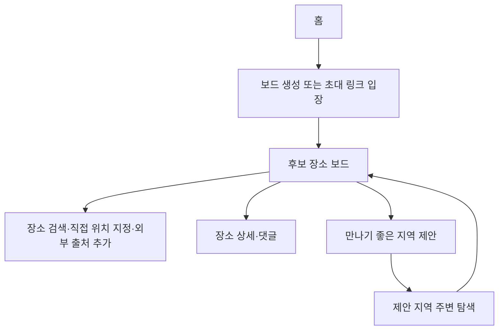

# 후보 장소 보드 기능 명세서

| 항목 | 내용 |
|---|---|
| 문서 유형 | Software Requirements Specification / Functional Specification |
| 문서 버전 | 1.3 |
| 작성일 | 2026-07-23 |
| 대상 | 모바일 우선 반응형 웹 서비스 |
| 독자 | 기획자, 디자이너, 프론트엔드·백엔드 개발자, QA |
| 기준 문서 | `docs/superpowers/specs/2026-07-23-candidate-place-board-product-design.md` |
| 인증 방식 | MVP 비회원·초대 링크 기반 |

## 1. 제품 정의

### 1.1 한 문장 정의

여러 사람이 각자 가고 싶은 장소를 하나의 보드에 모으고, 지도 핀·좋아요·댓글로 함께 비교한 뒤, 누구나 현재 선택된 장소를 바꿔 보여 주는 협업 서비스다.

### 1.2 핵심 사용자 가치

1. 검색 결과, 외부 지도에서 확인한 장소, 직접 찍은 위치를 후보로 빠르게 모은다.
2. 모든 후보를 카드와 지도 핀에서 동시에 비교한다.
3. 장소별 좋아요와 댓글로 선호와 이유를 축적한다.
4. 모든 참여자가 현재 선택 장소를 지정·변경·해제해 지금 의견이 모이는 후보를 보여 준다.
5. 후보가 막히면 만나기 좋은 지역 제안으로 탐색 범위를 좁힌 뒤 다시 후보를 추가한다.

### 1.3 범위 제외

- 회원가입, 소셜 로그인, 친구·팔로우
- 자유 채팅 및 메신저 대체
- 정식 투표 생성·마감·집계 절차
- 다중 장소 코스 편집과 번호 지도
- 장소 확정, 공개 일정, 공개 공유 페이지
- 개인 출발 안내와 출발 알림
- 장소 리뷰·별점 복제 또는 자동 추천 점수화
- 장거리 모임 공정성 해결
- 네이버 공식 검색 연동과 네이버 링크 자동 해석

## 2. 우선순위 정의

| 우선순위 | 정의 | 출시 기준 |
|---|---|---|
| P0 | 핵심 기능 | MVP 출시 전 반드시 구현하고 핵심 E2E 흐름을 통과해야 한다. |
| P1 | 확장 기능 | MVP 이후 적용 가능하며 현재 데이터 모델의 확장 지점만 고려한다. |
| P2 | 연구 과제 | PoC 또는 사용자 검증 후 채택 여부를 결정한다. |

### 2.1 기능군별 우선순위

| 기능군 | 우선순위 | 설명 |
|---|---:|---|
| 보드 생성·초대 | P0 | 로그인 없이 협업 공간을 만든다. |
| 참여자 입장·닉네임 등록 | P0 | 초대 링크만으로 보드에 들어온다. |
| 출발지 등록 | P0 | 지역 제안 계산을 위한 출발 좌표를 등록한다. |
| 장소 검색·후보 추가 | P0 | 장소명 검색, 외부 출처, 직접 위치 지정으로 후보를 만든다. |
| 후보 보드·지도 핀 | P0 | 모든 후보를 목록과 지도에서 함께 본다. |
| 장소 좋아요 | P0 | 가벼운 선호 표현을 제공한다. |
| 장소 댓글 | P0 | 후보별 의견을 해당 후보에 묶는다. |
| 현재 선택 장소 | P0 | 모든 참여자가 현재 의견이 모이는 후보를 표시한다. |
| 만나기 좋은 지역 제안 | P0 | 후보가 막힐 때만 탐색 지역을 계산한다. |
| 제안 지역 주변 탐색 | P0 | 제안 지역 근처 장소를 다시 후보 보드에 추가한다. |
| 보드 닫기 UI | P1 | 운영상 보관이 필요할 때만 검토한다. |
| 장거리 추천 | P2 | 별도 정책과 비용 검토 후 재정의한다. |
| 네이버 자동 링크 해석 | P2 | 별도 PoC 이후 재검토한다. |

## 3. 사용자와 권한

### 3.1 사용자 역할

| 역할 | 설명 |
|---|---|
| 개설자 | 보드를 처음 생성한 참여자다. 생성 이력만 다르고 기능 권한은 다른 참여자와 같다. |
| 참여자 | 참여 코드나 초대 링크로 입장하며 후보·선택·지역 제안을 동일한 권한으로 관리한다. |

### 3.2 권한 매트릭스

| 기능 | 모든 참여자 |
|---|:---:|
| 참여 코드·초대 링크 확인·공유 | O |
| 본인 출발지 등록·수정 | O |
| 후보 장소 추가·삭제 | O |
| 좋아요 추가·취소 | O |
| 댓글 등록 | O |
| 본인 댓글 삭제 | O |
| 현재 선택 장소 지정·변경·해제 | O |
| 지역 제안 실행 | O |

보드 생성은 입장 전 사용자가 수행하지만, 생성 후에는 개설자에게 별도 관리 권한을 부여하지 않는다. 보드 폐쇄·삭제는 MVP 화면에서 제공하지 않는다.

### 3.3 비회원 식별

- 보드별 닉네임과 참여 토큰으로 사용자를 식별한다.
- 참여 토큰은 브라우저의 안전한 저장소에 보관한다.
- 동일 닉네임은 허용하지만 내부 식별자는 별도로 관리한다.
- 토큰을 잃어버리면 기존 댓글·후보의 소유권은 자동 복구하지 않는다.

## 4. 정보 구조와 핵심 흐름

### 4.1 상위 내비게이션

| 위치 | 메뉴 | 노출 조건 | 이동 대상 |
|---|---|---|---|
| 하단 또는 홈 진입 | 홈 | 항상 | 홈 |
| 보드 상단 | 후보 보드 | 보드 참여 후 | 지도·카드 메인 화면 |
| 보드 상단 | 참여 코드·초대 링크 | 보드 참여 후 | 상시 확인·복사 |
| 보드 상단 | 지역 제안 | 보드 참여 후 | 제안 실행 및 결과 |
| 보드 상단 | 참여자 정보 | 보드 참여 후 | 닉네임·출발지 관리 |

## 5. 공통 제품 규칙

| 규칙 ID | 규칙 |
|---|---|
| BR-001 | 검색 결과는 사용자가 명시적으로 추가하기 전까지 후보 장소로 저장하지 않는다. |
| BR-002 | 후보 장소는 목록과 지도 핀에 동시에 표시되어야 한다. |
| BR-003 | 좋아요는 참여자 한 명이 장소 하나에 최대 하나만 남기며, 서로 다른 여러 장소에는 각각 남길 수 있다. 켜기와 끄기는 멱등적이어야 한다. |
| BR-004 | 댓글 삭제는 작성자만 가능하며 soft delete를 허용한다. |
| BR-005 | 보드는 `selectedPlaceId`를 0개 또는 1개만 가진다. |
| BR-006 | 모든 참여자는 현재 선택 장소를 지정·변경·해제할 수 있다. 동시 변경은 마지막 성공 요청을 적용한다. |
| BR-007 | 선택된 후보를 삭제할 때는 선택 포인터를 먼저 해제한 뒤 후보를 보관 처리한다. |
| BR-008 | 지역 제안은 후보가 막힐 때 사용하는 fallback이며 최종 장소 추천으로 표현하지 않는다. |
| BR-009 | 지역 제안 입력은 참여자 출발지와 허용 이동 시간의 스냅샷으로 고정한다. |
| BR-010 | 출발지 상세 주소는 다른 참여자에게 노출하지 않는다. |
| BR-011 | 외부 지도 링크는 허용된 `https` 호스트만 저장하며 서버가 임의 리다이렉트를 따라가며 메타데이터를 수집하지 않는다. |
| BR-012 | 좌표가 확인되지 않은 링크만으로 후보 장소를 생성하지 않는다. |
| BR-013 | 서울-부산 같은 장거리 공통 영역 문제는 MVP 범위에서 제외한다. |
| BR-014 | 네이버 공식 검색과 자동 링크 해석은 이번 문서 범위에 포함하지 않는다. |
| BR-015 | 투표·코스·장소 확정·공개 공유·출발 안내 API와 화면은 새 MVP 계약에 포함하지 않는다. |

## 6. 페이지 목록

| 페이지 ID | 페이지명 | 사용자 | 우선순위 | 핵심 산출물 |
|---|---|---|---:|---|
| PG-01 | 홈 | 전체 | P0 | 생성·입장 진입 |
| PG-02 | 보드 생성 | 입장 전 사용자 | P0 | 보드와 참여 코드·초대 링크 |
| PG-03 | 참여자 입장 | 모든 사용자 | P0 | 닉네임·참여 토큰 |
| PG-04 | 참여자 정보 설정 | 모든 참여자 | P0 | 출발지 등록 상태 |
| PG-05 | 후보 장소 보드 | 모든 참여자 | P0 | 지도 핀·카드 목록·현재 선택 |
| PG-06 | 장소 검색/추가 | 모든 참여자 | P0 | 검색 결과·후보 생성 |
| PG-07 | 장소 상세·좋아요·댓글 | 모든 참여자 | P0 | 장소별 반응과 의견 |
| PG-08 | 현재 선택 장소 관리 | 모든 참여자 | P0 | 선택 후보·마지막 변경자 |
| PG-09 | 만나기 좋은 지역 제안 | 모든 참여자 | P0 | 비동기 제안 작업 |
| PG-10 | 제안 지역 주변 탐색 | 모든 참여자 | P0 | 추가 후보 소스 |

## 7. 페이지별 기능 명세

### PG-01. 홈

**목적:** 사용자가 로그인 없이 보드를 만들거나 초대 링크로 입장한다.

| 기능 ID | 기능명 | 설명 | 규칙·검증 | 우선순위 | 완료 조건 |
|---|---|---|---|---:|---|
| F01-01 | 새 보드 만들기 | 보드 생성 화면으로 이동한다. | 중복 클릭 시 한 번만 이동 | P0 | PG-02가 열린다. |
| F01-02 | 초대 링크 입장 | 초대 링크 또는 코드로 입장한다. | 만료·존재 여부 검사, 공백 제거 | P0 | 유효하면 PG-03으로 이동한다. |
| F01-03 | 최근 참여 보드 | 현재 브라우저의 참여 토큰 목록을 보여 준다. | 최신 활동순 정렬 | P0 | 선택 시 해당 보드로 이동한다. |

### PG-02. 보드 생성

**목적:** 협업 가능한 후보 장소 보드를 만든다.

| 기능 ID | 기능명 | 설명 | 규칙·검증 | 우선순위 | 완료 조건 |
|---|---|---|---|---:|---|
| F02-01 | 보드 이름 입력 | 보드의 표시 이름을 입력한다. | 필수, 2~40자 | P0 | 유효한 이름이 저장된다. |
| F02-02 | 보드 생성 | 보드·개설자 참여자·참여 코드·초대 링크를 만든다. | 중복 요청 방지 | P0 | 보드 ID와 초대 정보가 생성된다. |
| F02-03 | 초대 공유 | 참여 코드와 초대 링크를 복사한다. | 참여 토큰은 링크에 포함하지 않음, 모든 참여자에게 상시 노출 | P0 | 다른 참여자가 입장할 수 있다. |

### PG-03. 참여자 입장

**목적:** 초대 링크를 받은 사용자가 보드 참여자로 등록된다.

| 기능 ID | 기능명 | 설명 | 규칙·검증 | 우선순위 | 완료 조건 |
|---|---|---|---|---:|---|
| F03-01 | 닉네임 입력 | 보드 안에서 사용할 이름을 입력한다. | 필수, 1~20자 | P0 | 참여 토큰이 발급된다. |
| F03-02 | 입장 완료 | 참여자 레코드를 생성한다. | 보드 상태가 `OPEN`이어야 함 | P0 | PG-04 또는 PG-05로 이동한다. |

### PG-04. 참여자 정보 설정

**목적:** 지역 제안에 필요한 출발지를 등록하고 상태를 확인한다.

| 기능 ID | 기능명 | 설명 | 규칙·검증 | 우선순위 | 완료 조건 |
|---|---|---|---|---:|---|
| F04-01 | 출발지 검색 | 건물·역·주소를 검색해 좌표를 선택한다. | Kakao Local 기반, 직접 입력 검증 | P0 | 출발 좌표가 저장된다. |
| F04-02 | 출발지 수정 | 기존 출발지를 바꾼다. | 본인만 수정 가능 | P0 | 최신 좌표가 반영된다. |
| F04-03 | 등록 상태 표시 | 다른 참여자의 출발지 상세값 대신 등록 여부만 표시한다. | 상세 주소 비노출 | P0 | 모든 참여자가 계산 가능 상태를 이해할 수 있다. |

### PG-05. 후보 장소 보드

**목적:** 활성 후보를 지도와 카드에서 함께 비교한다.

| 기능 ID | 기능명 | 설명 | 규칙·검증 | 우선순위 | 완료 조건 |
|---|---|---|---|---:|---|
| F05-01 | 지도 핀 표시 | 활성 후보를 지도에 핀으로 표시한다. | 목록과 동일한 장소 집합 유지 | P0 | 카드와 핀이 서로 대응된다. |
| F05-02 | 후보 카드 목록 | 장소명·카테고리·제안자·좋아요 수·댓글 수를 표시한다. | 기본 최근 추가순 | P0 | 비교 가능한 목록이 보인다. |
| F05-03 | 현재 선택 강조 | 선택된 후보를 지도와 카드에서 시각적으로 강조한다. | `selectedPlaceId` 1개만 반영 | P0 | 현재 선택이 한눈에 보인다. |
| F05-04 | 후보 삭제 | 참여자가 후보를 삭제한다. | 보드 참여자라면 제안자와 무관하게 가능 | P0 | 삭제 시 목록과 핀에서 제거된다. |
| F05-05 | 실시간 또는 새로고침 반영 | 다른 참여자의 추가·좋아요·댓글·선택 변경을 반영한다. | SSE/WebSocket 또는 폴링 | P1 | 협업 중 최신 상태가 유지된다. |

### PG-06. 장소 검색/추가

**목적:** 검색, 외부 출처, 직접 위치 지정으로 후보를 보드에 추가한다.

| 기능 ID | 기능명 | 설명 | 규칙·검증 | 우선순위 | 완료 조건 |
|---|---|---|---|---:|---|
| F06-01 | 장소명 검색 | 장소명과 지역명으로 공식 검색을 수행한다. | 2~80자, 명시적 검색 버튼 기반 | P0 | 검색 결과가 표시된다. |
| F06-02 | 검색 결과 선택 추가 | 사용자가 정확한 후보를 선택해 보드에 추가한다. | 자동 등록 금지 | P0 | 후보 장소가 생성된다. |
| F06-03 | 외부 출처 후보 추가 | 외부 지도에서 확인한 장소 정보를 수동으로 넣어 추가한다. | 좌표·장소명 확인 필수, 허용 호스트·`https`만 저장 | P0 | `sourceProvider=EXTERNAL` 후보가 생성된다. |
| F06-04 | 직접 위치 지정 | 검색되지 않는 장소를 지도 핀과 이름으로 직접 추가한다. | 유효 경위도와 서비스 범위 검증 | P0 | `sourceProvider=MANUAL` 후보가 생성된다. |
| F06-05 | 좌표 없는 링크 차단 | 링크만 넣고 장소를 생성하려는 시도를 막는다. | 좌표 미확인 링크는 저장 불가 | P0 | 잘못된 후보 생성이 차단된다. |

### PG-07. 장소 상세·좋아요·댓글

**목적:** 개별 후보의 맥락과 반응을 누적한다.

| 기능 ID | 기능명 | 설명 | 규칙·검증 | 우선순위 | 완료 조건 |
|---|---|---|---|---:|---|
| F07-01 | 장소 정보 표시 | 이름·주소·카테고리·원본 링크를 보여 준다. | 출발지 상세는 포함하지 않음 | P0 | 후보의 맥락을 이해할 수 있다. |
| F07-02 | 좋아요 추가·취소 | 참여자가 좋아요를 켜고 끈다. | 사용자당 장소별 1회, 여러 장소 허용, 멱등 처리 | P0 | 수와 내 상태가 갱신된다. |
| F07-03 | 댓글 등록 | 장소별 의견을 남긴다. | 1~500자, 빈 댓글 금지 | P0 | 댓글 목록과 수가 갱신된다. |
| F07-04 | 댓글 삭제 | 본인 댓글을 삭제한다. | 소유권 검사, soft delete 허용 | P0 | 목록에서 제외된다. |
| F07-05 | 외부 지도 열기 | 저장된 원본 링크 또는 좌표 기반 링크로 외부 지도를 연다. | 허용 호스트만 사용 | P0 | 사용자가 상세 정보를 원본 지도에서 확인한다. |

### PG-08. 현재 선택 장소 관리

**목적:** 모든 참여자가 현재 의견이 모이는 후보를 지정하거나 해제한다.

| 기능 ID | 기능명 | 설명 | 규칙·검증 | 우선순위 | 완료 조건 |
|---|---|---|---|---:|---|
| F08-01 | 현재 선택 지정 | 참여자가 후보 하나를 현재 선택 장소로 지정한다. | 같은 보드의 활성 후보만 가능 | P0 | `selectedPlaceId`와 변경자·시각이 저장된다. |
| F08-02 | 현재 선택 변경 | 다른 후보로 교체한다. | 이전 선택 자동 해제, last-write-wins | P0 | 항상 하나의 선택만 유지된다. |
| F08-03 | 현재 선택 해제 | 선택을 비운다. | 모든 참여자 가능 | P0 | `selectedPlaceId=null`과 변경자·시각이 저장된다. |
| F08-04 | 삭제 연동 | 선택된 후보 삭제 시 포인터를 먼저 해제한다. | 단일 트랜잭션 또는 동등 보장 필요 | P0 | dangling selection이 남지 않는다. |

### PG-09. 만나기 좋은 지역 제안

**목적:** 후보가 막혔을 때 공통으로 탐색하기 좋은 지역을 찾는다.

| 기능 ID | 기능명 | 설명 | 규칙·검증 | 우선순위 | 완료 조건 |
|---|---|---|---|---:|---|
| F09-01 | 계산 대상 확인 | 출발지 등록 상태와 참여자 목록을 보여 준다. | 상세 주소 비노출 | P0 | 모든 참여자가 계산 가능 여부를 판단한다. |
| F09-02 | 허용 시간 선택 | 30·45·60분 중 하나를 선택한다. | 기본 45분 | P0 | 작업 파라미터가 저장된다. |
| F09-03 | 지역 제안 실행 | 참여자가 비동기 작업을 시작한다. | 중복 실행 방지, 스냅샷 생성 | P0 | 작업 ID와 상태가 생성된다. |
| F09-04 | 실패·재시도 안내 | 공통 영역 없음, 외부 API 실패, 429를 처리한다. | 시간 확대 또는 재시도 제안 | P0 | 다음 행동이 명확히 안내된다. |
| F09-05 | 지역 제안 결과 | 최대 1~3개의 지역을 보여 준다. | 정답 추천이 아닌 탐색 진입점으로 표기 | P0 | 후속 탐색이 가능하다. |

### PG-10. 제안 지역 주변 탐색

**목적:** 제안 지역을 기준으로 다시 장소를 찾고 후보 보드에 추가한다.

| 기능 ID | 기능명 | 설명 | 규칙·검증 | 우선순위 | 완료 조건 |
|---|---|---|---|---:|---|
| F10-01 | 카테고리 탐색 | 맛집·카페·놀거리 등으로 지역 주변을 탐색한다. | Kakao Local 카테고리·키워드 조합 사용 | P0 | 탐색 결과가 표시된다. |
| F10-02 | 키워드 탐색 | 제안 지역 중심으로 자유 검색어를 사용한다. | 명시적 검색만 수행 | P0 | 추가 장소 후보를 찾을 수 있다. |
| F10-03 | 후보로 추가 | 탐색 결과를 다시 후보 보드에 추가한다. | PG-06과 동일한 저장 규칙 적용 | P0 | 보드의 지도·목록에 반영된다. |

## 8. 외부 API와 데이터 사용 명세

| 기능 | 연동 대상 | 사용하는 정보 | 호출 시점 | 정책 |
|---|---|---|---|---|
| 지도 렌더링 | Kakao Maps JavaScript API | 후보 좌표, 제안 지역, 마커 이벤트 | 보드·지역 제안 화면 진입 | 지도 렌더링 전용 |
| 장소 검색 | Kakao Local 키워드 검색 | 장소명, 주소, 카테고리, 좌표 | 사용자가 검색 실행 | 선택 전 결과는 후보로 저장하지 않음 |
| 주소/출발지 검색 | Kakao Local 주소/키워드 검색 | 주소명, 건물명, 좌표 | 출발지 등록 시 | 확정된 출발지만 저장 |
| 지역 제안 계산 | ODsay + JTS + Kakao Local | 도달권, 교집합, 지역 거점 | 참여자가 지역 제안 실행 | 입력 스냅샷과 결과를 작업 단위로 저장 |

### 8.1 장소 유입 정책

1. 기본 검색 공급자는 현재 연동된 Kakao Local이다.
2. 저장 모델은 공급자 중립적으로 유지한다.
3. 후보 장소는 `sourceProvider`를 `KAKAO`, `NAVER`, `EXTERNAL`, `MANUAL` 중 하나로 기록한다.
4. `providerPlaceId`는 공급자가 제공할 때만 저장한다.
5. `sourceUrl`은 사용자가 원본 지도를 다시 열 수 있도록 보존한다.
6. 좌표가 확인되지 않은 링크만으로 후보를 생성하지 않는다.
7. 네이버 공식 검색 및 링크 해석은 PoC 이후 별도 어댑터로 검토한다.

### 8.2 지역 제안 파이프라인

1. 참여자별 ODsay 대중교통 도달권을 조회한다.
2. JTS로 도달권 다각형의 공통 교집합을 계산한다.
3. 의미 있는 면적의 조각을 큰 순서로 추린다.
4. 각 조각 내부에서 Kakao 검색으로 역·상권 등 탐색 기준점을 수집한다.
5. 중복과 조각 외부 결과를 제거하고 최대 1~3개 지역 제안을 반환한다.

### 8.3 비용 경계

- 지역 계산 중 TMAP 경로 API를 참여자×후보 조합으로 전수 호출하지 않는다.
- ODsay와 Kakao 응답은 입력 좌표, 시간, 검색 조건을 정규화한 키로 재사용 가능하게 설계한다.
- 같은 입력의 실행 중 작업 또는 유효한 완료 결과가 있으면 재사용한다.
- 실제 특정 후보의 대표 경로 조회는 후속 기능으로 미룬다.

## 9. 데이터 모델

| 엔터티 | 주요 필드 | 설명 |
|---|---|---|
| `board` | `public_id`, `name`, `status`, `selected_place_id`, `selected_by_participant_id`, `selected_at`, `invite_code` | 협업 보드. 마지막 선택 변경자와 시각 기록 |
| `participant` | `public_id`, `board_id`, `nickname`, `token_hash`, `origin_label`, `origin_ciphertext`, `active` | 권한 차이가 없는 비회원 참여자와 출발지 |
| `place` | `public_id`, `board_id`, `proposer_id`, `source_provider`, `provider_place_id`, `source_url`, `name`, `address_name`, `road_address_name`, `lon`, `lat`, `status`, `deleted_at` | 후보 장소 |
| `place_like` | `place_id`, `participant_id`, `created_at` | 참여자별 장소 좋아요, `(place_id, participant_id)` 유일 |
| `place_comment` | `public_id`, `place_id`, `author_id`, `body`, `deleted_at` | 장소 댓글 |
| `area_search_job` | `public_id`, `board_id`, `snapshot`, `duration_min`, `status`, `progress`, `result`, `error_code` | 지역 제안 비동기 작업 |
| `area_suggestion` | `public_id`, `job_id`, `name`, `lon`, `lat`, `source_place_id`, `rank`, `metadata` | 제안된 지역 탐색 기준점 |

다음 엔터티는 새 MVP 핵심 모델에서 제거한다.

- `vote`
- `vote_option`
- `vote_ballot`
- `course_draft`
- `course`
- `course_stop`
- `departure_calculation`

## 10. 상태 정의

### 10.1 보드 상태

| 상태 | 의미 |
|---|---|
| `OPEN` | 후보를 모으고 반응을 남기고 현재 선택을 바꿀 수 있는 활성 상태 |
| `CLOSED` | 오래된 보드를 보관한 상태. 모임 확정을 뜻하지 않음 |

### 10.2 후보 장소 상태

| 상태 | 의미 |
|---|---|
| `ACTIVE` | 후보 보드에 노출되는 상태 |
| `ARCHIVED` | 삭제 또는 보관되어 기본 목록에서 제외된 상태 |

### 10.3 지역 제안 작업 상태

`QUEUED → RUNNING → SUCCEEDED` 또는 `QUEUED/RUNNING → FAILED`

같은 입력의 실행 중 작업 또는 유효한 완료 결과가 있으면 재사용한다.

## 11. API 계약 방향

상세 스키마는 별도 API 명세에서 정의하되, MVP 자원 경계는 다음과 같다.

- 보드·초대·참여자
- 장소 검색 후보
- 보드 후보 장소
- 장소 좋아요
- 장소 댓글
- 현재 선택 장소
- 지역 제안 작업

핵심 명령 예시는 다음과 같다.

- `POST /boards/{boardId}/places`
- `GET /boards/{boardId}/places`
- `PUT /boards/{boardId}/places/{placeId}/likes/me`
- `DELETE /boards/{boardId}/places/{placeId}/likes/me`
- `POST /boards/{boardId}/places/{placeId}/comments`
- `DELETE /boards/{boardId}/places/{placeId}/comments/{commentId}`
- `PUT /boards/{boardId}/selected-place`
- `DELETE /boards/{boardId}/selected-place`
- `GET /boards/{boardId}/invitation`
- `POST /boards/{boardId}/area-search-jobs`
- `GET /boards/{boardId}/area-search-jobs/{jobId}`

다음 API는 새 MVP 계약에서 제거한다.

- 투표 관련 API
- 코스 관련 API
- 일정 확정 및 공개 공유 API
- 개인 출발 안내 API

## 12. 예외·오류 처리

| 상황 | 사용자 메시지 | 시스템 처리 |
|---|---|---|
| 검색 결과 없음 | 장소명에 지역이나 지점명을 더해 보세요. | 검색어 유지, 재검색 또는 직접 위치 지정 유도 |
| 좌표 없는 외부 링크 입력 | 링크만으로는 후보를 만들 수 없어요. 장소명과 위치를 함께 확인해 주세요. | 저장 거부 |
| 참여하지 않은 사용자의 선택 변경 | 보드 참여자만 현재 선택 장소를 바꿀 수 있어요. | 403 반환 |
| 다른 보드의 후보 선택 시도 | 이 보드의 후보만 선택할 수 있어요. | 400 반환 |
| 선택된 후보 삭제 | 현재 선택을 먼저 해제하고 장소를 삭제했어요. | 선택 포인터 해제 후 보관 처리 |
| 공통 영역 없음 | 이동 시간을 늘리거나 직접 지역을 정해 보세요. | 30→45→60분 확대 제안 |
| 외부 API 429 | 요청이 많아 순서대로 처리하고 있어요. | 재시도 또는 기존 작업 재사용 |
| 장거리 모임 입력 | 아직 멀리 떨어진 도시 간 추천은 지원하지 않아요. | 범위 외 안내 |

## 13. 비기능 요구사항

| 분류 | 요구사항 | 목표 |
|---|---|---|
| 성능 | 후보 보드 초기 응답 | p95 2초 이하, 지도 SDK 로딩 제외 |
| 성능 | 장소 검색 | 명시적 검색 후 응답시간 측정, 타임아웃 시 재검색 안내 |
| 비동기 처리 | 지역 제안 | 진행 상태 제공, 요청 스레드 장시간 점유 금지 |
| 보안 | 참여 토큰 | 원문 미저장, 해시 검증 |
| 개인정보 | 출발지 | 저장 시 암호화, 다른 참여자에게 미노출 |
| 보안 | 외부 링크 | 허용 프로토콜·호스트 검증, `javascript:` 차단 |
| 반응형 | 화면 | 360px 모바일부터 데스크톱까지 지원 |
| 관측성 | 외부 API | 제공자별 호출량·오류율·지연시간 수집 |

## 14. MVP 완료 기준

1. 한 참여자가 보드를 만들고 모든 참여자가 참여 코드와 초대 링크를 언제든 확인·공유할 수 있다.
2. 두 명 이상 참여자가 닉네임으로 입장하고 출발지를 등록할 수 있다.
3. Kakao 검색 결과, 외부 출처 확인, 직접 위치 지정으로 후보를 추가할 수 있다.
4. 후보가 카드 목록과 지도 핀에 동시에 표시된다.
5. 서로 다른 참여자의 좋아요와 댓글이 후보별로 반영된다.
6. 서로 다른 참여자가 현재 선택 장소를 지정·변경·해제하고 마지막 변경자와 시각을 확인할 수 있다.
7. 선택된 후보를 삭제하면 선택이 자동 해제된다.
8. 후보가 막히면 임의 참여자가 지역 제안 작업을 실행할 수 있다.
9. 제안된 지역 주변을 키워드·카테고리로 탐색해 기존 후보 보드에 추가할 수 있다.
10. 지역 제안 검증에서 ODsay 호출, 교집합 계산, Kakao 기준점 탐색을 확인하고 TMAP 전수 평가가 없음을 확인한다.

다음 항목은 완료 기준에 포함하지 않는다.

- 정식 투표
- 다중 장소 코스
- 장소 확정과 공개 공유
- 개인 출발 안내
- 장거리 공통 영역 해결
- 네이버 자동 링크 해석

## 15. 권장 개발 순서

| 단계 | 범위 | 결과물 |
|---|---|---|
| 1 | 보드·참여자·초대 | 생성부터 입장까지의 기본 E2E |
| 2 | 출발지 등록 | 지역 제안 입력 기반 |
| 3 | 장소 검색·외부 출처·직접 위치 지정 | 후보 생성 경로 완성 |
| 4 | 후보 보드·좋아요·댓글 | 협업 축적 경험 완성 |
| 5 | 현재 선택 장소 | 공동 편집 의사결정 흐름 완성 |
| 6 | 지역 제안·주변 탐색 | 후보 막힘을 푸는 fallback 완성 |
