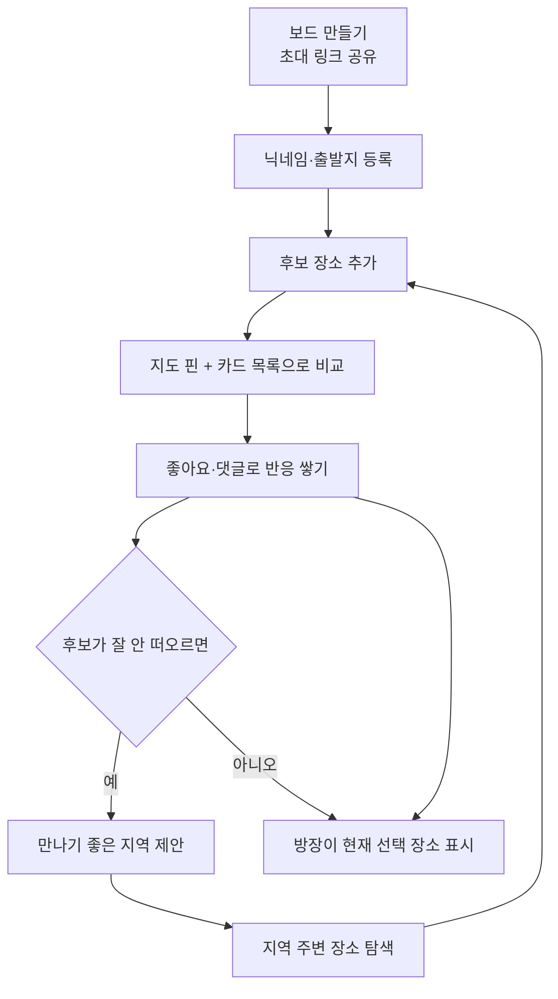
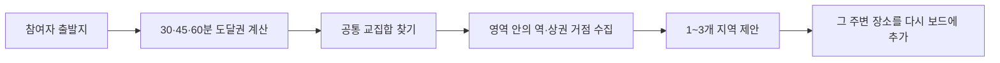

# 후보 장소 보드 — 우리가 만드는 서비스

> 개발자용 상세 명세는 `기능명세서_v1.3`에 있습니다. 이 문서는 팀 전체가 새 MVP를 빠르게 공유하기 위한 요약본입니다.

## 한 줄로 말하면

**여러 사람이 가고 싶은 장소를 한 보드에 모으고, 지도 핀·좋아요·댓글로 함께 비교한 뒤, 방장이 현재 선택된 장소를 언제든 바꿔 보여 주는 서비스**입니다.

## 왜 바꾸나

약속 장소를 정할 때 실제 문제는 "공정한 정답 계산"보다 **후보와 의견이 흩어지는 것**입니다.

1. 각자가 카카오맵·네이버지도·메신저에서 찾은 링크와 캡처가 대화방에 흩어집니다.
2. 누가 어떤 장소를 좋아하는지, 왜 좋은지 다시 읽어야 합니다.
3. 선택이 바뀔 때마다 이전 맥락을 다시 설명해야 합니다.
4. 아무도 장소를 못 떠올리면 어디부터 찾아야 할지 막힙니다.

이 서비스는 흩어진 후보를 한 화면에 쌓아 두고, 반응을 붙이고, 지금 의견이 어디로 모였는지를 빠르게 보여 주는 데 집중합니다.

## 안 만드는 것

이번 MVP에서 아래 기능은 핵심 흐름에서 뺍니다.

| 안 만드는 것 | 이유 |
|---|---|
| 정식 투표 절차 | 좋아요와 댓글이면 가벼운 합의에 충분함 |
| 다중 장소 코스 | 먼저 한 장소를 정하는 경험에 집중해야 함 |
| 확정 일정·공개 공유 페이지 | 되돌리기 어려운 상태를 만들지 않음 |
| 개인 출발 안내 | 장소 결정 전후의 핵심 가치와 직접 연결되지 않음 |
| 장거리 공정성 해결 | 서울-부산 같은 사례는 MVP 범위를 벗어남 |
| 네이버 링크 자동 해석 | 별도 PoC 없이는 안정성과 유지비를 보장하기 어려움 |

## 등장인물

| 역할 | 하는 일 |
|---|---|
| **방장** | 보드를 만들고 초대 링크를 공유합니다. 현재 선택 장소 지정·변경·해제와 지역 제안을 실행합니다. |
| **참여자** | 초대 링크로 들어와 닉네임과 출발지를 등록하고, 후보 장소를 추가하고, 좋아요와 댓글을 남깁니다. |

> 로그인이 없기 때문에 브라우저에 저장되는 참여 토큰으로 "내가 추가한 후보"와 "내 댓글"을 구분합니다.

## 전체 흐름

핵심은 **모은다 → 비교한다 → 반응한다 → 현재 선택을 보여 준다**입니다. 지역 제안은 후보가 막혔을 때만 쓰는 fallback입니다.

## 핵심 경험

### 1. 후보 장소 보드

- 검색 결과, 외부 지도에서 확인한 장소, 직접 찍은 위치를 모두 후보로 추가할 수 있습니다.
- 추가된 후보는 **카드 목록과 지도 핀**에 동시에 나타납니다.
- 검색만 했다고 자동 등록되지 않고, 사용자가 명시적으로 추가해야 보드에 들어옵니다.

### 2. 좋아요와 댓글

- 좋아요는 **가벼운 선호 표시**입니다.
- 한 참여자는 장소 하나에 좋아요를 한 번만 켜거나 끌 수 있습니다.
- 댓글은 특정 장소에 붙어서 단톡방처럼 맥락이 사라지지 않습니다.

### 3. 현재 선택 장소

- 여러 후보 중 하나를 **방장만** 현재 선택 장소로 지정할 수 있습니다.
- 이것은 "확정"이 아니라 **지금 의견이 모이는 곳을 보여 주는 포인터**입니다.
- 방장은 언제든 다른 후보로 바꾸거나 해제할 수 있습니다.
- 선택된 후보를 삭제하면 선택은 먼저 자동 해제됩니다.

### 4. 만나기 좋은 지역 제안

후보가 안 나올 때만 쓰는 보조 기능입니다.

- 결과는 "최종 장소 추천"이 아니라 **어디를 중심으로 더 찾아볼지** 알려 주는 영역입니다.
- 공통 영역이 없으면 시간을 늘려 다시 시도하도록 안내합니다.
- 서울-부산 같은 장거리 모임은 이번 MVP 해결 범위에 넣지 않습니다.

## 우리가 지키는 원칙

| 원칙 | 왜 |
|---|---|
| 자동 추천보다 함께 축적하는 경험을 우선 | 장소를 왜 고르는지 맥락이 중요함 |
| 후보는 사용자가 확인한 뒤에만 등록 | 이름이 비슷한 다른 장소 오등록을 막기 위해 |
| 좋아요를 정식 투표로 확장하지 않음 | 절차보다 빠른 의견 표현이 중요함 |
| 현재 선택은 언제든 바꿀 수 있어야 함 | 장소 논의는 중간에 자주 바뀜 |
| 출발지는 지역 제안 계산에만 사용 | 다른 참여자에게 상세 주소를 노출하면 안 됨 |
| 외부 원본 링크는 보존하되 자동 해석은 미룸 | 안정성과 유지비를 동시에 관리해야 함 |

## 만드는 순서

| 순서 | 기능 | 등급 |
|---|---|---|
| 1 | 보드 생성·초대 | P0 |
| 2 | 참여자 입장·닉네임·출발지 등록 | P0 |
| 3 | 장소 검색·직접 위치 지정·외부 출처 후보 추가 | P0 |
| 4 | 후보 보드(지도 핀 + 카드 목록) | P0 |
| 5 | 좋아요·댓글 | P0 |
| 6 | 현재 선택 장소 지정·변경·해제 | P0 |
| 7 | 만나기 좋은 지역 제안 | P0 |
| 8 | 제안 지역 주변 탐색 후 후보 추가 | P0 |
| — | 장거리 추천, 네이버 자동 링크 해석 | 나중에 검토 |

## 한 장 정리

|  |  |
|---|---|
| **무엇** | 여러 사람이 후보 장소를 모아 함께 비교하는 협업 보드 |
| **누구** | 약속 장소를 정해야 하는 소규모 그룹 |
| **왜 쓰나** | 흩어진 링크와 의견을 한곳에 축적해 빠르게 합의하려고 |
| **남과 다른 점** | 후보 축적 보드, 장소별 반응, 방장의 가벼운 현재 선택, 지역 fallback |
| **형태** | 휴대폰 우선 반응형 웹, 로그인 없음 |
