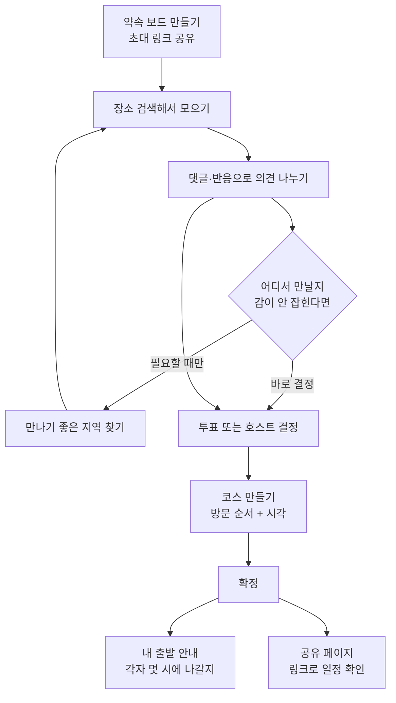
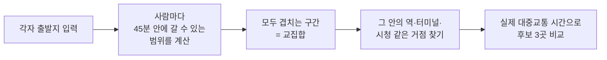

# 약속 올인원 — 우리가 만드는 서비스

> 개발자용 상세 명세는 `기능명세서 v1.3`에 있습니다. 이 문서는 **팀 전체가 서비스 전체를 파악하기 위한 요약본**입니다.

## 한 줄로 말하면

**여러 사람이 만날 장소를 함께 정하고, 순서를 짜고, 각자 언제 출발할지까지 알려 주는 서비스**입니다.

## 왜 만드나

친구 다섯 명이 만나기로 했을 때 보통 이렇게 됩니다.

1. 단톡방에 "어디서 볼까?" → 각자 링크를 던짐
2. 링크가 위로 밀려 올라가서 뭐가 후보였는지 모름
3. "다 좋아"만 반복되다가 결국 아무도 안 정함
4. 겨우 정했는데 누구는 20분, 누구는 1시간 반 걸림
5. 당일에 "나 몇 시에 나가야 해?"를 각자 검색

**흩어진 정보를 한 곳에 모으고, 결정을 도와주고, 각자에게 필요한 답을 주는 것**이 이 서비스가 하는 일입니다.

## 안 만드는 것 (중요)

기능을 정하는 것만큼 **안 할 것을 정하는 것**이 중요합니다. 아래는 의도적으로 제외했습니다.

| 안 만드는 것 | 이유 |
|---|---|
| 회원가입·로그인 | 링크만 받으면 바로 쓸 수 있어야 함 |
| 채팅 기능 | 카톡을 대체할 생각이 없음. 장소별 댓글로 충분 |
| 맛집 별점·리뷰 | 우리가 평가하지 않음. 자세한 정보는 카카오맵·네이버지도에서 |
| 예약·결제·N빵·택시 | 범위가 너무 커짐 |
| 실시간 위치 공유 | 부담스럽고 민감함 |

---

# 등장인물

| 역할 | 하는 일 |
|---|---|
| **호스트** | 약속을 만든 사람. 지역 찾기 실행, 투표 개설, 코스 확정 같은 **결정 권한**을 가짐 |
| **참여자** | 초대 링크로 들어온 사람. 장소 추가, 댓글, 투표, 본인 출발지 입력 |
| **방문자** | 공유 링크만 받은 사람. **확정된 일정만 구경** (수정 불가) |

> 로그인이 없기 때문에, 브라우저에 저장되는 **참여 토큰**으로 "내가 쓴 글"을 구분합니다.

---

# 전체 흐름



핵심은 **모은다 → 의견 → 정한다 → 순서 → 확정 → 각자 안내** 여섯 단계입니다.

---

# 단계별로 보기

## 1단계. 약속 보드 만들기

호스트가 약속 이름과 날짜를 정하면 **초대 링크와 초대 코드**가 생깁니다.
받은 사람은 닉네임만 입력하고 바로 입장합니다. 가입 절차가 없습니다.

## 2단계. 장소 모으기

장소 **이름으로 검색**합니다. (예: "성수동 카페")

> ⚠️ **카카오맵 링크를 붙여 넣는 방식이 아닙니다.**
> 링크를 받아 정보를 긁어오는 방식은 상대 서비스가 조금만 바뀌어도 깨져서, 사전 검증(PoC) 후 방향을 바꿨습니다.
> 지금은 카카오 공식 검색 API로 직접 찾습니다.

검색 결과에서 **정확한 곳을 사람이 직접 고른 뒤**에 보드에 추가됩니다.
검색만 했다고 자동으로 담기지 않습니다 — 이름이 같은 다른 가게가 많기 때문입니다.

추가된 장소는 **카드 목록 + 지도 마커**로 동시에 보입니다.

## 3단계. 의견 나누기

- **장소별 댓글**: 단톡방과 달리 의견이 해당 장소에 붙어 있어 밀려 올라가지 않습니다
- **반응**: 가볍게 선호 표시
- **투표**: 의견이 갈릴 때만 씁니다. **투표 없이 호스트가 바로 정해도 됩니다**

## 4단계. 만나기 좋은 지역 찾기 ⭐ 차별화 기능

출발지가 넓게 흩어져 있을 때 쓰는 기능입니다.



- 결과는 **평균 이동시간**과 **가장 오래 걸리는 사람의 시간**을 함께 보여 줍니다. 한 명만 크게 손해 보는 걸 막기 위해서입니다
- **호스트가 버튼을 눌렀을 때만 실행**됩니다. 외부 API 호출에 비용과 제한이 있기 때문입니다
- 겹치는 구간이 없으면 "시간 범위를 넓혀 볼까요?"를 제안합니다
- 계산에 몇 초 걸리므로 **진행률을 보여 주며 기다립니다**

> 개인 출발지 주소는 **다른 참여자에게 보이지 않습니다.** 입력 완료 여부만 표시됩니다.

## 5단계. 코스 만들기

정해진 장소들을 **방문 순서대로 배치**합니다.

- 1번은 반드시 **첫 만남 장소** (여기서 모입니다)
- 각 장소에 도착 예정시각 입력
- 장소마다 역할 지정: 식사 / 카페 / 놀거리 …
- 지도에 **번호가 붙은 마커**로 표시 — 1번은 크고 강조색

장소 사이 이동시간은 **직선거리 기준 추정치**입니다. 화면에 `약 N분(추정)`이라고 솔직하게 표시합니다.
정확한 길찾기는 외부 지도로 넘깁니다.

## 6단계. 확정, 그리고 각자에게 필요한 답 ⭐ 차별화 기능

호스트가 확정하면 두 가지가 만들어집니다.

**① 내 출발 안내** — 참여자마다 다르게 계산됩니다

```
권장 출발시각 = 만남시각 − 이동시간 − 여유 10분
```

"나는 6시 12분에 나가면 된다"를 각자 받습니다. 그리고 버튼 하나로 네이버지도·카카오맵 길찾기가 열립니다.

**② 공유 페이지** — 링크를 받은 사람은 로그인 없이 확정 일정을 봅니다.
단, **출발지·댓글 작성자·투표 상세는 빠집니다.**

> 일정이 바뀌면 기존 출발 안내는 **자동으로 만료 처리**되고 다시 계산됩니다.
> 옛날 정보를 보고 늦는 사람이 생기면 안 되기 때문입니다.

---

# 우리가 지키기로 한 원칙

| 원칙 | 왜 |
|---|---|
| 검색 결과는 **사람이 확인한 뒤** 등록 | 이름이 같은 다른 가게가 담기는 걸 막기 위해 |
| 추정치에는 **반드시 `추정` 표시** | 정확한 것처럼 보이면 그 시간을 믿고 늦음 |
| 리뷰·인기도로 **자동 추천하지 않음** | 우리가 검증할 수 없는 정보로 순위를 매기지 않음 |
| 개인 출발지는 **본인과 서버만** | 집 주소가 노출되면 안 됨 |
| 비싼 계산은 **호스트가 누를 때만** | 외부 API는 호출마다 비용과 제한이 있음 |
| 추천 이유는 **숫자로 설명 가능해야** | "평균이 짧음"처럼 근거를 댈 수 있는 말만 씀 |

---

# 만드는 순서 (MVP 기준)

**P0 = 없으면 서비스가 성립하지 않는 것.** 여기까지가 이번 목표입니다.

| 순서 | 기능 | 등급 |
|---|---|---|
| 1 | 보드 생성·초대 | P0 |
| 2 | 장소 검색·추가 | P0 |
| 3 | 장소 보드(지도+카드) | P0 |
| 4 | 장소별 댓글 | P0 |
| 5 | 투표·장소 결정 | P0 |
| 6 | 만나기 좋은 지역 찾기 | P0 ⭐ |
| 7 | 코스 만들기·번호 지도 | P0 ⭐ |
| 8 | 확정 일정·공유 페이지 | P0 |
| 9 | 내 출발 안내 | P0 ⭐ |
| — | 반응, 근처에서 더 찾기, 출발 알림, 운영 대시보드 | P1 (나중에) |

**화면은 총 16개**이고, 그중 14개가 P0입니다.

---

# 한 장 정리

|  |  |
|---|---|
| **무엇** | 약속 장소를 함께 정하고 각자 출발시각까지 알려 주는 웹 서비스 |
| **누구** | 여러 명이 만날 약속을 잡는 사람들 |
| **왜 쓰나** | 단톡방에서 흩어지는 후보와 의견을 한 곳에 모아 결정까지 끝냄 |
| **남과 다른 점** | ① 모두에게 공평한 지역 계산 ② 순서가 있는 코스 ③ 개인별 출발 안내 |
| **형태** | 휴대폰 우선 반응형 웹 (앱 설치 없음, 로그인 없음) |
