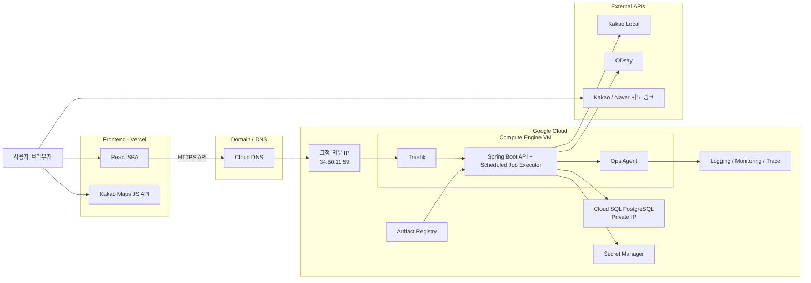
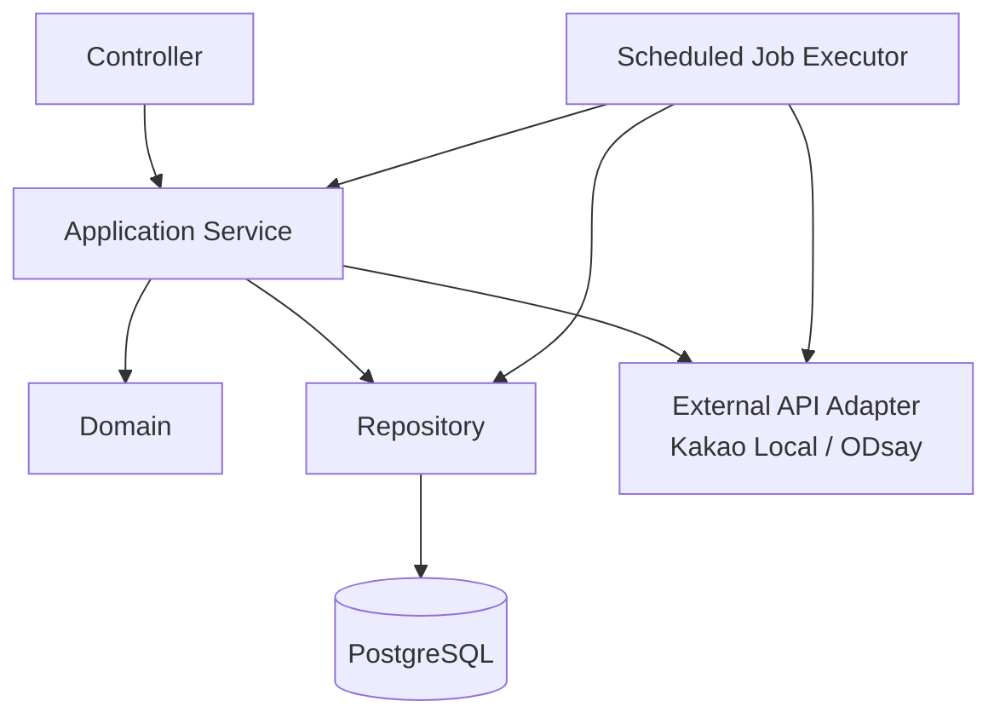
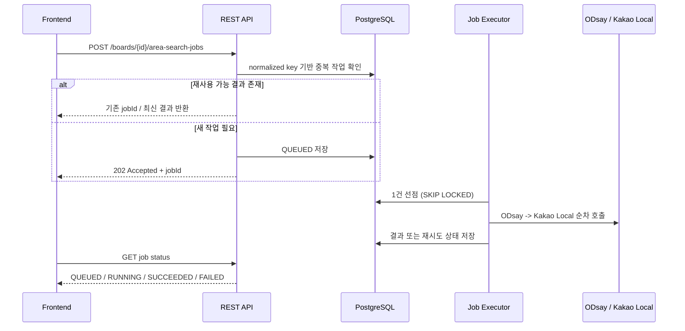
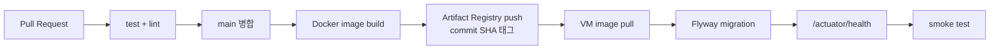

# 시스템 아키텍처

| 항목 | 내용 |
|---|---|
| 문서 버전 | 1.0 |
| 작성일 | 2026-07-23 |
| 목적 | 후보 장소 보드 MVP의 구조·배포·운영 기준 정의 |
| 제품 기준 | `docs/superpowers/specs/2026-07-23-candidate-place-board-product-design.md` |
| 기능 기준 | `기능명세서_v1.3.md` |
| API 계약 기준 | `API명세서_v1.1.md` |
| 데이터 모델 기준 | `ERD_v1.0.md` |

이 문서는 기능·화면·REST 스키마를 다시 설명하지 않는다. 현재 MVP에 필요한 **구조, 인프라, 실행 경계**만 정의한다.

## 1. 확정된 기술 결정

| 영역 | 확정안 | 상태 |
|---|---|:---:|
| 서비스 형태 | 모바일 우선 반응형 웹 | ✅ |
| 프론트 배포 | Vercel | 🔨 |
| 프론트 스택 | Vite + React + JavaScript(JSX) | ✅ |
| 프론트 라우팅 | 미도입. 화면 증가 시 도입 | 🔨 |
| 백엔드 | Kotlin + Spring Boot 단일 애플리케이션 | ✅ |
| 백엔드 실행 | GCP Compute Engine VM | 🔨 |
| 리버스 프록시 | Traefik | 🔨 |
| 데이터베이스 | Cloud SQL for PostgreSQL | 🔨 |
| 스키마 관리 | Flyway | 🔨 |
| 컨테이너 이미지 | Artifact Registry | 🔨 |
| 비밀 관리 | Secret Manager | 🔨 |
| 지도 표시 | Kakao Maps JavaScript API | 🔨 |
| 장소 검색 | Kakao Local REST API (서버) | ✅ 검증 완료 |
| 지역 제안 도달권 | ODsay (서버, 고정 IP 필요) | ✅ 검증 완료 |
| 폴리곤 연산 | JTS Topology Suite (JVM) | 🔨 |
| 관측성 | Ops Agent + Cloud Logging / Monitoring / Trace | 🔨 |
| 도메인 | `yeondang.com` / `api.yeondang.com` | ✅ |

쓰지 않기로 한 것: Cloud Run·Functions, Nginx, Redis, Kafka, RabbitMQ, 별도 워커 서버, Kubernetes, PostGIS, TMAP 기반 전수 경로 평가.

### 저장소 구성

| 저장소 | 내용 | 배포 대상 |
|---|---|---|
| `frontend` | Vite + React 웹 | Vercel |
| `backend` | Kotlin + Spring Boot | GCP Compute Engine |
| `docs` | 기획·설계 문서 | 배포 없음 |

## 2. 전체 구조

### 핵심 흐름

1. 사용자는 Vercel에 배포된 SPA에 접속한다.
2. 지도 렌더링만 브라우저가 Kakao Maps JS를 직접 사용한다.
3. 나머지 기능은 `https://api.yeondang.com`의 Spring Boot REST API를 호출한다.
4. Spring Boot는 후보 장소 보드, 좋아요, 댓글, 현재 선택 장소, 지역 제안 작업을 PostgreSQL에 저장한다.
5. 장소 검색은 서버가 Kakao Local을 호출해 수행한다.
6. 지역 제안은 같은 프로세스의 Scheduled Job Executor가 ODsay와 JTS를 사용해 비동기로 계산한다.
7. 외부 지도 상세 확인은 서비스 내부 프록시 없이 사용자가 원본 `sourceUrl`로 이동한다.

## 3. 프론트엔드 경계

### 책임

- 후보 장소 목록, 지도 핀, 좋아요, 댓글, 현재 선택 장소 UI 렌더링
- Kakao Maps JS API로 지도·마커·영역 표시
- REST API 호출과 로딩·오류·빈 상태 처리
- 지역 제안 작업 상태 폴링
- 외부 지도 원본 링크 열기

### 금지

- Kakao Local REST, ODsay를 브라우저에서 직접 호출하지 않는다.
- 서버 비밀 키를 `VITE_` 환경변수로 노출하지 않는다.
- 외부 지도 HTML을 브라우저에서 파싱해 내부 데이터 모델을 만든다고 가정하지 않는다.

### 공개 환경변수

| 이름 | 용도 |
|---|---|
| `VITE_API_BASE_URL` | API base URL |
| `VITE_KAKAO_MAP_JS_KEY` | Kakao Maps JavaScript 키 |
| `VITE_APP_NAME` | 외부 지도 앱 링크용 이름 |

`VITE_` 값은 빌드 결과물에 포함되므로 비밀 값 금지다.

## 4. 백엔드 구조

### 주요 책임

- 보드, 참여자, 후보 장소, 좋아요, 댓글, 현재 선택 장소 관리
- 공급자 중립 장소 검색 응답 구성
- 안전한 외부 `sourceUrl` 검증 및 저장
- 지역 제안 비동기 실행, 재시도, 결과 재사용
- 관측성·보안·입력 검증 일원화

### 의존성 기준

| 의존성 | 용도 | 상태 |
|---|---|:---:|
| Spring Web MVC | REST API | ✅ |
| Spring Validation | 입력 검증 | ✅ |
| Spring Data JPA | 영속성 | ✅ |
| Spring Boot Actuator | health check·메트릭 | ✅ |
| springdoc-openapi | API 문서 | ✅ |
| H2 | 현재 로컬 임시 DB | ✅ (교체 예정) |
| PostgreSQL Driver | 운영 DB | 🔨 |
| Flyway | 스키마 버전 관리 | 🔨 |
| Spring Security | 참여 토큰 검증·권한 | 🔨 |
| JTS Topology Suite | 도달권 교집합 계산 | 🔨 |
| Micrometer + OpenTelemetry | 메트릭·트레이스 | 🔨 |

외부 API 호출은 Spring `RestClient`를 사용한다. WebFlux, 별도 Node.js 연산 서버, 별도 워커 프로세스는 도입하지 않는다.

## 5. 도메인 흐름

### 5.1 후보 장소 보드

- 보드는 후보 장소 집합과 nullable `selectedPlaceId`를 가진다.
- 현재 선택 장소는 별도 엔터티가 아니라 보드가 가리키는 후보 1개다.
- 개설자는 생성 이력으로만 기록하고 모든 참여자에게 같은 기능 권한을 부여한다.
- 모든 참여자는 참여 코드와 초대 링크를 언제든 다시 조회할 수 있다.
- 선택 변경은 last-write-wins로 처리하고 마지막 변경 참여자와 시각을 보드에 기록한다.
- 후보 삭제 시 선택 포인터를 먼저 해제해야 한다.
- 투표, 코스, 모임 확정, 공개 일정, 출발 안내 전용 상태 모델은 사용하지 않는다.

### 5.2 좋아요와 댓글

- 좋아요는 `(board_place_id, participant_id)` 기준으로 1개만 허용하며 한 참여자가 서로 다른 여러 장소에 남길 수 있다.
- 좋아요 추가·취소는 멱등적이어야 한다.
- 댓글은 소프트 삭제 가능 구조로 두되 조회에서는 숨긴다.

### 5.3 장소 유입

- 공식 검색은 현재 Kakao Local 하나로 시작한다.
- 저장 모델은 공급자 중립 구조를 유지한다.
  - `sourceProvider`: `KAKAO`, `NAVER`, `EXTERNAL`, `MANUAL`
  - `providerPlaceId`
  - `sourceUrl`
  - 이름, 주소, 경도, 위도, 카테고리
- 검색 결과는 사용자가 명시적으로 추가할 때만 후보가 된다.
- `sourceUrl`은 `https`와 허용 호스트만 저장한다.
- 좌표가 확인되지 않은 외부 링크만으로 후보를 생성하지 않는다.

### 5.4 지역 제안

- 목적은 정답 장소 추천이 아니라 탐색 범위 축소다.
- 입력은 참여자 출발지 스냅샷과 허용 이동 시간이다.
- 파이프라인은 `ODsay -> JTS 교집합 -> Kakao Local 기준점 수집` 순서다.
- 지역 제안 계산에는 TMAP를 사용하지 않는다.

## 6. 비동기 작업, 캐시, 멱등성

### 구현 규칙

1. 단일 Spring Boot 프로세스 안의 `@Scheduled` 실행기가 작업을 처리한다.
2. 외부 API 호출 중 DB 트랜잭션을 열어두지 않는다.
3. 외부 호출 실행 풀은 동시성 1로 시작한다. ODsay 제한을 우선 고려한다.
4. `429`는 `Retry-After` 우선, 없으면 1초·2초·4초 백오프로 최대 3회 재시도한다.
5. 서버 재시작 시 오래된 `RUNNING` 작업은 `QUEUED`로 복구한다.
6. Redis 같은 별도 캐시는 두지 않는다.
7. 대신 `area_search_job`과 결과 테이블을 **정규화된 입력 키 기반 DB 캐시**로 사용해 중복 실행을 막는다.
8. 좋아요 추가·취소는 멱등적으로 처리한다.
9. 선택 장소 변경은 보드 행 잠금으로 순서를 직렬화하고 마지막 성공 요청을 현재 상태로 저장한다.

## 7. 데이터베이스 원칙

| 항목 | 설정 |
|---|---|
| 제품 | Cloud SQL for PostgreSQL |
| 연결 | VM과 같은 VPC의 Private IP만 사용 |
| Public IP | 사용하지 않음 |
| 시간 저장 | UTC |
| 표시 시간대 | `Asia/Seoul` |
| 좌표 | WGS84 (`lon`, `lat`) |
| 스키마 변경 | Flyway migration만 사용 |
| 백업 | 자동 백업 활성화 |

### 모델 방향

- 핵심 테이블: `board`, `participant`, `place`, `place_like`, `place_comment`, `area_search_job`, `area_suggestion`
- 내부 PK/FK는 `bigint`, 외부 노출 식별자는 `public_id`
- 출발지 상세 정보는 최소 저장, 필요 시 암호화
- PostGIS, DB ENUM, 트리거, 저장 프로시저는 사용하지 않는다
- GeoJSON 또는 다각형 결과는 JSONB 저장 가능, 연산은 JTS에서 수행한다

기존 `vote`, `vote_option`, `vote_ballot`, `course_draft`, `course`, `course_stop`, `departure_calculation` 중심 구조는 이 아키텍처의 기준에서 제외한다.

## 8. 도메인, DNS, TLS

| 주소 | 대상 | 용도 |
|---|---|---|
| `https://yeondang.com` | Vercel | 사용자 화면 |
| `https://www.yeondang.com` | Vercel | 사용자 화면 |
| `https://api.yeondang.com` | GCE 고정 외부 IP `34.50.11.59` | REST API |

- 프론트 인증서는 Vercel이 관리한다.
- API 인증서는 Traefik이 Let's Encrypt로 관리한다.
- 프론트와 API는 다른 origin이므로 CORS를 명시적으로 제한한다.
- ODsay에는 운영 VM의 고정 IP를 등록해야 한다.

## 9. 보안

- 참여자 토큰은 원문 대신 해시 또는 HMAC 기반으로 검증한다.
- 출발지 상세 좌표는 저장 시 암호화한다.
- 외부 API 키와 DB 비밀번호는 Secret Manager에서 주입한다.
- `sourceUrl`은 프로토콜·호스트 검증으로 `javascript:` URL과 내부망 접근을 차단한다.
- 로그와 오류 응답에 토큰, API 키, 상세 출발지, 검색 원문, 댓글 본문을 남기지 않는다.
- 운영 CORS는 운영 프론트 도메인과 승인된 Preview만 허용한다.
- VM 공개 포트는 80/443만 사용하고 애플리케이션 8080은 외부에 열지 않는다.

### Secret Manager 저장 대상

- PostgreSQL 비밀번호
- 참여 토큰 HMAC pepper
- 출발지 암호화 키
- Kakao REST API 키
- ODsay 서버 키

## 10. 관측성

Ops Agent가 VM 로그·메트릭·트레이스를 Cloud Logging / Monitoring / Trace로 전송한다.

### 최소 로그 필드

- `timestamp`
- `level`
- `service`
- `requestId`
- `traceId`
- `errorCode`
- `elapsedMs`

### 최소 메트릭

- HTTP 요청 수, 4xx/5xx 비율, p95 응답 시간
- JVM heap, GC, 커넥션 풀
- 지역 제안 작업 상태별 개수
- 외부 API 제공자별 호출 수, 성공률, 429 수
- VM CPU / 메모리 / 디스크

### 초기 경보

- API 5xx 비율 급증
- ODsay 또는 Kakao Local 429 급증
- 지역 제안 `FAILED` 증가 또는 `QUEUED` 적체
- health check 실패
- DB 연결 실패

## 11. 배포와 롤백

- `latest`만 쓰지 않고 commit SHA 태그를 유지한다.
- 배포 전 자동 백업 상태를 확인한다.
- 실패 시 직전 이미지 태그로 되돌린다.
- migration은 롤백 친화적으로 작성한다.
- MVP 초기에는 수동 배포 스크립트여도 되지만, 롤백 절차는 반드시 검증한다.

## 12. 구현 제약 요약

- 프론트는 Vite + React + JSX 기준을 유지한다.
- 백엔드는 Kotlin + Spring Boot 단일 프로세스를 유지한다.
- 지역 제안은 ODsay, JTS, Kakao Local만 사용한다.
- 공급자 중립 검색 모델과 안전한 `sourceUrl` 정책을 지킨다.
- 후보 장소 보드 외의 투표·코스·출발 아키텍처를 새 코드 기준으로 확장하지 않는다.
- Redis, 메시지 큐, 별도 워커, Kubernetes는 실제 병목이 확인되기 전 도입하지 않는다.

## 참고 문서

- [Cloud DNS Managed Zone](https://docs.cloud.google.com/dns/docs/zones)
- [Vercel Custom Domain](https://vercel.com/docs/domains/set-up-custom-domain)
- [Google Cloud Observability agents](https://docs.cloud.google.com/stackdriver/docs/solutions/agents)
- [Secret Manager 개요](https://docs.cloud.google.com/secret-manager/docs/overview)
- [Spring Scheduling](https://docs.spring.io/spring-framework/reference/integration/scheduling.html)
- [Spring Boot Tracing](https://docs.spring.io/spring-boot/reference/actuator/tracing.html)
