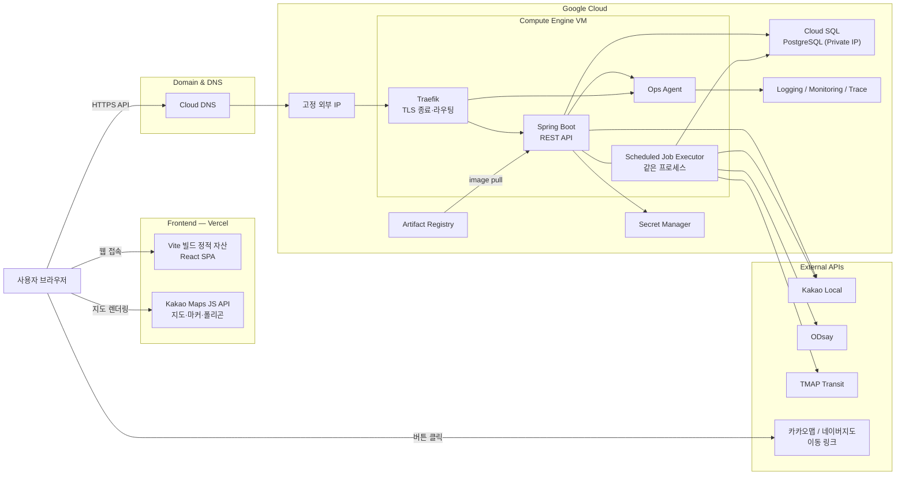
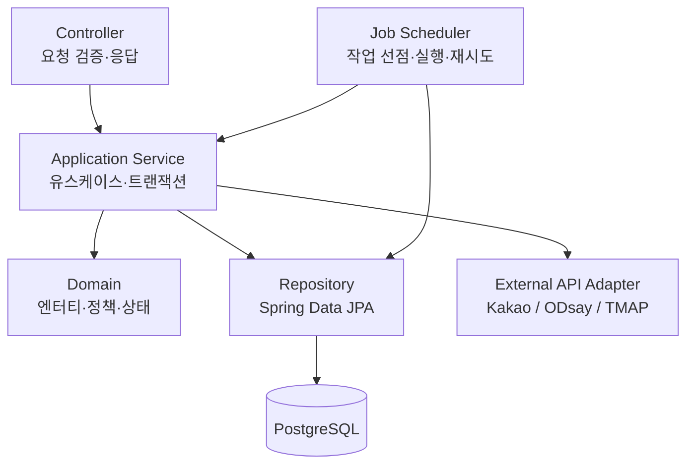
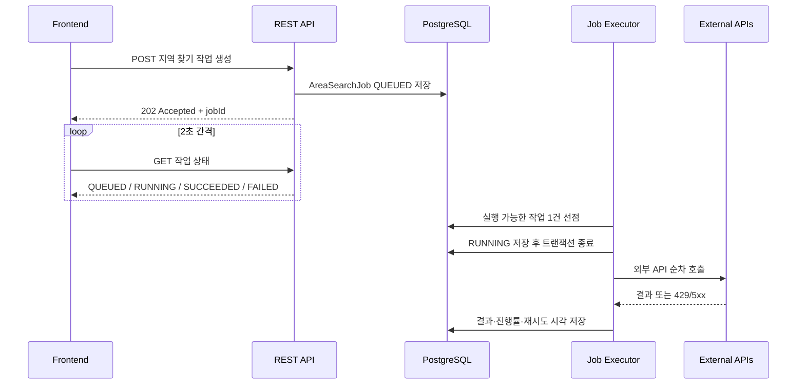
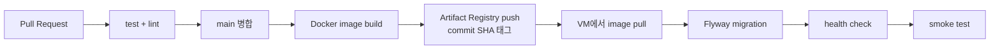

# 시스템 아키텍처

| 항목 | 내용 |
|---|---|
| 문서 버전 | 1.0 |
| 작성일 | 2026-07-22 |
| 목적 | 사람과 구현 에이전트가 같은 구조로 개발·배포하기 위한 기준 |
| 기능 기준 | `기능명세서_v1.3.md` |
| API 계약 기준 | `API명세서_v1.1.md` |
| 데이터 모델 기준 | `ERD_v1.0.md` |

이 문서는 기능이나 REST API를 다시 정의하지 않는다. **구조와 배포만** 다룬다.

## 읽는 법 — 현재와 목표를 구분한다

이 문서는 **목표 아키텍처**를 기술한다. 아직 만들지 않은 것이 많다.
각 항목에 상태를 표시했으니, 구현 에이전트는 **있다고 가정하지 말고 상태를 먼저 확인**한다.

| 표기 | 뜻 |
|---|---|
| ✅ | 저장소에 이미 있다 |
| 🔨 | 앞으로 추가한다 (지금은 없다) |
| ❓ | 아직 결정되지 않았다 — 임의로 정하지 말 것 |

---

## 1. 확정된 기술 결정

| 영역 | 확정안 | 상태 |
|---|---|:---:|
| 서비스 형태 | 모바일 우선 반응형 웹 (앱 없음) | ✅ |
| 프론트 배포 | Vercel | 🔨 |
| 프론트 스택 | **Vite + React + JavaScript(JSX)** | ✅ |
| 프론트 라우팅 | 미도입. 화면이 늘어날 때 도입 | 🔨 |
| 백엔드 | Kotlin + Spring Boot (단일 애플리케이션) | ✅ |
| 백엔드 실행 | GCP Compute Engine VM | 🔨 |
| 리버스 프록시 | Traefik | 🔨 |
| 데이터베이스 | **Cloud SQL for PostgreSQL** | 🔨 |
| 스키마 관리 | Flyway | 🔨 |
| 컨테이너 이미지 | Artifact Registry | 🔨 |
| 비밀 관리 | Secret Manager | 🔨 |
| 지도 표시 | Kakao Maps JavaScript API (브라우저) | 🔨 |
| 장소 검색 | Kakao Local REST API (서버) | ✅ 검증 완료 |
| 도달권 | ODsay (서버, **고정 IP 필요**) | ✅ 검증 완료 |
| 대중교통 평가 | TMAP Transit (서버) | ✅ 검증 완료 |
| 폴리곤 연산 | JTS Topology Suite (JVM) | 🔨 |
| 관측성 | Ops Agent + Cloud Logging / Monitoring / Trace | 🔨 |
| 도메인 | 서비스명 확정 후 Cloud Domains | ❓ |

**쓰지 않기로 한 것**: 서버리스(Cloud Run·Functions), Nginx, Redis·Kafka·RabbitMQ, 별도 워커 서버, Kubernetes, 자체 운영 모니터링 스택.

### 저장소 구성

세 저장소가 **각각 독립된 git 원격**을 가진다. CI/CD도 저장소별로 구성한다.

| 저장소 | 내용 | 배포 대상 |
|---|---|---|
| `frontend` | Vite + React 웹 | Vercel |
| `backend` | Kotlin + Spring Boot | GCP Compute Engine |
| `docs` | 기획·검증 문서 (이 문서 포함) | 배포 없음 |

---

## 2. 전체 구조



### 요청이 흐르는 방식

1. 사용자가 Vercel에 배포된 프론트엔드에 접속한다.
2. 프론트엔드가 `https://api.{domain}`으로 REST API를 호출한다.
3. Cloud DNS가 API 서브도메인을 VM의 고정 외부 IP로 해석한다.
4. Traefik이 HTTPS를 종료하고 Spring Boot 내부 포트(8080)로 전달한다.
5. Spring Boot가 PostgreSQL을 조회·변경하고, 필요하면 외부 API를 호출한다.
6. 오래 걸리는 계산(지역 찾기, 출발 안내)은 **도메인 테이블에 작업 상태를 저장**하고 즉시 응답한다.
7. 같은 프로세스의 Job Executor가 작업을 가져가 순차 처리한다.
8. 프론트엔드가 작업 상태 API를 주기적으로 조회해 진행률을 표시한다.

**지도 렌더링만 브라우저가 직접** Kakao Maps를 호출한다. 나머지 외부 API는 전부 서버 경유다.

---

## 3. 프론트엔드

> 상세 규칙은 `frontend/AGENTS.md`, 실행 방법은 `frontend/README.md`.

### 책임

- 화면 렌더링과 사용자 입력
- REST API 호출, 로딩·오류·빈 상태 표시
- Kakao Maps JS API로 지도·마커·폴리곤·코스 선 표시
- 장소명·좌표로 카카오맵·네이버지도 이동 링크 생성 (서버 호출 없음)
- 참여 토큰 보관과 `Authorization: Bearer` 전송
- 지역 찾기 작업 상태 폴링

### 하지 않는 것

**ODsay, TMAP, Kakao Local REST API를 브라우저에서 직접 호출하지 않는다.**
이 키들은 서버용이며, 번들에 들어가면 그대로 공개된다.
브라우저가 쓰는 키는 **Kakao Maps JavaScript 키 하나뿐**이고, 카카오 콘솔에서 허용 도메인을 제한한다.

### 환경변수

Vite는 **`VITE_` 접두사가 붙은 값만** 앱 코드에 전달한다. `import.meta.env.VITE_*`로 읽으며 `process.env`는 동작하지 않는다.

| 이름 | 공개 | 용도 |
|---|---|---|
| `VITE_API_BASE_URL` | 공개 | `https://api.{domain}/api/v1` |
| `VITE_KAKAO_MAP_JS_KEY` | 공개 | Kakao Maps JavaScript 키 |
| `VITE_APP_NAME` | 공개 | 네이버지도 앱 스킴의 앱 이름 |

⚠️ `VITE_` 값은 **빌드 결과물에 그대로 박혀** 사용자가 볼 수 있다.
REST API 키, DB 비밀번호, 암호화 키를 이 이름으로 만들지 않는다.

### Vercel 배포

| 환경 | 브랜치 | 백엔드 |
|---|---|---|
| Preview | Pull Request | 개발 API 또는 Mock |
| Production | `main` | `https://api.{domain}` |

- Vercel이 Vite 프로젝트를 자동 인식한다. **빌드 명령 `npm run build`, 산출물 `dist`.**
- Preview와 Production 환경변수를 분리한다.
- `VITE_` 값은 빌드 시점에 박히므로 **변수를 바꾸면 재배포해야 반영**된다.
- 도메인 확정 전에는 Vercel 기본 도메인을 쓴다.
- 🔨 **라우터를 도입하는 시점에** 모든 경로를 `index.html`로 보내는 rewrite 설정이 필요하다.
  지금은 화면이 하나라 필요 없다. 미리 넣지 않는다.

---

## 4. 백엔드

> 상세 규칙은 `backend/AGENTS.md`.

### 단일 Spring Boot 애플리케이션

MVP에서는 API 서버와 워커를 나누지 않는다. **하나의 프로세스**가 둘 다 한다.



### 의존성 현황

| 의존성 | 용도 | 상태 |
|---|---|:---:|
| Spring Web MVC | REST API | ✅ |
| Spring Validation | 입력 검증 | ✅ |
| Spring Data JPA | 영속성 | ✅ |
| Spring Boot Actuator | health check·메트릭 | ✅ |
| springdoc-openapi | API 문서 | ✅ |
| H2 | 로컬 임시 DB | ✅ (교체 예정) |
| **PostgreSQL Driver** | 운영 DB | 🔨 |
| **Flyway** | 스키마 버전 관리 | 🔨 |
| **Spring Security** | Bearer 참여 토큰 필터·권한 확인 (로그인용 아님) | 🔨 |
| **JTS Topology Suite** | 도달권 교집합·면적·포함 판정 | 🔨 |
| **Micrometer + OpenTelemetry** | 메트릭·트레이스 | 🔨 |

> PoC에서는 Turf.js로 폴리곤 연산을 검증했지만, **운영 백엔드가 Kotlin이므로 Node.js 서버를 추가하지 않는다.**
> 같은 연산을 JVM 라이브러리인 JTS로 수행한다.

### 백그라운드 작업 처리

지역 찾기와 출발 안내는 외부 API 때문에 수 초 이상 걸린다. HTTP 요청 안에서 기다리지 않는다. 두 계산은 서로 다른 영속 상태 모델을 사용한다.



위 흐름은 `area_search_job`에 해당한다. 출발 안내는 `departure_calculation`의 참여자×코스 unique 행을 `CALCULATING`으로 저장하고 `202 Accepted`를 반환한다. 별도 job ID나 `QUEUED/RUNNING/RETRY_WAIT` 상태를 노출하지 않는다. 단일 실행기가 처리한 뒤 `READY`, `UNAVAILABLE`, `FAILED` 중 하나로 바꾼다.

**구현 규칙**

1. `@Scheduled`가 짧은 주기로 실행 가능한 지역 찾기와 출발 계산을 조회한다.
2. 지역 찾기는 `SELECT ... FOR UPDATE SKIP LOCKED`로 **한 작업만** 선점한다. (PostgreSQL 지원)
3. 지역 찾기를 `RUNNING`으로 바꾸고 **즉시 트랜잭션을 끝낸다.** 출발 계산은 단일 실행 풀에서 `CALCULATING` 행을 처리한다.
4. **외부 API 호출 중에는 DB 트랜잭션을 열어두지 않는다.** 커넥션이 묶여 전체가 느려진다.
5. 외부 호출 실행 풀은 **동시성 1**로 시작한다. 개발용 TMAP 키의 호출 제한 때문이다.
6. `429`는 `Retry-After`를 우선 쓰고, 없으면 1초·2초·4초 백오프로 최대 3회 재시도한다.
7. 지역 찾기의 재시도는 `RETRY_WAIT`와 `nextRetryAt`을 저장한다. 출발 계산은 실행 중 짧게 재시도하고 한도를 넘으면 `FAILED`로 저장한다.
8. 서버 재시작 후 오래된 지역 찾기 `RUNNING`은 `QUEUED`로 복구한다. 남아 있는 출발 계산 `CALCULATING` 행은 다시 처리한다.
9. 같은 보드의 활성 지역 찾기는 partial unique index로 하나만 허용하고, 출발 계산은 `(participant_id, course_id)` unique로 중복을 방지한다.
10. 외부 API 결과 캐시는 사용하지 않는다. 검색 후보는 저장하지 않고, 지역 찾기와 출발 안내 결과만 각 도메인 테이블에 보존한다.

---

## 5. 데이터베이스

| 항목 | 설정 |
|---|---|
| 제품 | Cloud SQL for **PostgreSQL** |
| 연결 | VM과 같은 VPC의 **Private IP만** |
| Public IP | 사용하지 않음 |
| 시간 저장 | **UTC** |
| 표시 시간대 | `Asia/Seoul` |
| 좌표 | WGS84 (`lon`=경도, `lat`=위도) |
| 스키마 변경 | **Flyway migration만** |
| 백업 | 자동 백업 활성화 |

- **적용된 migration 파일은 수정하지 않는다.** 항상 새 버전을 추가한다.
- DB 비밀번호는 Secret Manager에서 주입한다. 설정 파일·이미지·저장소에 평문으로 넣지 않는다.
- 로컬 개발은 Docker PostgreSQL을 쓴다. 🔨 현재 `backend`는 H2로 되어 있어 **교체가 필요하다.**
- 내부 PK와 FK는 `bigint`를 사용하고 API에는 접두사 ULID `public_id`만 노출한다.
- 코스 초안은 보드당 한 행의 JSONB로 전체 교체하고, 버전으로 ETag/If-Match를 검증한다.
- 확정 코스의 순서·역할·예정시각은 새 버전으로 보존하지만 장소 정보는 스냅샷 없이 Place FK를 참조한다.
- 외부 API 전용 캐시 테이블과 TTL 정책은 두지 않는다. 지역 찾기와 출발 안내 결과만 도메인 기록으로 저장한다.
- PostGIS·PostgreSQL ENUM·트리거·저장 프로시저는 사용하지 않는다. 폴리곤은 JTS에서 처리하고 GeoJSON은 JSONB로 저장한다.

---

## 6. 도메인 · DNS · TLS

서비스명이 정해질 때까지 `{domain}`은 임시 표기다. ❓

| 주소 | 대상 | 용도 |
|---|---|---|
| `app.{domain}` 또는 `{domain}` | Vercel | 사용자 화면 |
| `api.{domain}` | GCE 고정 외부 IP | REST API |

**TLS 책임이 나뉜다**: 프론트 인증서는 Vercel이, API 인증서는 Traefik이 Let's Encrypt로 관리한다.

프론트와 API는 **서로 다른 origin**이므로 CORS 설정이 반드시 필요하다.

### 연동 순서

1. 서비스명·도메인 확정 → Cloud Domains 구매 → DNS 공급자로 Cloud DNS 선택
2. **등록자 확인 메일을 반드시 처리한다.** 기간 내 미확인 시 도메인이 비활성화될 수 있다
3. 고정 외부 IP 예약 → VM에 연결
4. Cloud DNS에 `api` A 레코드 추가 (고정 IP)
5. Vercel에 프론트 도메인 추가 → **Vercel 화면이 그때 안내하는 값**을 Cloud DNS에 등록
   (안내 값은 바뀔 수 있으므로 문서의 예시를 복사하지 않는다)
6. Traefik 인증서 발급 확인
7. Kakao Developers 허용 도메인에 운영 프론트 URL 추가
8. Spring CORS 허용 목록에 운영 프론트 URL 추가
9. **ODsay에 고정 IP 등록** — 이걸 빠뜨리면 지역 찾기가 통째로 실패한다

---

## 7. 보안과 비밀 관리

### Secret Manager에 저장할 것

- PostgreSQL 사용자 비밀번호
- 참여 토큰 HMAC용 서버 pepper
- 개인 출발지 암호화 키
- Kakao REST API 키 / ODsay 서버 키 / TMAP App Key

Kakao Maps **JavaScript 키는 공개 키**라 보호 대상이 아니지만, 허용 도메인 제한은 반드시 건다.

### VM 서비스 계정 — 최소 권한

| 역할 | 목적 |
|---|---|
| Secret Manager Secret Accessor | 비밀 읽기 |
| Artifact Registry Reader | 이미지 pull |
| Logs Writer / Monitoring Metric Writer / Cloud Trace Agent | 텔레메트리 전송 |

- **서비스 계정 JSON 키 파일을 다운로드해 VM이나 저장소에 두지 않는다.**
- 사람 계정에 Owner를 상시 부여하지 않는다.
- CI/CD는 가능하면 GitHub Actions Workload Identity Federation을 쓴다.

### 보안 기본선

- CORS는 운영 프론트 도메인과 승인된 Preview만 허용한다. **운영에서 `*` 금지.**
- 8080 포트를 외부에 열지 않는다. Traefik 뒤에서만 접근한다.
- 방화벽은 **80/443만** 공개. SSH는 IAP + OS Login 권장.
- 참여·초대·공개 토큰은 원문이 아니라 **HMAC 값**으로 저장한다.
- 개인 출발지 좌표는 애플리케이션 수준에서 암호화한다.
- API 키·토큰·출발지 원문·검색어를 **로그와 오류 응답에서 제거**한다.
- 사용자 텍스트는 HTML로 실행하지 않는다.
- 외부 지도 URL을 입력받거나 서버에서 크롤링하지 않는다. (기능명세서 BR-014·015)
- **GCP Billing Budget 알림을 만든다.** 단, 알림은 자동 차단이 아니므로 외부 API 쪽 사용량 상한도 따로 건다.

---

## 8. 관측성

Ops Agent가 VM에서 로그·메트릭·트레이스를 수집해 Cloud Logging / Monitoring / Trace로 보낸다.

**로그**는 JSON으로 남기고 `timestamp`, `level`, `service`, `requestId`, `traceId`, `errorCode`, `elapsedMs`를 포함한다.
**참여 토큰, 초대 코드, API 키, 댓글 본문, 출발지 원문, 전체 검색어는 기록하지 않는다.**
외부 API는 공급자·엔드포인트 종류·상태 코드·지연시간·재시도 횟수만 남긴다.

**최소 메트릭**: HTTP 요청 수와 4xx/5xx 비율, p95 응답시간 / JVM heap·GC·커넥션 풀 /
지역 찾기 상태별 개수(QUEUED·RUNNING·RETRY_WAIT·FAILED) / 출발 계산 상태별 개수(CALCULATING·READY·STALE·UNAVAILABLE·FAILED) / 외부 API 제공자별 호출 수·429·성공률 / VM 자원.

**초기 경보**: API 5xx 비율 초과, 외부 API 429 급증, 작업 FAILED 또는 QUEUED 적체,
VM 자원 임계치, health check 실패, DB 연결 실패.

---

## 9. 환경 분리

| 환경 | 구성 |
|---|---|
| Local | 프론트 로컬 + Spring 로컬 + Docker PostgreSQL + 개발 키 또는 mock |
| Production | Vercel Production + 운영 VM + Cloud SQL |

예산상 VM을 두 대 운영하기 어렵다. **개발은 로컬에서 하고, 운영에는 검증된 이미지만 배포한다.**
최소한 로컬 DB와 운영 DB는 반드시 분리한다.

```text
backend/src/main/resources/
  application.yml          # 공통
  application-local.yml    # 로컬 PostgreSQL, 개발 키
  application-prod.yml     # 값이 아닌 Secret Manager 참조
frontend/.env.example      # 변수 이름만, 실제 키 금지
```

---

## 10. 배포와 롤백



- `latest`만 쓰지 않고 **commit SHA 태그**를 함께 붙인다. 롤백할 대상을 특정하기 위해서다.
- 배포 전 자동 백업 상태를 확인한다.
- `/actuator/health` 성공 후 smoke test를 실행한다.
- 실패하면 **직전 이미지 태그로 되돌린다.**
- ⚠️ **DB migration은 애플리케이션 롤백만으로 되돌아가지 않는다.**
  컬럼 추가 → 코드 전환 → 구 컬럼 제거 순서로, 호환 가능한 migration을 쓴다.

MVP 초기에는 수동 배포 스크립트로 검증해도 된다. **자동화보다 수동 배포·롤백이 먼저 동작해야 한다.**

---

## 11. 구현 순서

| 단계 | 작업 | 완료 확인 |
|---:|---|---|
| 1 | 백엔드 H2 → Docker PostgreSQL + Flyway 교체 | migration 적용, health check 성공 |
| 2 | 프론트 로컬에서 API 연결 | CORS·Bearer 토큰 요청 성공 |
| 3 | GCP 프로젝트·결제·API 활성화 | 필요한 서비스 사용 가능 |
| 4 | VPC + Cloud SQL Private IP | VM에서만 DB 연결됨 |
| 5 | VM + 고정 외부 IP | 재시작 후 IP 유지 |
| 6 | Artifact Registry 이미지 push | 서비스 계정으로 pull 성공 |
| 7 | Traefik + Spring Docker Compose | 고정 IP에서 health check 성공 |
| 8 | Secret Manager 연동 | 비밀이 파일·로그에 없음 |
| 9 | Ops Agent 연동 | 로그·메트릭·트레이스 각 1건 확인 |
| 10 | Vercel 배포 | 운영 API 연결 성공 |
| 11 | 도메인 구매·DNS·TLS·CORS | HTTPS로 지도·API 호출 성공 |
| 12 | **ODsay에 고정 IP 등록** | 운영 VM에서 도달권 호출 성공 |
| 13 | 배포·롤백 리허설 | 새 버전 배포와 직전 버전 복구 성공 |

---

## 12. 아직 결정되지 않은 것 ❓

**임의로 정하지 말고 팀에 확인한다.**

- 서비스명과 도메인
- GCP 예산 상한
- VM 머신 타입 (`e2-medium` 수준에서 시작해 측정 후 조정)
- 라우터 도입 시점과 라이브러리
- Preview 환경용 백엔드를 별도로 둘지, Mock으로 대체할지

---

## 13. 구현 에이전트를 위한 요약

### 공통

- 기능은 `기능명세서_v1.3.md`, API 계약은 `API명세서_v1.1.md`, 데이터 구조와 DB 제약은 `ERD_v1.0.md`가 기준이다.
  **문서와 구현이 어긋나면 구현으로 덮어쓰지 말고 먼저 보고한다.**
- 이 문서의 🔨 항목은 **아직 없는 것**이다. 있다고 가정한 코드를 쓰지 않는다.
- 복잡도를 임의로 늘리지 않는다. Redis·Kafka·Kubernetes·별도 워커는 MVP에 추가하지 않는다.

### 프론트엔드 에이전트

```text
Vite + React + JavaScript(JSX). TypeScript·Next.js가 아니다.
API는 src/api/ 의 공용 axios 인스턴스만 거치고,
baseURL은 import.meta.env.VITE_API_BASE_URL 에서 읽는다.
ODsay·TMAP·Kakao Local REST 키를 브라우저에서 쓰지 않는다.
브라우저가 쓰는 외부 API는 Kakao Maps JavaScript 하나뿐이다.
지역 찾기는 즉시 응답이 오지 않는다. 202 + jobId 를 받고 상태를 폴링해 진행률을 표시한다.
상세 규칙은 frontend/AGENTS.md 를 따른다.
```

### 백엔드 에이전트

```text
Kotlin + Spring Boot 단일 프로세스가 REST API와 Scheduled Job Executor를 함께 실행한다.
DB는 PostgreSQL, 스키마는 Flyway로만 바꾸고 적용된 migration은 수정하지 않는다.
지역 찾기는 area_search_job에 저장하고 짧은 트랜잭션으로 SKIP LOCKED 선점한 뒤
트랜잭션 밖에서 호출한다. 출발 안내는 departure_calculation의 CALCULATING 행을 단일 실행기가 처리한다.
429 재시도·재시작 복구·중복 실행 방지를 각 상태 모델에 맞게 구현한다.
외부 API 결과 캐시는 추가하지 않고 도메인 결과만 DB에 보존한다.
폴리곤 연산은 JTS를 쓴다. Node.js 서버를 추가하지 않는다.
비밀은 Secret Manager에서 주입하고 로그에 남기지 않는다.
상세 규칙은 backend/AGENTS.md 를 따른다.
```

---

## 14. MVP 이후에만 검토

지금 넣지 않는다: API와 워커 분리 배포, 메시지 큐, 다중 VM·로드밸런서, Kubernetes,
자체 운영 모니터링 스택, 읽기 복제본, blue/green·canary 배포.

**아래가 실제로 발생한 뒤에** 확장한다.

- API와 작업이 자원을 다퉈 응답시간이 나빠짐
- 단일 VM 장애를 감당할 수 없게 됨
- 작업 적체가 지속됨
- 배포 중단 시간이 사용자에게 문제가 됨

> 단일 VM이므로 무중단·고가용성을 보장하지 않는다.
> MVP의 목표는 **구조를 단순하게 유지하면서 복구 가능한 배포**를 만드는 것이다.

---

## 참고 문서

- [Cloud Domains 도메인 등록](https://docs.cloud.google.com/domains/docs/register-domain)
- [Cloud DNS Managed Zone](https://docs.cloud.google.com/dns/docs/zones)
- [Vercel Custom Domain](https://vercel.com/docs/domains/set-up-custom-domain)
- [Google Cloud Observability agents](https://docs.cloud.google.com/stackdriver/docs/solutions/agents)
- [Secret Manager 개요](https://docs.cloud.google.com/secret-manager/docs/overview)
- [Spring Scheduling](https://docs.spring.io/spring-framework/reference/integration/scheduling.html)
- [Spring Boot Tracing](https://docs.spring.io/spring-boot/reference/actuator/tracing.html)
- [Traefik ACME](https://doc.traefik.io/traefik/reference/install-configuration/tls/certificate-resolvers/acme/)
